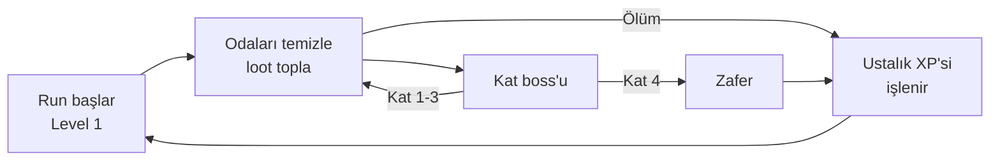

# Zindan Oyunu — Tasarım Dokümanı (GDD)

Sep 23, 2026 · @Mustafa · Son güncelleme: 25 Eyl 2026 (Aşama 5)

Bu doküman oyunun tam tasarımı ve yapım rehberidir. Yeni bir sohbette oyunu yapmaya başlamak için bu dosyayı ekle ve en alttaki **Uygulama Rehberi**'nde verilen başlangıç mesajını gönder. Tüm sayılar başlangıç değerleridir ve oyun testlerinde ayarlanır.

## Genel Bakış

Tamamen emekle ilerlenen, öl-baştan-başla (roguelike) bir 2D izometrik zindan oyunu. Zindan temizlenir, loot toplanır ve kalıcı silah ustalığı sayesinde her run'da biraz daha güçlü dönülür.

| Konu | Karar |
| --- | --- |
| Motor | Godot 4 |
| Kamera | İzometrik |
| Görsel | Blender'da modellenip 8 yönden render edilen 3D görünümlü sprite'lar, normal map ile dinamik ışık |
| Platform | Windows .exe |
| Hedef içerik | \~100 silah, 4 ırk, 55 sıradan düşman, 20 boss, 4 etap |

100 silah ve 55 düşman veri odaklı üretilir: \~12 temel silah tipi ve \~15-18 temel düşman modeli, element, özellik ve varyantlarla çoğaltılır. Yeni içerik eklemek bir tabloya satır eklemek kadar kolay olmalıdır.

## Temel Döngü ve Run Yapısı

Her run level 1'de ve boş çantayla başlar. Ölünce yalnızca silah tipi ustalığı ve boss ilk kesiş bonusları kalır.



| Run sonunda | Ne olur |
| --- | --- |
| Oyuncu leveli (maks 80) | Sıfırlanır |
| Tüm silahlar, tılsımlar, eşyalar | Kaybolur |
| Boss'un run içi ödülü | Kaybolur |
| Silah tipi ustalığı (maks 12) | Kalır |
| Boss ilk kesiş bonusu (+%0,3 hasar) | Kalır |

## Kontroller ve Slotlar

WASD ile yürünür, saldırılar farenin gösterdiği yöne gider. Oyuncunun 4 slotu var ve çantayla slotlar arası değişim yalnızca oda dışında (koridorda ya da temizlenmiş odada) yapılabilir.

| Tuş | İşlev |
| --- | --- |
| WASD | Yürüme |
| Fare | Nişan (tüm saldırılar fare yönüne) |
| Sol tık | Aktif silahın normal saldırısı |
| Sağ tık | Aktif silahın güçlü saldırısı |
| Q | Birinci ırk yeteneği |
| E | İkinci ırk yeteneği |
| Space | Klasik atılma (tüm ırklarda aynı) |
| Tab | İki aktif silah arasında anında geçiş |
| 1 | İksir |
| F | Etkileşim (loot, kapı, tüccar) |
| I | Çanta ve slotlar (Aşama 5; açıkken oyun durur) |

| Slot | Ne konur | Etkisi |
| --- | --- | --- |
| Aktif silah 1 | Açık silah | Tam güçle kullanılır |
| Aktif silah 2 | Açık silah | Tam güçle kullanılır, savaşta tuşla geçilir |
| Rezonans | Kilitli ya da açık silah | Kilitliyken normal saldırısının %10'u, açıkken %7'si kadar ek hasar |
| Esnek | Silah (kilitli ya da açık) veya tılsım | Silahsa pasifinin %9'u, tılsımsa tılsımın tam etkisi |

Diğer tüm silahlar çantada durur ve etki etmez.

## Zindan

Zindan 4 etaptan oluşur ve her etapta daha derine inilir. Harita yapısı (odalar, duvarlar, engeller) her run'da prosedürel olarak yeniden üretilir.

| Etap | Tema | Bulunan silah leveli | Not |
| --- | --- | --- | --- |
| 1 | Damarlı Mağara: bazı bölümlerinde duvarlarda damarlar ve gözler; iskeletler, fareler | 1 |  |
| 2 | Mantar Mağaraları: zehir, böcekler | 10 |  |
| 3 | Kül Dökümhanesi: ateş, taş golemler | 25-40 | Efsanevi silahlar buradan itibaren düşer |
| 4 | Boşluk: gölge, hayaletler | 50 |  |

Her etabın 5 boss'luk bir havuzu vardır ve her run'da bu havuzdan rastgele biri çıkar. 20 boss'un hepsini görmek için birçok run gerekir.

## Irklar

4 ırk var: Warrior, Ghost, Archer, Magical. Her ırk her silahı kullanabilir. Kendi silah ailesinde en iyidir, diğer ailelerde küçük bir ayar yer.

| Irk | Silah ailesi | Q | E | Kaynak | Pasif |
| --- | --- | --- | --- | --- | --- |
| Warrior | Kılıç, balta, demir yumruk | Zırh: kısa süreli, az hasar emen zırh ve +%3 hasar | Yer sarsıntısı: önündeki alana büyük hasar | Enerji | Yüksek can ve zırh |
| Ghost | Tırpan, hançer, gürz | Faz: maks 1 sn dokunulmaz ve düşmanlara görünmez | Gölge adımı: hedef düşmanın arkasına ışınlanır | Yok (bekleme süresi) | Fiziksele dirençli, ateşe zayıf; özel iyileşme kuralı |
| Archer | Yay, arbalet, mızrak | Geri sıçrama: geriye atılırken önüne 3 ok atar | Ok yağmuru: seçilen alana çoklu ok | Yok (bekleme süresi) | Menzil ve kritik bonusu |
| Magical | Kitap, asa, rün | Uçuş: kısa süre engel ve tuzakların üstünden uçar | Element fırtınası: aktif silahın elementinde alan hasarı | Mana | Element hasarı yüksek, can düşük |

Yakın ırklar (Warrior-Ghost, Archer-Magical) arasında ceza küçük, uzak ırklar arasında büyüktür. Ceza, o ırkın silahla birleşince bozacağı güce göre seçilir: tank ırklar uzak silahta can kaybeder, kırılgan ırklar yakın silahta biraz can kazanıp hasar ya da hız kaybeder.

| Irk ↓ / Silah ailesi → | Warrior | Ghost | Archer | Magical |
| --- | --- | --- | --- | --- |
| Warrior | 0 | −%5 saldırı hızı | −%25 maks can | −%20 maks can, −%10 element |
| Ghost | −%5 saldırı hızı | 0 | −%20 maks can | −%15 maks can, −%10 element |
| Archer | +%10 can, −%15 hasar | +%10 can, −%10 hasar | 0 | −%8 hasar |
| Magical | +%15 can, −%15 saldırı hızı | +%10 can, −%15 saldırı hızı | −%8 hasar | 0 |

Değerler başlangıç noktasıdır, oyun testlerinde ayarlanır. Ustalık ırktan bağımsızdır: Warrior ile yay kullanılırsa Yay ustalığı yine artar.

## Oyuncu Leveli ve Silah Leveli

Oyuncu her run'da level 1'den başlar ve en fazla 80'e çıkar. Silahlar da en fazla 80 level olur ve her 5 levelde istatistikleri +%5 artar.

- **Silah stat artışı:** Her 5 levelde oran yenilenir, üst üste katlanmaz: level 5'te +%5, level 10'da +%10 … level 80'de +%80. Oran her zaman silahın temel değerine uygulanır.
- **Yetişme XP'si:** Oyuncunun levelinin altındaki silah, oyuncunun kazandığı XP'nin 1,5 katını alır (oyuncu 100 XP alırsa silah 150 alır). Oyuncunun levelini yakalayınca normal hıza döner. Bu kural her katta aynıdır.
- **Kilitli silah:** Oyuncunun levelinden yüksek silah, oyuncu o levele gelene kadar kilitli kalır ve aktif slotta kullanılamaz. Rezonans ya da Esnek slota konabilir veya geride bırakılabilir.

**Level hedefi:** 1. kat 1→15 · 2. kat 15→35 · 3. kat 35→55 · 4. kat 55→80. XP eğrisi bu aralıklara göre ayarlanır.

### XP eğrisi

Bir sonraki levele gereken XP = 100 + 20 × mevcut level. Düşman XP'leri, her katın hedef level aralığına tam denk gelecek şekilde ayarlandı: katın tüm düşmanları ve boss'u kesilirse oyuncu katın hedef üst levelinde çıkar.

| Kat | Level aralığı | Gereken toplam XP | Normal düşman | Elit | Boss | Tahmini normal düşman sayısı |
| --- | --- | --- | --- | --- | --- | --- |
| 1 | 1→15 | 3.500 | 40 | 150 | 800 | \~60 |
| 2 | 15→35 | 11.800 | 120 | 500 | 2.400 | \~70 |
| 3 | 35→55 | 19.800 | 180 | 900 | 3.600 | \~80 |
| 4 | 55→80 | 36.000 | 280 | 1.800 | 7.200 | \~90 |

Kat başına 2 elit varsayılmıştır. Odaları atlayan oyuncu hedefin altında kalır; Deneyim kazanımı ödülleri bu açığı kapatır.

## Run İçi Ödüller

Run içinde iki ödül kaynağı var. İkisinde de kendi havuzundan gelen 2 seçenekten biri seçilir ve ödüller run bitince gider.

| Kaynak | Ne zaman | Havuz | Örnek |
| --- | --- | --- | --- |
| Level ödülü | Her 5 levelde (run başına 16 kez) | Küçük stat artışları | +%5 saldırı hızı |
| Boss ödülü | Her boss kesişinde | Büyük stat artışları ve saldırıyı değiştiren özellikler | +%10 saldırı hızı; çift vuruş; saldırıya küçük ek mermi |

### Level ödül havuzu

Küçük ve tekrar seçilebilir stat artışları. Her 5 levelde havuzdan rastgele 2 tanesi sunulur; tavana ulaşan stat artık çıkmaz.

| Ödül | Değer |
| --- | --- |
| Saldırı hızı | +%5 |
| Hasar | +%5 |
| Element hasarı | +%6 |
| Skill hasarı (sağ tık, Q, E) | +%5 |
| Maks can | +%8 |
| Kritik şansı | +%3 |
| Kritik hasarı | +%10 |
| Saldırı menzili | +%4 |
| Hareket hızı | +%4 |
| Bekleme süresi azaltma | +%3 |
| Space bekleme süresi azaltma | +%5 |
| Hasar azaltma | +%3 |
| Can emme | +%1 |
| Deneyim kazanımı | +%8 |
| Altın bulma | +%10 |

### Boss ödül havuzu

İki tür ödül var. Her boss sonrası sunulan 2 seçenekten biri büyük stat artışı, diğeri özel etki olur. Böylece oyuncu her seferinde "güvenli güç mi, build değiştiren etki mi" kararı verir. Özel etkiler bir run'da yalnızca bir kez alınabilir.

| Büyük stat (tekrar seçilebilir) | Değer |
| --- | --- |
| Saldırı hızı | +%10 |
| Hasar | +%12 |
| Element hasarı | +%15 |
| Skill hasarı (sağ tık, Q, E) | +%15 |
| Maks can | +%20 |
| Kritik şansı | +%8 |
| Kritik hasarı | +%25 |
| Saldırı menzili | +%10 |
| Hareket hızı | +%10 |
| Bekleme süresi azaltma | +%8 |
| Hasar azaltma | +%8 |
| Can emme | +%3 |

| Özel etki (run başına bir kez) | Etkisi |
| --- | --- |
| Çift vuruş | Normal saldırı %25 ihtimalle iki kez vurur |
| Ek mermi | Normal saldırı %30 hasarlı küçük bir mermi daha fırlatır (yakın silahta kılıç dalgası) |
| Delici | Mermiler ve dalgalar 1 düşmanı deler |
| Element izi | Space sonrası aktif silahın elementinde yerde iz kalır |
| Kombo ustası | Kombo hasarı +%30 |
| Kritik zinciri | Kritik vuruş %20 ihtimalle sağ tık, Q ve E beklemelerini 1 sn azaltır |
| Rezonans güçlendirme | Rezonans bonusu kilitliyken %15, açıkken %10 olur |
| Hiddet | Öfke tavanı %6'dan %10'a çıkar |
| Cellat | İnfaz eşiği +%2 (boss'larda +%1) |
| Yedek iksir | İksir kapasitesi +1 ve tüm iksirler dolar |
| İkinci şans | Ölünce bir kez %30 canla dirilir |

## Silah Tipi Ustalığı

Ustalık, silahın kendisine değil silah tipine (Kılıç, Yay, Asa…) bağlıdır ve oyunda kalıcı olan tek ilerlemedir. Maks level 12'dir.

| Bonus | Level başına | Level 6 | Level 12 |
| --- | --- | --- | --- |
| Hasar | +%5 | +%30 | +%60 |
| Saldırı hızı | +%3,33 | +%20 | +%40 |
| Saldırı menzili | +%1,67 | +%10 | +%20 |
| Element hasarı | +%2,5 | +%15 | +%30 |

**XP dağılımı:** Run boyunca ustalık XP'si birikir ve run bitince işlenir. XP, verilen toplam hasarın silah tiplerine göre yüzdesiyle bölünür. Örneğin hasarın %70'i kılıçtan, %30'u yaydan geldiyse XP de aynı oranda gider.

**XP eğrisi:** Referans birimi 1 maç = 100 XP, yani 2. katı tamamlayıp ölen bir oyuncunun kazancı.

| Level | Gereken maç | Gereken XP | Toplam maç |
| --- | --- | --- | --- |
| 1 → 2 | 3 | 300 | 3 |
| 2 → 3 | 4 | 400 | 7 |
| 3 → 4 | 6 | 600 | 13 |
| 4 → 5 | 8 | 800 | 21 |
| 5 → 6 | 12 | 1.200 | 33 |
| 6 → 7 | 12 | 1.200 | 45 |
| 7 → 8 | 13 | 1.300 | 58 |
| 8 → 9 | 13 | 1.300 | 71 |
| 9 → 10 | 13 | 1.300 | 84 |
| 10 → 11 | 14 | 1.400 | 98 |
| 11 → 12 | 16 | 1.600 | 114 |

**Derinlik çarpanı:** 1. katta ölüm ×0,1 · 2. katta ölüm ×0,3 · 2. katı bitirme ×1,0 · 3. katta ölüm ×1,5 · 4. katta ölüm ×2,0 · zafer ×3,0.

## Rezonans ve Esnek Slot

Kilitli silahlar çöp değildir: iki özel slot sayesinde kullanılamazken bile güç verirler. Bu, "çok istediğim silahı taşıyıp kilidini açmayı bekleyeyim mi, geride mi bırakayım?" kararını doğurur.

- **Rezonans slotu (1 adet):** Kilitli ya da açık silah konur. Kilidi açılan silah slotta kalabilir, ancak bonus %10'dan %7'ye düşer. Aktif silah her vuruşta, kilitli silahın normal saldırısının %10'u kadar ek hasarı onun elementiyle verir. Örneğin zehirli kılıç ve kilitli yıldırım asasıyla her vuruşta zehir arttı küçük bir yıldırım.
- **Esnek slot (1 adet):** Silah konursa (kilitli ya da açık) pasif özelliğinin %9'u işler. Tılsım konursa tılsımın kendi etkisi tam işler.
- **Bağışıklık geçerlidir:** Rezonans hasarı da bağışıklık kurallarına uyar. Taş düşmana yıldırım rezonansı işlemez.
- **İstifleme yok:** Tek Rezonans slotu olduğu için çantadaki diğer kilitli silahlar etki etmez.

### Tılsımlar (ilk sürüm)

| Tılsım | Etkisi |
| --- | --- |
| Kan Taşı | Her öldürme 10 sn boyunca +%2 hasar verir, maks 5 yığın |
| Rüzgâr Tüyü | Space bekleme süresi %30 azalır; atılmadan sonra 2 sn +%15 hareket hızı |
| Element Kalbi | Bir kombo tetiklenince 3 sn boyunca +%20 element hasarı |

## Elementler, Özellikler ve Kombolar

6 element ve 5 özellik vardır. Elementler bağışıklık ve kombo sistemine girer. Özellikler herhangi bir elementle birleşir (örn. "Öfkeli Buz Kılıcı", "İnfazcı Zehir Hançeri"). 12 silah tipi × 6 element × 5 özellik × nadirlik ile 100 silah hedefi rahatça aşılır.

| Element | Tek başına etkisi |
| --- | --- |
| Ateş | Yanma: süreli hasar |
| Su | Islatma: kendi hasarı düşük, kombo hazırlar |
| Yıldırım | Yakındaki düşmana zincirleme sıçrar |
| Zehir | İstiflenen süreli hasar |
| Buz | Yavaşlatma, istiflenince kısa süre dondurur |
| Karanlık | Hedefe arkasından vurulursa +%10 hasar; kısa süreli Gölge işareti bırakır |

| Özellik | Etkisi |
| --- | --- |
| Öfke | Aynı hedefe her vuruşta +%1 hasar, hedef başına ayrı birikir, maks %6 |
| İnfaz | Hedefin canı %7'nin altına düşünce anında öldürür; boss'larda eşik %3 |
| Can Emme | Verilen hasarın %3'ü can olarak döner |
| Sekme | Vuruş %35 ihtimalle yakındaki ikinci düşmana %50 hasarla seker |
| Sersemletme | Vuruş %8 ihtimalle hedefi 0,8 sn sersemletir; boss'larda bunun yerine 1 sn yavaşlatır |

**Kombolar:** Hedefin üzerinde bir element varken ikinci bir elementle vurulursa kombo tetiklenir ve ilk element tüketilir.

| Kombo | Sonuç |
| --- | --- |
| Su + Yıldırım | Elektroşok: tüm ıslak düşmanlara zincirleme hasar |
| Ateş + Buz | Erime: büyük tek seferlik hasar |
| Su + Buz | Donma: hedef 2 sn donar |
| Donmuş + Yıldırım | Kırılma: garantili kritik vuruş |
| Ateş + Zehir | Zehir Patlaması: alan hasarı |
| Ateş + Su | Buhar: hedeflerin isabeti düşer |
| Zehir + Karanlık | Çürüme: iyileşme engellenir, zehir hasarı iki katına çıkar |

Boss'lar dondurulduktan sonra 8 sn donmaya bağışık olur. İki aktif silah arasında geçiş komboların ana aracıdır: Su yayıyla ıslat, Yıldırım asasına geç, Elektroşok patlat.

## Düşmanlar, Boss'lar ve Bağışıklık

55 sıradan düşman \~15-18 temel modelin varyantlarından (taş, zehirli, elit, hayalet sürümü) üretilir. 20 boss, etap başına 5'erli havuzlara bölünür ve her birinin özel bir mekaniği olur.

### İlk düşman listesi

17 temel düşman, 5 rolde: yakın dövüş, uzak, sürü, tank, destek. Her birinin elit sürümü (daha büyük, bir auralı) ve katlar arası element varyantlarıyla 55'e tamamlanır.

| Kat | Düşman | Rol | Davranış | Bağışık |
| --- | --- | --- | --- | --- |
| 1 | İskelet Savaşçı | Yakın | Oyuncuya yürür, basit kılıç darbesi | — |
| 1 | İskelet Okçu | Uzak | Mesafe korur, tek ok atar | — |
| 1 | Mağara Faresi | Sürü | 5-8'li gruplar, hızlı ve zayıf | — |
| 1 | Göz Yavrusu | Uzak | Duvara yapışık durur, kısa ışın atar | — |
| 1 | Damar Kütlesi | Tank | Yavaş, ölünce etrafına patlar | — |
| 2 | Sporlu Böcek | Sürü | Ölünce zehir bulutu bırakır | Zehir |
| 2 | Mantar Adam | Tank | Yavaş, geniş yumruk | Zehir |
| 2 | Zehir Tükürücü | Uzak | Yerde zehir birikintisi bırakan tükürük | Zehir |
| 2 | Mantar Şifacı | Destek | Yakındaki düşmanları iyileştirir, öncelikli hedef | Zehir |
| 3 | Taş Golemcik | Tank | Zırhlı, yavaş, yere vurur | Yıldırım |
| 3 | Kor Köpeği | Yakın | Sürü halinde hızlı saldırır | Ateş |
| 3 | Cüruf Büyücüsü | Uzak | Ateş topu atar, yere lav bırakır | Ateş |
| 3 | Demir Muhafız | Yakın | Kalkanı önden hasarı engeller; arkadan vurulmalı | Yıldırım |
| 4 | Gölge | Yakın | Kısa süre görünmezleşip arkadan saldırır | Fiziksel |
| 4 | Feryatçı | Uzak | Çığlığı yavaşlatır | Fiziksel |
| 4 | Boşluk Kulu | Tank | Karanlık hasarı, oyuncuyu kendine çeker | Karanlık |
| 4 | Boşluk Çağırıcı | Destek | Sürekli Gölge çağırır, öncelikli hedef | Fiziksel |

**Boss ödülü:**

- Her kesişte boss ödül havuzundan gelen 2 seçenekten biri seçilir (Run İçi Ödüller bölümü)
- İlk kesişte ayrıca kalıcı +%0,3 hasar (20 boss ile maks +%6)

**Bağışıklık:** Her düşmanın malzemesine göre elementlere karşı Bağışık, Dirençli ya da Zayıf durumu vardır. Bağışık olunan element, o elementle efsunlu silahları ve Rezonans hasarını da kapsar.

| Düşman türü | Bağışık | Zayıf |
| --- | --- | --- |
| Taş | Yıldırım | Buz |
| Hayalet | Fiziksel | Ateş |
| Ateş elementali | Ateş | Buz, Su |

Yaygın (elementsiz) silahlar hayaletlere %25 hasar verir. Haksız run'ları önlemek için düşmanın üstünde bağışıklık ikonu görünür ve oyuncunun her zaman ikinci bir aktif silahı vardır.

## Boss'lar (İlk Sürüm)

İlk sürümde her katta 1 boss var; kat havuzları sonradan 5'er boss'a tamamlanır. Her boss'un %50 canda başlayan ikinci fazı ve bir elementi ödüllendiren özel bir mekaniği vardır. Saldırıların hepsi yerde kırmızı işaretle önceden gösterilir.

| Kat | Boss | Bağışık | Zayıf |
| --- | --- | --- | --- |
| 1 | Morvath, Ana Göz | — | Yıldırım |
| 2 | Mycela, Spor Kraliçesi | Zehir | Ateş |
| 3 | Kordrak, Erimiş Demirci | Yıldırım | Buz |
| 4 | Nyx'thar, Yankısız | Fiziksel | Ateş |

### 1. Kat — Morvath, Ana Göz

**Görünüş:** Mağara duvarına gömülü, 3-4 oyuncu boyunda ıslak ve etli bir göz kütlesi. Çevresinden zemine ve duvarlara nabzı atan kırmızı-mor damarlar yayılır; duvarlarda 3 küçük göz vardır. Hareket etmez, arena onun etrafındaki yarım daire şeklindeki mağara odasıdır.

| Saldırı | Ne yapar | Nasıl kaçınılır |
| --- | --- | --- |
| Bakış Işını | Arenayı yavaşça tarayan döner ışın | Space ile ışının içinden geçmek ya da kaya sütunların arkasına saklanmak |
| Damar Kırbacı | Zeminde çizgiler halinde damarlar fışkırır | Kırmızı çatlak işaretlerinden çıkmak |
| Göz Yavruları | 4-6 küçük sürünen göz doğurur | Alan hasarıyla temizlemek |

**Özel mekanik — Kapanan Göz Kapağı:** Morvath düzenli olarak göz kapağını kapatır ve hasar almaz. Duvardaki 3 küçük göz kırılınca kapak açılır ve 6 sn boyunca %50 fazla hasar alır. Islak damarlar yıldırımı iletir: yıldırım hasarı duvardaki gözlere de sıçrar.

**2. faz (%50):** Damarlar nabzı hızlanır ve zeminin bazı bölgeleri sürekli hasar verir. Bakış Işını ikiye bölünür ve ters yönlere döner.

### 2. Kat — Mycela, Spor Kraliçesi

**Görünüş:** Mantardan yapılmış, uzun ve ince insansı bir gövde; başında geniş, altı parlayan yeşil-mor bir mantar şapkası. Kolları kök gibi yere uzanır, etrafında sürekli toz halinde sporlar uçuşur. Arena, yer yer büyük mantarların olduğu yuvarlak bir mağara.

| Saldırı | Ne yapar | Nasıl kaçınılır |
| --- | --- | --- |
| Spor Bulutu | Arenada birkaç saniye kalan zehirli bulutlar bırakır | Bulutlardan uzak durmak |
| Kök Patlaması | Oyuncunun altından sırayla kökler fışkırır | Sürekli hareket etmek |
| Spor Oku | Oyuncuya doğru yelpaze şeklinde 5 spor fırlatır | Aralarındaki boşluğa girmek |

**Özel mekanik — İyileştiren Mantarlar:** Mycela arenaya 3 mantar totemi diker; totemler yaşadıkça onu iyileştirir. Totemler öncelikli hedeftir. Ateş, spor bulutlarını yakıp yok eder; üzerinde zehir olan bulut ateşle vurulursa Zehir Patlaması tetiklenir ve boss'a da hasar verir.

**2. faz (%50):** Arena yavaşça sporla dolar; temiz hava alanları küçülür. Mycela köklerini çekip arenada hızla yer değiştirmeye başlar.

### 3. Kat — Kordrak, Erimiş Demirci

**Görünüş:** Kara taştan yontulmuş, iri omuzlu bir golem. Göğsünde turuncu parlayan erimiş bir çekirdek, vücudunda demir zırh plakaları, elinde örs başlı dev bir çekiç. Arena, zemininde lav kanalları olan bir dökümhane salonu.

| Saldırı | Ne yapar | Nasıl kaçınılır |
| --- | --- | --- |
| Örs Darbesi | Çekici yere vurur, genişleyen bir şok halkası yayılır | Space ile halkanın üzerinden atlamak |
| Lav Dolumu | Zemindeki kanalları lavla doldurur | Kanalların dışında durmak |
| Kor Yumruğu | Oyuncuya doğru hızlı bir atılım ve yumruk | Yana kaçmak |

**Özel mekanik — Soğutma:** Zırh plakaları gelen hasarı %70 azaltır. Buz hasarı plakaları soğutur; 5 buz yığınında plakalar kırılır ve zırh 10 sn boyunca kalkar. Ateş + Buz Erime kombosu zırhsız Kordrak'a çok büyük hasar verir. Taş gövdesi nedeniyle yıldırım işlemez.

**2. faz (%50):** Plakalar kalıcı olarak düşer, çekirdek açığa çıkar. Kordrak hızlanır ve her Örs Darbesi'nden sonra etrafa ateş topları saçar.

### 4. Kat — Nyx'thar, Yankısız (final boss'u)

**Görünüş:** Havada süzülen, yırtık bir pelerine benzeyen uzun bir hayalet. Yüzünün yerinde boş bir karanlık ve içinde sönmeyen tek bir soluk ışık; alt kısmı duman gibi dağılır. Arena, uçurumla çevrili, kenarlarında meşale tutacakları olan yürünebilir bir taş platform.

| Saldırı | Ne yapar | Nasıl kaçınılır |
| --- | --- | --- |
| Gölge Kopyaları | 3 kopyaya bölünür; gerçek olanın tek farkı yere gölge düşürmesidir | Gerçek olanı bulmak; sahteye vurmak onu oyuncunun yanına ışınlar |
| Boşluk Yırtığı | Oyuncuyu içine çeken portallar açar | Çekime karşı yürümek ya da Space |
| Çığlık | Etrafındaki alana gecikmeli patlama | İşaret dolmadan alanı terk etmek |

**Özel mekanik — Karanlık Perdesi:** Nyx'thar arenayı karartır; yalnızca yanan meşalelerin çevresi güvenlidir, karanlıkta durmak canı yavaşça eritir. Ateş hasarı sönmüş meşaleleri yeniden yakar. Hayalet olduğu için fiziksele bağışıktır (yaygın silahlar %25 hasar verir).

**2. faz (%50):** Platformun kenarları uçuruma çöker ve arena küçülür. Gölge Kopyaları 5'e çıkar ve kopyalar da Boşluk Yırtığı açabilir.

## Skill Sistemi

Her silahın iki saldırısı var: sol tık normal saldırı, sağ tık güçlü saldırı. Irkın iki yeteneği Q ve E'de (Irklar bölümü). Space tüm ırklarda aynı klasik atılmadır.

### Silah tipleri

Warrior silahları hızlı ve kısa menzilli, Ghost silahları kısa menzilli ve yüksek hasarlı, Archer silahları uzun menzilli, yavaş-orta hızlı ve biraz düşük hasarlı, Magical silahları orta menzilli ve standart hasarlıdır. Menzil karo cinsindendir; hasar = nadirlik temel hasarı × çarpan.

| Tip | Aile | Saldırı/sn | Menzil | Hasar çarpanı | Güçlü saldırı (sağ tık) |
| --- | --- | --- | --- | --- | --- |
| Kılıç | Warrior | 1,4 | 1,5 | ×1,0 | Dönen kesik: etrafındaki herkese hasar |
| Balta | Warrior | 1,1 | 1,6 | ×1,25 | Balta fırlatma: geri dönen balta |
| Demir yumruk | Warrior | 2,0 | 1,0 | ×0,7 | Seri yumruk: 5 hızlı yumruk, sonuncusu sersemletir |
| Tırpan | Ghost | 0,9 | 2,0 | ×1,5 | Hasat: geniş yay, arkadan vurulanlara +%20 |
| Hançer | Ghost | 1,6 | 1,0 | ×0,9 | Saplama: ileri atılıp hedefin arkasından vurma |
| Gürz | Ghost | 0,7 | 1,4 | ×1,9 | Yere vuruş: alan hasarı ve yavaşlatma |
| Yay | Archer | 0,9 | 9 | ×0,9 | Güçlü atış: basılı tutunca dolan delici ok |
| Arbalet | Archer | 0,6 | 10 | ×1,3 | Saçma: yelpaze şeklinde 5 cıvata |
| Mızrak | Archer | 0,8 | 3,5 | ×1,0 | Fırlatma: uzağa saplınır, tekrar basınca geri döner |
| Kitap | Magical | 1,2 | 5 | ×0,85 | Güdümlü sayfalar: hedef arayan 4 mermi |
| Asa | Magical | 1,0 | 6 | ×1,0 | Element küresi: çarpınca patlayan büyük küre |
| Rün | Magical | 0,8 | 5 | ×1,2 | Rün tuzağı: üzerine basılınca patlayan rün alanı |

### Kaynaklar

| Irk | Kaynak | Nasıl çalışır |
| --- | --- | --- |
| Warrior | Enerji, sabit 100 | Q 40, E 70 enerji harcar. Saniyede 10 dolar, her isabetli vuruşta +2. Sağ tık bekleme süreli (5-7 sn). |
| Magical | Mana: 120 + level × 4 (level 80'de 440) | Sol tık 1, sağ tık 55, Q 65, E 90 mana harcar. Saniyede maks mananın %3'ü dolar, enerjiden yavaş. Maks levelde arka arkaya 5-6 skill atılabilir. |
| Archer | Yok | Sağ tık 6 sn, Q 8 sn, E 18 sn bekleme süresi |
| Ghost | Yok | Sağ tık 5 sn, Q 12 sn, E 10 sn bekleme süresi |

Magical dışındaki bir ırk kitap, asa ya da rün kullanırsa silah mana yerine bekleme süresiyle çalışır; bu süreler normalin 1,5 katıdır.

### Irk başlangıç statları

| Irk | Can (level 1) | Level başına can | Hareket hızı | Zırh |
| --- | --- | --- | --- | --- |
| Warrior | 150 | +6 | 1,0 | %15 |
| Ghost | 100 | +4 | 1,1 | %0 |
| Archer | 90 | +3,5 | 1,05 | %0 |
| Magical | 80 | +3 | 1,0 | %0 |

## Denge: Stat Tavanları

Bir run'da 16 level ödülü, boss ödülleri, silah leveli ve ustalık üst üste biner. Kontrolden çıkmaması için her statta tüm kaynakların toplamı bir tavanla sınırlıdır.

| Stat | Toplam tavan (başlangıç değeri) |
| --- | --- |
| Saldırı hızı | +%150 |
| Saldırı menzili | +%50 |
| Kritik şansı | %60 |
| Hasar azaltma | %75 |
| Bekleme süresi azaltma | %40 |

Hasarın tavanı yoktur, onun yerine düşmanlar ölçeklenir: her katta düşman canı ve hasarı, o katın hedef oyuncu level aralığına göre artar. Tavana ulaşan stat, ödül seçeneklerinde artık çıkmaz. Değerler oyun testlerinde ayarlanır.

## Nadirlik ve Efsanevi Silahlar

4 nadirlik seviyesi var. Nadirlik; temel hasarı, element ve özellik sayısını belirler.

| Nadirlik | Renk | Temel hasar | Element | Özellik | Ekstra |
| --- | --- | --- | --- | --- | --- |
| Yaygın | Gri | 100 | Yok (fiziksel) | Yok |  |
| Ender | Mavi | 125 | 1 | Yok |  |
| Destansı | Mor | 175 | 1 | 1 |  |
| Efsanevi | Turuncu | 260 | 1 | 1 veya 2 | Kendine özel pasif ve skill |

Temel hasar silah tipine göre bir çarpanla ayarlanır: hızlı silahlar (hançer, demir yumruk) daha düşük, yavaş silahlar (balta, gürz) daha yüksek vurur. Böylece saldırı başına değil saniye başına hasar dengelenir.

**Düşme oranları:**

| Kat | Yaygın | Ender | Destansı | Efsanevi |
| --- | --- | --- | --- | --- |
| 1 | %75 | %22 | %3 | %0 |
| 2 | %55 | %33 | %12 | %0 |
| 3 | %35 | %38 | %22 | %5 |
| 4 | %20 | %38 | %32 | %10 |

Elit düşmanlar ve gizli odalar üst nadirlik şanslarını iki katına çıkarır. 3. ve 4. kat boss'ları en az Destansı silah düşürür.

Efsanevi pasif örnekleri: her 5. vuruş gökten yıldırım indirir; öldürülen düşman elementinde patlar; bir kombo tetiklenince sağ tık, Q ve E bekleme süreleri sıfırlanır. Her efsanevi silahın adı ve pasifi elle tasarlanır.

## Ekonomi ve Oda Tipleri

Altın yalnızca run içinde harcanır ve ölünce gider. Her kat, savaş odalarının arasına serpiştirilmiş özel odalar içerir.

| Oda | Kat başına | İşlevi |
| --- | --- | --- |
| Savaş | Çoğunluk | Düşman dalgaları, loot ve altın |
| Elit | 1-2 | Güçlü tek düşman, daha iyi loot |
| Tüccar | 1 | Silah, tılsım ve iksir satın alma; çantadaki silahları satma |
| Demirci | 1 | Altınla silah leveli atlatma ya da ek stat yeniden çekme |
| Sandık | 1-2 | Ücretsiz loot, bazen tuzaklı |
| Gizli oda | 0-1 | Duvar kırılarak bulunur, yüksek nadirlik şansı |
| Boss | 1 | Kat sonu |

Oda değişimi kuralı burada da geçerli: tüccar ve demirci odaları savaş dışı sayılır, slot değişimi yapılabilir.

## Can ve İyileşme

Can kıt bir kaynaktır: temel iyileşme sınırlı iksirler ve boss sonrası tam iyileşmedir.

- **İksir:** Run'a 2 iksirle başlanır, en fazla 3 taşınır. Her biri maks canın %40'ını doldurur. Yenisi tüccardan alınır ya da nadiren düşmandan düşer. Kullanım tuşu: 1.
- **Boss sonrası:** Kat boss'u kesilince can tamamen dolar.
- **Diğer kaynaklar:** Can emme ödülleri ve özellikleri, tılsımlar.
- Temizlenen odalarda otomatik iyileşme yoktur.

**Ghost istisnası (onaylandı):** Ghost iksir kullanamaz ve can emmeyle iyileşmez. Yalnızca iki yolla iyileşir: öldürdüğü her düşman maks canının %4'ünü (elit %10) doldurur, kat boss'u kesilince canı tamamen dolar. Ghost'ta can emme etkileri öldürme başına ek iyileşmeye dönüşür.

## Run Süresi

Tam bir run (4 kat, zafer) hedefi 30-45 dakikadır. Harita boyutu ve düşman sayısı buna göre ayarlanır.

| Kat | Hedef süre | Oda sayısı (boss dahil) |
| --- | --- | --- |
| 1 | 6-8 dk | 8 |
| 2 | 7-10 dk | 9 |
| 3 | 8-12 dk | 10 |
| 4 | 9-15 dk | 11 |

## Menüler ve Oyun Sonu

İlk sürümde yalnızca iki ekran var: Başla tuşu olan ana menü ve ırk seçim ekranı. Ustalık levelleri ve boss ilk kesiş bonusları otomatik kaydedilir. 4. kat boss'u kesilince "Kazandın" ekranı çıkar ve ana menüye dönülür. Ayrıntılı arayüz tasarımı ve hikâye sonraya bırakıldı.

## Görsel Stil ve Efektler

Oyun 2D ama 3D gibi görünmeli ve vuruşlar iyi hissettirmelidir.

- **Sprite üretimi:** Karakter ve düşmanlar Blender'da low-poly modellenir, animasyonlanır ve 8 yönden render alınarak sprite sheet'e dönüştürülür. Aynı render'dan normal map de çıkarılır.
- **Işık:** Meşaleler ve büyüler normal map sayesinde karakterleri dinamik olarak aydınlatır.
- **Shader'lar:** Vuruşta beyaz flaş, eriyerek ölme, outline, sis, su ve lav.
- **Vuruş hissi:** Hitstop (mikro donma), ekran sarsıntısı, uçan hasar sayıları, büyük ve renkli kritik yazısı, silah izi, kıvılcım ve kan partikülleri, savrulan düşmanlar.
- **Loot:** Düşen eşyanın nadirliğine göre ışık sütunu (efsanevi = turuncu).
- **Arayüz:** Godot'nun Control sistemiyle özel tema: envanter ızgarası, sürükle-bırak, stat karşılaştırmalı tooltip, skill çubuğu. Ekranlar kodlamadan önce mockup olarak tasarlanır.
- **Ses:** Ses efektleri kodla sentezlenir. Müzik için basit sentez ya da ücretsiz müzik kütüphaneleri kullanılır.

## Açık Kararlar

- [ ] Oyunun adı
- [ ] Kalan 16 boss (kat başına 4)
- [ ] Hikâye ve lore
- [ ] Ayrıntılı arayüz tasarımı
- [ ] Efsanevi silah listesi: Aşama 5'te 12 efsanevi önerildi (her tipten bir; ad, element, pasif, sağ tık eki — Uygulamada Verilen Kararlar > Loot ve envanter). Kullanıcı ad ve pasifleri değiştirebilir; liste zamanla genişletilir.
- [x] Ghost iksir kullanamaz (Aşama 3'te onaylandı)
- [x] Magical mana bedelleri düşürüldü: sol tık 1, sağ tık 55, Q 65, E 90 (Aşama 3 testinden sonra)
- [x] Kontroller: WASD, fare nişan, sol/sağ tık silah, Q/E ırk, Space atılma
- [x] Kaynaklar: Warrior enerji, Magical mana, Archer ve Ghost bekleme süresi
- [x] Silah ailesi karakterleri (menzil, hız, hasar)
- [x] 3 tılsım, 17 temel düşman, XP eğrisi, 4 boss
- [x] Menüler: Başla ve ırk seçimi; zaferde "Kazandın"
- [x] Level ve boss ödül havuzları (15 + 12 stat, 11 özel etki)
- [x] Nadirlik: Yaygın 100, Ender 125, Destansı 175, Efsanevi 260
- [x] Magical'ın uçuşu, dört ırkın pasifleri
- [x] Silah stat artışı: her 5 levelde oran yenilenir, katlanmaz (maks +%80)
- [x] Oyuncu level hedefi: 1→15, 15→35, 35→55, 55→80
- [x] 3\. kat silah leveli 25-40
- [x] Ustalık XP'si derinlik çarpanları
- [x] Boss ilk kesiş bonusu +%0,3 (20 boss ile maks +%6)
- [x] 12 silah tipi: kılıç, balta, demir yumruk, tırpan, hançer, gürz, yay, arbalet, mızrak, kitap, asa, rün

## Uygulamada Verilen Kararlar

Yapım sırasında dokümanda sayısı ya da ayrıntısı olmayan yerler için verilen kararlar ve kullanıcının oyun testinden sonra istediği değişiklikler. Hepsi `data/` dosyalarında `_default` notuyla işaretlidir ve oyun testlerinde ayarlanabilir. Bu bölüm dokümanın geri kalanıyla aynı ağırlıktadır: yeni bir oturum bu kararları değiştirmeden önce kullanıcıya sorar.

### Kullanıcının onayladığı değişiklikler

| Aşama | Değişiklik |
| --- | --- |
| 1 | Vuruş hissi (hitstop, sarsıntı, flaş, savrulma) olduğu gibi onaylandı |
| 2 | Kombolar ve element sistemi olduğu gibi onaylandı |
| 3 | Ghost iksir kullanamaz (açık karar kapandı) |
| 3 | Magical mana bedelleri düşürüldü: sol tık 2 → 1, sağ tık 70 → 55, Q 80 → 65, E 110 → 90 |
| 4 | Zindan üretimi olduğu gibi onaylandı |

### Teknik ve his (Aşama 0-1)

- Motor sürümü: Godot 4.7.2 (headless Linux sürümüyle test ve Windows export). Renderer: GL Compatibility. Pencere 1920×1080, açılış penceresi 1600×900, `canvas_items` stretch, `expand` en-boy.
- İzometrik karo 64×32 piksel; 1 karo = karonun zemindeki kenar uzunluğu. Tüm menzil ve hızlar karo cinsindendir.
- Oyuncu: temel hareket hızı 4,5 karo/sn (ırkın hız çarpanıyla çarpılır), gövde yarıçapı 0,3 karo, hasar aldıktan sonra 0,4 sn dokunulmazlık.
- Space atılması: 3 karo, 0,18 sn sürer; 1 sn bekleme, ilk 0,2 sn dokunulmazlık.
- Vuruş hissi: hitstop 60 ms (güçlü vuruş ve kritikte 90 ms), ekran sarsıntısı 5 (güçlü 10, oyuncu hasar alınca 8), sönme hızı 32, beyaz flaş 0,1 sn, geri savrulma 0,7 karo (güçlü 1,3 karo) 0,16 sn'de.
- Oyuncu hasarı da aynı hasar formülünden geçer (ırk direnci ve zırh uygulanır).
- Kat yer renkleri (placeholder) `floors.json` içindedir.

### Savaş çekirdeği (Aşama 2)

- Su'nun kendi hasarı ×0,8. Yıldırım zinciri 3 karo menzil. Buz yığını her buz vuruşunda 3 sn tazelenir.
- Arkadan vuruş: hedefin baktığı yönden 90°'den fazla açıyla gelen vuruş.
- Kombo sayıları: Elektroşok 6 karo içindeki tüm ıslaklara vuruşun %60'ı · Erime vuruşa ek +%200 · Donma 2 sn · Kırılma garantili kritik · Zehir Patlaması 2,5 karo alana %80 · Buhar 2 karo alanda 4 sn %40 ıskalama · Çürüme 6 sn, zehir ×2.
- Zehir + Ateş ve Su + Ateş kombolarında sıra önemli değildir (iki yönde de tetiklenir); diğerlerinde tablodaki sıra geçerlidir.
- Kombo ilk elementi tüketir (Çürüme'de de zehir tüketilir; sonraki zehir iki kat vurur). Bir vuruşta en fazla bir kombo.
- Sekme 3 karo menzil. Sersemletme boss'ta 1 sn %30 yavaşlatır.
- Zincir, sekme ve kombo alan hasarları "ikincil vuruş"tur: element bırakır ama yeni kombo, zincir ya da özellik tetiklemez; kritik ve arkadan vuruş almaz.
- Fiziksel hasara element hasarı bonusları uygulanmaz.
- Elit düşmanlar ve gizli odalardaki "üst nadirlik ×2" farkı Yaygın'dan düşülür.
- 1\. kat düşmanlarının prototip statları (Aşama 7'de kat ölçeklemesiyle yeniden ayarlanacak):

| Düşman | Can | Hasar | Zırh | Hız | Saldırı menzili | Hazırlık | Bekleme | Not |
| --- | --- | --- | --- | --- | --- | --- | --- | --- |
| İskelet Savaşçı | 380 | 14 | %0 | 2,2 | 1,1 (90°) | 0,45 sn | 1,3 sn |  |
| İskelet Okçu | 260 | 12 | %0 | 2,0 | 7 | 0,7 sn | 2,0 sn | Ok hızı 9, 5 karo mesafe korur |
| Mağara Faresi | 90 | 6 | %0 | 3,6 | 0,8 (90°) | 0,25 sn | 0,9 sn |  |
| Göz Yavrusu | 200 | 10 | %0 | 0 | 4 | 0,9 sn | 2,4 sn | Işın 0,4 sn, savrulmaz |
| Damar Kütlesi | 900 | 20 | %10 | 1,2 | 1,3 (120°) | 0,8 sn | 2,2 sn | Ölünce 2 karo alana 25 hasar, savrulmaya %70 dirençli |

### Irklar ve silahlar (Aşama 3)

- **Irk pasifleri:** Archer +%10 saldırı menzili ve +%5 kritik şansı; Magical +%15 element hasarı (her silahta geçerli). Warrior ve Ghost'un pasifi başlangıç statları ve dirençleridir.
- **Yetenek hasarı:** Hasar veren Q/E yetenekleri aktif silahın vuruşunun katıdır (skill çarpanı) ve onun elementini taşır; Q/E ile de kombo yapılır.
- **Warrior** Q Zırh: 3 sn, +%20 hasar azaltma ve +%3 hasar. E Yer sarsıntısı: önde 3 karo, 100° yay, aktif silahın ×2,5'i.
- **Warrior enerjisi:** isabet eden her saldırı başına bir kez +2 (vurulan düşman sayısından bağımsız). Sağ tık bekleme süresi 5-7 sn aralığının ortası: 6 sn.
- **Ghost** Q Faz: 1 sn; saldırınca erken biter, faz sırasında düşmanların içinden geçilir. E Gölge adımı: farenin en yakınındaki düşmanın (oyuncuya en fazla 7 karo) 0,9 karo arkasına ışınlanır, 0,25 sn dokunulmazlık; menzilde hedef yoksa yetenek kullanılmaz ve bekleme başlamaz.
- **Ghost iyileşmesi:** Can Emme özellikli silah aktifken öldürme başına ek %3 maks can iyileşmesi.
- **Archer** Q Geri sıçrama: 0,22 sn'de 3 karo geri (dokunulmaz), öne 24°'lik yelpazede 3 ok (her biri ×0,8, 9 karo menzil). E Ok yağmuru: farenin gösterdiği yerde (en fazla 9 karo) 2,2 karo alana 0,35 sn gecikmeyle 0,25 sn arayla 6 dalga ok (her biri ×0,45).
- **Magical** Q Uçuş: 2,5 sn, sütun ve engellerin üstünden geçer (dış duvarlardan geçemez), +%20 hareket hızı; uçuş bir engelin üstünde biterse oyuncu engelden çıkana kadar uçmaya devam eder. E Element fırtınası: farenin gösterdiği yerde (en fazla 6 karo) 2,6 karo alana 0,4 sn arayla 5 vuruş (her biri ×0,7).
- **Magical** her silahta mana harcar (yakın silahta da). Magical dışı ırk büyü silahında (kitap, asa, rün) sol tık bedavadır, sağ tık = ırkın sağ tık beklemesi × 1,5 (Warrior 9 sn, Ghost 7,5 sn, Archer 9 sn).
- **Irk-silah matrisi** aktif silaha göre işler. Tab ile farklı ailedeki silaha geçince maks can değişir, can oranı korunur. Uçan mermiler atıldıkları silahın statlarını kullanır.
- **İksir** (1 tuşu) Aşama 3'ten itibaren çalışır: run 2 iksirle başlar, maks canın %40'ı; can doluyken içilmez. Tüccar ve iksir düşmesi Aşama 5'te geldi.
- **Çarpışma katmanları:** duvarlar 1, oyuncu 2, düşmanlar 4, sütun ve engeller 8 (Uçuş 8'i yok sayar). Mermiler duvar ve sütunlarda durur.
- **Silah saldırıları** (sol tık ve sağ tık):

| Tip | Sol tık | Sağ tık ayrıntısı |
| --- | --- | --- |
| Kılıç | 110° yay | Dönen kesik: 1,9 karo çevre, ×1,6 |
| Balta | 120° yay | Balta fırlatma: 5 karo gidip döner (hız 11, dönüş ×1,15), gidişte ve dönüşte aynı düşmana birer kez vurur, ×1,4 |
| Demir yumruk | 80° yay | Seri yumruk: 0,09 sn arayla 5 × ×0,55 (1,25 karo, 90°); sonuncusu 0,8 sn sersemletir, boss'ta 1 sn %30 yavaşlatır; seri sürerken yeni saldırı yok |
| Tırpan | 140° yay | Hasat: 2,4 karo, 220° yay, ×1,4, arkadan vurulanlara +%20 |
| Hançer | 70° yay | Saplama: farenin yakınındaki düşmana (4,5 karo) 0,12 sn'de atılıp arkasına geçer ve ×2,2 vurur; hedef yoksa 2,5 karo ileri atılıp keser |
| Gürz | 100° yay | Yere vuruş: 0,8 karo önde 2,2 karo alan, ×1,5, 2 sn %40 yavaşlatma |
| Yay | Ok (hız 18) | Güçlü atış: basılı tutunca 1,2 sn'de ×1'den ×3'e dolar, 11 karo, yoldaki bütün düşmanları deler; bekleme bırakınca başlar |
| Arbalet | Cıvata (hız 22) | Saçma: 40°'lik yelpazede 5 cıvata, her biri ×0,7, 6 karo |
| Mızrak | Dar dürtme (24°) | Fırlatma: 8 karo, deler, menzil sonunda ya da duvarda saplanır; tekrar sağ tık ya da 6 sn sonra geri döner ve dönüşte yeniden vurur; havadayken sol tık çalışmaz; bekleme mızrak dönünce başlar |
| Kitap | Sayfa (hız 13) | Güdümlü sayfalar: 4 mermi, her biri ×0,6, 7 karodaki hedefi arar |
| Asa | Küre (hız 14) | Element küresi: yavaş büyük küre, ilk düşmana ya da duvara çarpınca 2 karo alanda patlar, ×2,0 |
| Rün | Farenin gösterdiği yerde 0,3 sn sonra 1,1 karo patlama | Rün tuzağı: 5 karoya kadar kurulur, 0,5 sn'de hazır olur, 1 karo içine düşman girince 2,2 karo alanda patlar (×2,5), 10 sn sonra söner; aynı anda tek tuzak |

- **Hata ayıklama odası** (geçici, Aşama 10'da kalkar): M ile menü açılır; ırk, level, iki silahın tipi/elementi/özelliği ve düşman türü (1. kat dalgaları ya da saldırmayan kuklalar) seçilir. 2-7 / 0 aktif silahın elementini, 8 özelliğini değiştirir; N yeni dalga, R yeniden başlatır. Aşama 4'ten beri oyun zindanla açılır; test odasına M menüsündeki "Test odasına git" düğmesiyle geçilir (geri dönüş: "Zindana git").

### Zindan (Aşama 4)

Sayıların hepsi `data/dungeon.json` ve `data/floors.json` içindedir.

- **Oda sayısı:** Run Süresi tablosundaki sayı (8 / 9 / 10 / 11, boss dahil) savaş, elit, tüccar, demirci, sandık ve boss odalarının toplamıdır. Düşmansız küçük bir **giriş odası** ve varsa **gizli oda** bu sayıya ektir.
- **Oda tipi sayıları:** Ekonomi ve Oda Tipleri tablosundaki aralıklardan her katta rastgele (elit 1-2, sandık 1-2, gizli 0-1; tüccar, demirci, boss 1). Savaş odası 3'ün altına düşerse önce fazladan sandık, sonra fazladan elit azaltılır.
- **Harita yapısı:** Odalar 28×28 karoluk bir ızgaranın hücrelerine yerleşir, komşu odalar 3 karo genişliğinde koridorla bağlanır. Girişten boss'a giden ana yol oda sayısının %60'ıdır; kalan odalar ana yoldan ya da dallardan çıkan yan dallardır. Boss odası ana yolun sonundadır, tek kapısı vardır ve yan dallar ona bitişik olamaz.
- **Oda tiplerinin yeri:** Tüccar, demirci ve sandık önce çıkmaz odalara konur; elit en az 2 oda derindedir (önce ana yola).
- **Şablonlar (11):** 8 savaş şablonu (Kare salon, Sütunlu salon, L oda, Haç, Yuvarlak mağara, Uzun salon, Çift oda, Halka), 2 küçük oda (tüccar, demirci, sandık, gizli oda), giriş odası ve boss arenası. Elit odası savaş şablonlarının 5'inden seçilir. Her oda 8 yönlü döndürme/aynalamayla ve ±2 karo kaydırılarak yerleşir; kapılar her kenarın ortasındadır.
- **Rastgele engeller:** savaş odasında 2-6, elitte 1-4, sandık odasında 0-2, diğerlerinde yok; %35 ihtimalle 2 karoluk. Kapı yollarına 2 karodan, oda ortasına 2 karodan ve birbirine 2 karodan yakın konmaz; her engelden sonra odanın tüm zemini kapıdan ulaşılabilir olmalıdır, değilse engel geri alınır.
- **Seed:** Her run yeni bir seed alır; her katın haritası `hash(run seed, kat)` ile üretilir, yani aynı seed aynı haritaları verir. Seed ekranın solunda görünür (hata bildiriminde yazılır).
- **Oda akışı:** Oyuncu kapı ağzından 2 karodan fazla içeri girince kapılar demir parmaklıklarla kilitlenir. İlk dalga 0,6 sn sonra, sonrakiler önceki dalga ölünce 1,2 sn arayla gelir. Düşmanlar oyuncudan en az 4 karo uzakta, kapı ağzına ve engellere bitişik olmayan karolarda doğar. Son dalga ölünce kapılar açılır. Düşmansız odalar girildiği anda temizlenmiş sayılır.
- **Dalgalar:** Katın normal düşman sayısı (60 / 70 / 80 / 90) savaş odalarına eşit bölünür; her oda 2-4 dalgaya ayrılır (dalga başına en fazla 8 düşman). Her elit odasında 1 elit vardır; kat başına 2 elitten eksik kalan, rastgele bir savaş odasının son dalgasına eklenir. Mağara Fareleri 3-5'li sürüler halinde gelir.
- **Prototip düşmanlar (Aşama 7'ye kadar):** Tüm katlarda 1. kat modelleri kullanılır: İskelet Savaşçı, Mağara Faresi, Damar Kütlesi. Katı belli etmek için malzeme varyantları karışır: 2. kat Alevli, 3. kat Taş ve Alevli, 4. kat Hayalet. İskelet Okçu ve Göz Yavrusu uzak yapay zekâyla Aşama 7'de gelir. Düşman statları katla ölçeklenmez (Aşama 7).
- **Yer tutucu elit:** İskelet Savaşçı ya da Damar Kütlesi; ×3 can, ×1,5 hasar, ×1,35 boy, altın halka, adı "Elit …".
- **Yer tutucu boss:** Katın boss havuzundan seçilen boss'un adını taşıyan dev bir Damar Kütlesi; ×6 can, ×1,6 hasar, ×2,1 boy (çarpışma gövdesi en fazla ×1,5), kırmızı halka ve ekranın üstünde can barı. Gerçek boss'lar Aşama 7'de.
- **Boss sonrası:** Kat boss'u kesilince can tamamen dolar (Ghost dahil), boss odasının ortasında merdiven belirir; F ile bir alt kata inilir. 4. kat boss'u kesilince "KAZANDIN!" yazısı çıkar. Ölünce ya da kazanınca R yeni run başlatır (yeni seed, 1. kat).
- **Gizli oda:** Bir odanın boş ızgara komşusuna konur; aradaki geçit 3 karoluk **çatlak duvarla** kapalıdır (açık renkli, kırık çizgili duvar). Yakın saldırıyla (menzil + 1,2 karo içinde ve duvara dönükken) ya da duvara 1,2 karodan fazla yaklaşan bir mermiyle vurulur; 3 vuruşta kırılır. Gizli oda ve koridoru duvar kırılana kadar çizilmez ve haritada görünmez. İçinde bir sandık vardır.
- **Etkileşim (F):** Sandık, tüccar ve demirci (loot ve arayüzleri Aşama 5'te geldi; bkz. Loot ve envanter); yerdeki silah ve tılsım da F ile alınır. Etkileşim menzili 1,6 karo; yakındaki nesnenin ipucu ekranın ortasında "F: …" olarak görünür.
- **Slot değişimi kuralı:** Kilitli bir odada savaş sürerken `GameState.in_combat` açıktır ve ırk/silah değişikliği yapılamaz; koridorda, temizlenmiş ya da düşmansız odada serbesttir. Tab (iki aktif silah arası) her zaman serbesttir. Aşama 5'teki çanta ve slotlar bu kuralı kullanır.
- **Kat paletleri (zemin / duvar / engel):** 1. kat #5a3a44 / #2e1d26 / #7a3448 · 2. kat #3d5a3a / #1f2e22 / #6b4a7a · 3. kat #5a3a24 / #2a2320 / #a0521e · 4. kat #2a2440 / #121020 / #4a3f7a. Gerçek karo setleri Aşama 8'de.
- **Minimap:** Sağ üstte, dünyayla aynı izometrik yönde. Girilen odalar tip rengi ve harfiyle (G giriş, E elit, T tüccar, D demirci, S sandık, B boss, ? gizli oda), girilen odaların komşuları gri "?" olarak görünür; temizlenmemiş düşmanlı odada kırmızı nokta vardır. Gizli oda bulunana kadar görünmez.
- **Duvar arkası siluet:** Karakter (oyuncu ya da düşman) bir duvarın ya da engelin arkasında kalınca yarı saydam silueti duvarın üstünde görünür.
- **Yol bulma:** Düşmanlar ve test botu, arada engel varsa oda içinde engelin etrafından dolaşır (mesafe haritası).
- **Güvenlik ağları:** Kilitli odanın dışına düşen oyuncu (örn. Gölge adımı kapının ötesine ışınlarsa) ve duvarın ötesine itilen düşman odanın içindeki son konumuna geri alınır.
- **Hata ayıklama menüsü (zindanda):** "Uygula" ırk/level/silahları yerinde değiştirir (savaş sırasında kapalı). "Zindan" satırı: kat seçimi + "Bu kattan yeni harita", "Test odasına git" ve "Ölümsüz (test)" kutusu (hasar alınmaz; katları hızlı gezmek için).
- **Zorluk notu:** Aşama 6'ya (XP ve level) kadar oyuncu level atlamaz ve düşmanlar katla güçlenmez; level 1'de 60 düşmanlı 1. katı bitirmek zordur. Test için menüden level seçilebilir ya da "Ölümsüz" açılabilir.

### Loot ve envanter (Aşama 5)

Sayıların hepsi `data/economy.json`, `data/legendaries.json`, `data/talismans.json` ve `data/loot_tables.json` içindedir.

**Loot üretimi (`LootGenerator`)**

- Silah tipi 12 tipten eşit olasılıkla seçilir (oyuncunun ailesine ağırlık verilmez). Element (Ender ve üstü) 6 elementten eşit olasılıkla; özellikler farklı olmak üzere nadirliğin aralığından (Destansı 1, Efsanevi 1-2).
- Silah leveli katın aralığından eşit olasılıkla: 1. kat 1, 2. kat 10, 3. kat 25-40, 4. kat 50.
- Elit düşman ve gizli oda: Destansı ve Efsanevi ×2, fark Yaygın'dan düşülür; **Yaygın yetmezse kalan Ender'den** düşülür (yalnızca 4. katta olur: Yaygın %0, Ender %16, Destansı %64, Efsanevi %20). Sandık ve tüccar normal tabloyu kullanır.
- 3. ve 4. kat boss'ları en az Destansı: Destansı altı sıfırlanır, kalanlar oranları korunarak yeniden ölçeklenir (3. kat: Destansı %81,5, Efsanevi %18,5).
- Efsanevi seçilince 12 efsanevi kayıttan biri eşit olasılıkla gelir (tip ve element kayıttan).
- Aynı seed aynı loot'u verir: kat loot'u `hash(kat seed'i, "loot")`, sandık ve tüccar `hash(kat seed'i, oda, "chest"/"merchant")` ile.

**Düşmeler** (altın miktarları × katın altın çarpanı: 1. kat ×1, 2. kat ×2, 3. kat ×3, 4. kat ×4)

| Kaynak | Altın | Silah | İksir | Diğer |
| --- | --- | --- | --- | --- |
| Normal düşman | 2-5 | %8 | %1,5 | — |
| Elit | 25-35 | 1 (üst nadirlik ×2) | %25 | — |
| Boss | 90-110 | 2 (3-4. katta en az Destansı) | — | — |
| Sandık | 30-50 | 1 | — | %20 ihtimalle silah yerine sahip olunmayan bir tılsım; %25 tuzaklı |
| Gizli oda sandığı | 60-90 | 1 (üst nadirlik ×2) | — | tuzaksız |

- Loot düştüğü yerin çevresine (0,7 karo) yürünebilir bir karoya saçılır. Altın 1,6 karo içine girince kendiliğinden toplanır; iksir üstünden geçince (1 karo, taşıma sınırı dolmadıysa; Ghost almaz). Silah ve tılsım F ile alınır; ad etiketi oyuncuya en yakın eşyada (4 karo içinde) görünür.
- Alınan silah, savaş dışındaysa ve açıksa boş bir aktif slota takılır; yoksa çantaya. Çanta doluysa yerde kalır ("Çanta dolu").
- Loot ışık sütunu yüksekliği: Yaygın 46, Ender 80, Destansı 120, Efsanevi 175 piksel (efsanevi nabız gibi atar); tılsım Destansı yüksekliğinde, kendi renginde.
- **Tuzaklı sandık:** açılınca 2 karoluk kırmızı işaret belirir, 1 sn'de dolar ve patlar; içindeki oyuncuya maks canının %20'si (zırhtan önce) hasar.

**Çanta ve slotlar (`Inventory`, `InventoryUI`)**

- Run ırkın kendi ailesinden Yaygın, level 1 bir silahla Aktif 1'de başlar (Warrior kılıç, Ghost hançer, Archer yay, Magical asa); çanta boş.
- Çanta 12 göz (6 × 2). Envanter I ile açılır; açıkken oyun durur.
- Kurallar: aktif slotlara yalnızca açık silah; Rezonans'a kilitli ya da açık silah; Esnek'e silah ya da tılsım. En az bir aktif silah kalır. Dolu yere bırakılan eşya yer değiştirir (karşı taraf da kurala uymalı). Savaş sürerken slotlara dokunulamaz; çanta içinde düzenleme, yerden alma ve yere bırakma serbesttir.
- Arayüz: sürükle-bırak (taşı / yer değiştir; "Yere bırak" alanı), sağ tık ya da çift tık (çantadaki silahı boş aktif slota, yoksa kullanılan aktif silahla yer değiştirerek tak; kilitli silah Rezonans'a, tılsım Esnek'e; slottakini çantaya çıkar), sol tık seçer (tüccar ve demirci için).
- Tooltip: ad, nadirlik, tip ve aile, level, kilit, element, özellikler, efsanevi pasif ve sağ tık eki, vuruş hasarı / saldırı/sn / DPS / menzil (oyuncunun ırkı ve leveliyle; ustalık ve ödüller Aşama 6'da), ırk etkisi, Rezonans'taki ek hasarı, XP; kullanılan aktif silahla kıyas (DPS, vuruş, menzil, maks can farkı yeşil/kırmızı); tüccarda fiyat.
- HUD: altın, iksir (x / 3), silah levelleri, Rezonans ve Esnek slot kutuları.

**Silah leveli ve XP**

- Silah XP eğrisi oyuncununkiyle aynı: sonraki levele 100 + 20 × level.
- XP'yi yalnızca 4 slottaki silahlar alır (çantadakiler almaz). Kilitli silah XP almaz, oyuncunun levelini bekler.
- Oyuncunun levelinin altındaki silah 1,5 kat XP alır; yakalayınca normal hıza döner ama oyuncunun levelini geçemez (çubuk dolu bekler, oyuncu level atlayınca gelir).
- Oyuncu XP'si Aşama 6'da gelir; şimdilik hata ayıklama menüsündeki "Silahlara +1000 XP" ile denenir.
- **GEÇİCİ (Aşama 6'da kalkar):** bir kata inince oyuncu leveli katın hedef aralığının altındaysa alt sınıra çıkar (2. kat 15, 3. kat 35, 4. kat 55); böylece bulunan silahlar kilitli kalmaz. Kilidi açılan silahlar ekranda bildirilir.

**Rezonans ve Esnek slot etkileri (`ItemEffects`)**

- Rezonans ek hasarı her birincil vuruşta (sol tık, sağ tık, Q, E; her hedefe) verilir; ikincil vuruştur: element durumu bırakmaz, kombo/zincir/özellik tetiklemez; kritik yok; bağışıklık geçerli. Hasarı ustalık için Rezonans silahının tipine yazılır.
- Esnek slottaki silahın özellikleri %9 güçle işler: Öfke bonusu ve tavanı, İnfaz eşiği, Can Emme yüzdesi, Sekme ve Sersemletme şansları %9 ile çarpılır (Sekme hasarı ve sersemletme süresi değişmez). Aktif silahta aynı özellik varsa güçler toplanır (1,09). Ghost'ta Esnek'teki Can Emme öldürme başına %3 × 0,09 ek iyileşmeye dönüşür.
- Esnek slottaki efsanevinin pasifi, pasifin `flex_field` sayısı %9 ile çarpılarak işler; sağ tık eki yalnızca aktif silahta.
- Tılsımlar yalnızca Esnek slotta, tam etkiyle. Kan Taşı yığınları tek sayaçla 10 sn'de söner (her öldürme yeniler).

**Efsanevi silahlar (ilk sürüm, 12)** — her birinin elle seçilmiş adı, elementi, pasifi ve sağ tık eki (skill) var; özellik sayısı 1-2 rastgele.

| Silah | Tip | Element | Pasif | Sağ tık eki |
| --- | --- | --- | --- | --- |
| Gökyarığı | Kılıç | Yıldırım | Gökten yıldırım | Element dalgası |
| Kül Yiyen | Balta | Ateş | Ölüm patlaması | Element darbeleri |
| Buzul Yumruğu | Demir yumruk | Buz | Kritik patlaması | Element dalgası |
| Ruh Hasatçısı | Tırpan | Karanlık | Öldürme coşkusu | Element parçaları |
| Engerek Dişi | Hançer | Zehir | Ölüm patlaması | Element parçaları |
| Dalga Kıran | Gürz | Su | Kombo yenilemesi | Element dalgası |
| Fırtına Teli | Yay | Yıldırım | Kritik patlaması | Element darbeleri |
| Kor Tetik | Arbalet | Ateş | Öldürme coşkusu | Element darbeleri |
| Buz Sivrisi | Mızrak | Buz | Gökten element (buz) | Element parçaları |
| Kara Kehanet | Kitap | Karanlık | Kombo yenilemesi | Element parçaları |
| Derinlerin Asası | Asa | Su | Ölüm patlaması | Element darbeleri |
| Veba Mührü | Rün | Zehir | Öldürme coşkusu | Element dalgası |

| Pasif | Etkisi |
| --- | --- |
| Gökten element (`sky_lightning`) | Her 5. saldırıda (aynı saldırının birden çok isabeti bir sayılır) hedefe gökten silahın elementi iner: 1,2 karo alana vuruşun %80'i |
| Ölüm patlaması (`death_burst`) | Öldürülen düşman silahın elementinde patlar: 2 karo alana vuruşun %50'si |
| Kombo yenilemesi (`combo_reset`) | Kombo tetiklenince sağ tık, Q ve E beklemeleri sıfırlanır |
| Öldürme coşkusu (`kill_frenzy`) | Her öldürme 4 sn +%25 saldırı hızı (yenilenir, yığılmaz; saldırı hızı tavanına uyar) |
| Kritik patlaması (`crit_nova`) | Kritik vuruş hedefin etrafında 1,5 karo alana vuruşun %40'ı |

| Sağ tık eki | Etkisi |
| --- | --- |
| Element dalgası (`heavy_nova`) | Sağ tıktan 0,25 sn sonra oyuncunun etrafında 2,5 karo patlama (×0,6) |
| Element darbeleri (`heavy_strikes`) | Farenin gösterdiği yere (en fazla 7 karo) 0,15 sn arayla 3 darbe (1,2 karo, her biri ×0,5) |
| Element parçaları (`heavy_shards`) | Hedef arayan 3 mermi (her biri ×0,4, 7 karodaki hedefi arar) |

- Pasif patlamaları ikincil vuruştur (element bırakır, kritik ve yeni kombo yok); sağ tık ekleri normal vuruştur (kombo yapar).

**Tüccar ve demirci (`Shop`)** — fiyatlar × katın altın çarpanı

- Tüccarın tezgâhı kat başına bir kez üretilir: katın loot tablosundan 3 silah + sahip olunmayan 1 tılsım; iksir sınırsız (taşıma sınırına kadar, Ghost'a satılmaz). Satın alınan eşya çantaya gider (çanta doluysa alınamaz).
- Fiyatlar: silah Yaygın 40, Ender 80, Destansı 160, Efsanevi 400; tılsım 150; iksir 50. Satış alış fiyatının %30'u; slottaki eşya da satılabilir (son aktif silah hariç).
- Demirci: **Level atlat** silahı bir sonraki 5'in katına çıkarır (stat artışı her 5 levelde), en fazla oyuncunun leveline; bedeli kazanılan level × 8. **Elementi yeniden çek** (Ender ve üstü; efsanevide element sabit) 60; **özellikleri yeniden çek** (Destansı ve üstü; aynı sayıda, öncekinden farklı set) 90. Aynı silahta her yeniden çekme sonrakini ×1,5 pahalılaştırır.
- Silah örse sürüklenerek ya da çantada/slotta tıklanarak seçilir.

**Hata ayıklama (geçici)**

- Zindanda "Uygula" yalnızca ırk ve leveli değiştirir (silahlar envanterde kalır). "Loot (test)" satırı: menüdeki iki silahı oyuncunun levelinde çantaya ekle, loot yağdır (katın loot'undan 8 silah + altın + iksir + tılsım), +500 altın, slottaki silahlara +1000 XP.
- Geliştirme bayrakları: `--loot-rain`, `--fill-bag`, `--open-bag`, `--open-ui=merchant|blacksmith`; `--weapons=` verilirse aktif slotlara o silahlar konur.
- Zindan smoke testinde bot yerdeki eşyaları toplar, tüccarda çantayı satıp iksir ve bir eşya alır, demircide aktif silahını geliştirir; kat özetinde loot sayıları yazılır.

## Uygulama Rehberi

Bu bölüm, oyunu sıfırdan yapacak bir Claude oturumu için yazıldı. Oyun 11 aşamada (0-10) yapılır; her aşama oynanabilir ya da test edilebilir bir sonuçla biter ve kullanıcının onayıyla bir sonrakine geçilir. Tasarımın kaynağı bu dokümandır; yukarıdaki tablolar oyundaki veri dosyalarının birebir karşılığıdır.

**Yeni sohbete gönderilecek başlangıç mesajı:**

```
Ekteki dosya zindan oyunumun tasarım dokümanı (GDD). Oyunu bu dokümandaki
"Uygulama Rehberi"ni adım adım takip ederek yapacağız.
- Önce dokümanın tamamını oku.
- Aşama 0'dan başla; bir aşamayı bitirmeden sonrakine geçme.
- Her aşama sonunda testleri çalıştır, Windows .exe'yi derleyip bana gönder,
  GitHub reposuna push et ve bana neyi test etmem gerektiğini yaz.
- Tasarım kararlarını değiştirmeden önce bana sor; dokümanda olmayan
  bir ayrıntıda en makul kararı ver ve bana bildir.
```

Sonraki oturumlarda kaldığın yerden devam etmek için: "GDD ekte, repo şu: \<link>. Aşama N'den devam et."

### Proje Durumu ve Çalışma Düzeni

Bu bölüm her aşama sonunda güncellenir; yeni bir sohbet bu dosyayla başlatıldığında kaldığı yeri buradan bilir. Ayrıntılı durum reponun README'sindeki "Durum" bölümündedir.

| Aşama | Durum |
| --- | --- |
| 0 — Ortam ve iskelet | ✅ Bitti, main'e birleştirildi |
| 1 — Vuruş hissi prototipi | ✅ Bitti, onaylandı |
| 2 — Savaş çekirdeği | ✅ Bitti, onaylandı (`asama-2` dalı) |
| 3 — Irklar ve silahlar | ✅ Bitti, onaylandı (`asama-3` dalı, sürüm 0.3.1) |
| 4 — Zindan üretimi | ✅ Bitti, onaylandı (`asama-4` dalı, sürüm 0.4.0) |
| 5 — Loot ve envanter | ✅ Bitti (`asama-5` dalı, sürüm 0.5.0); kullanıcı testinde |
| 6-10 | Sırada: Aşama 6 — İlerleme |

- **Repo:** https://github.com/MustafaCap/zindan-oyunu (özel). Her aşama kendi dalında (`asama-N`), bitince main'e birleştirilir. `asama-0` … `asama-4` main'e birleştirildi (Pull Request #1-#5). `asama-5` dalı `asama-4`'ün üstüne kurulu; onaylanınca aynı şekilde PR ile birleştirilir.
- **Teslim:** Claude'un GitHub bağlantısı yalnızca okuyabilir. Kod `git bundle` olarak kullanıcının bilgisayarındaki `C:\Users\mcap5\Git_Dosyaları\ZindanOyunu-Derlemeler` klasörüne `zindan-oyunu-asama-N.bundle` adıyla bırakılır (önceki aşamanın dalına göre artımlı); push'u kullanıcı yapar. Kullanıcının yerel klonu `ZindanOyunu-Derlemeler\zindan-oyunu` klasöründedir. Kullanıcı **Git Bash** kullanır: verilen git komutlarında yol ayıracı `/` olmalıdır. Push komutları (klon klasöründe): `git fetch ../zindan-oyunu-asama-N.bundle asama-N:asama-N` ve `git push -u origin asama-N`.
- **.exe teslimi:** Zip 30 MB'tan büyük olduğu için 19 MB'lık parçalara bölünür ve `ZindanOyunu-Derlemeler\asama-N\` klasörüne, parçaları birleştirip açan `birlestir-ve-ac.bat` ile birlikte konur.
- **Test:** `make test` dört adımı çalıştırır: birim testleri (164 test; loot oranları 10.000 düşüşlük simülasyonla), test odası smoke testi (`make smoke`), 48 ırk × silah kombinasyonu (`make matrix`) ve zindan smoke testi (`make dungeon`: sabit seed'le ölümsüz bot 4 katın her odasına girer, gizli duvarı kırar, loot toplar, tüccar ve demirciyi kullanır, boss'ları keser, merdivenle iner).
- **Bilinen:** `bpy` paket deposunda bulunamadı (Aşama 8'de yeniden denenecek). .exe imzasız olduğu için SmartScreen uyarısında "Ek bilgi → Yine de çalıştır".

**Kaldığın yerden devam mesajı:** "GDD ekte, repo: https://github.com/MustafaCap/zindan-oyunu. Aşama N'den devam et. README'deki Durum bölümüne bak. Kodu git bundle olarak Git_Dosyaları\ZindanOyunu-Derlemeler klasörüne bırak, push'u ben yaparım; .exe'yi parçalayıp aynı klasöre birlestir-ve-ac.bat ile koy. Git Bash kullanıyorum: git komutlarında / kullan. Aşama sonunda GDD'yi de güncelle."

### Teknik Altyapı

| Araç | Kullanım | Nereden |
| --- | --- | --- |
| Godot 4 (kullanılan: 4.7.2) | Motor; Linux headless sürümü testler ve export için | GitHub releases (godotengine/godot) |
| Godot export şablonları | Linux'tan Windows .exe derlemek | Aynı sürümün GitHub release'i |
| GDScript | Tüm oyun kodu | — |
| Blender (Python `bpy`) | Low-poly modeller, 8 yönlü sprite render'ı, normal map | `pip install bpy` |
| Python + numpy + Pillow | Sprite sheet paketleme, ses efekti sentezi | pip |
| GitHub | Kod deposu; kullanıcının GitHub bağlantısı varsa repo onunla açılır | Kullanıcının hesabı |

Çalışma ortamında GitHub ve paket depoları dışındaki sitelere erişim olmayabilir. Bir araç kurulamıyorsa durum kullanıcıya söylenir ve dosyayı kendisinin eklemesi istenir.

**Repo adı:** `zindan-oyunu` (oyunun adı belirlenince değiştirilir).

```
zindan-oyunu/
  project.godot
  export_presets.cfg      # Windows Desktop ön ayarı
  Makefile
  README.md               # nasıl derlenir, nasıl oynanır
  docs/GDD.md             # bu dokümanın kopyası
  data/                   # tüm denge sayıları (JSON)
  scenes/                 # main_menu, race_select, game, player, enemies, bosses, rooms, ui
  scripts/
    autoload/             # Events, DataDB, GameState, SaveManager
    combat/               # DamageCalc, StatusEffects, Combos
    player/  enemies/  bosses/
    dungeon/              # DungeonRun (ana sahne), DungeonGenerator, DungeonLayout, RoomController, DungeonNav, RoomProp, test odası
    loot/                 # Weapon, Talisman, LootGenerator, Inventory, Shop, ItemEffects, WeaponInfo, LootDrop, ChestTrap
    ui/                   # Hud, Minimap, DebugMenu, InventoryUI, ItemSlot, ElementIcons
    progression/          # Leveling, Mastery, Rewards
  assets/                 # sprites, normals, audio/sfx, audio/music, fonts, shaders
  tools/
    blender/render_sprites.py
    audio/sfx_synth.py
    dev/print_dungeon.gd  # bir katın haritasını ASCII olarak basar (geliştirme aracı)
  tests/                  # headless birim testleri
  build/                  # export çıktıları (git'e girmez)
```

| Make hedefi | Ne yapar |
| --- | --- |
| `make test` | Birim testleri + test odası smoke + ırk×silah matrisi + zindan smoke testi |
| `make dungeon` | Zindan smoke testi: bot 4 katı baştan sona yürür, loot toplar, tüccar/demirci kullanır (Aşama 4-5 kabulü) |
| `make sprites` | Blender script'iyle tüm sprite ve normal map'leri yeniden üretir |
| `make sfx` | Ses efektlerini sentezleyip `assets/audio/sfx` içine yazar |
| `make export-windows` | `build/windows/` içine .exe üretir ve zip'ler |
| `make all` | Hepsini sırayla çalıştırır |

### Mimari ve Veri

Oyun veri odaklıdır: denge sayılarının hiçbiri koda yazılmaz, hepsi `data/` altındaki JSON dosyalarından okunur. Yeni silah ya da düşman eklemek bir JSON kaydı eklemektir.

| Dosya | İçerik | GDD kaynağı |
| --- | --- | --- |
| `races.json` | Can, hız, zırh, kaynak, Q/E, pasif | Irklar, Skill Sistemi |
| `race_weapon_matrix.json` | Irk-silah ailesi ceza ve bonusları | Irklar |
| `weapon_types.json` | 12 tip: aile, hız, menzil, çarpan, sağ tık | Skill Sistemi |
| `rarities.json` | Temel hasar, element/özellik sayısı | Nadirlik |
| `loot_tables.json` | Kat bazında nadirlik oranları ve silah levelleri | Nadirlik, Zindan |
| `elements.json` | 6 element, durum etkileri, 7 kombo | Elementler |
| `traits.json` | 5 özellik | Elementler |
| `legendaries.json` | 12 efsanevi silah; pasif ve sağ tık eki şablonları | Nadirlik |
| `talismans.json` | 3 tılsım (etki sayıları, renk) | Rezonans ve Esnek Slot |
| `enemies.json` | 17 düşman, rol, bağışıklık, XP | Düşmanlar |
| `bosses.json` | 4 boss, fazlar, saldırılar | Boss'lar |
| `rewards.json` | Level ve boss ödül havuzları | Run İçi Ödüller |
| `progression.json` | XP eğrisi, ustalık eğrisi, derinlik çarpanları, stat tavanları | Level, Ustalık, Denge |
| `floors.json` | 4 kat: tema, oda sayıları, düşman havuzu, placeholder renk paleti; oda tipleri | Zindan, Run Süresi, Ekonomi |
| `economy.json` | Çanta boyu, başlangıç silahları, altın ve düşme oranları, toplama, sandık tuzağı, tüccar fiyatları, demirci, silah XP'si | Ekonomi, Uygulamada Verilen Kararlar |
| `dungeon.json` | Harita üretimi: ızgara, koridor, oda şablonları, engeller, dalgalar, prototip düşmanlar, yer tutucu elit/boss, gizli duvar | Zindan, Uygulamada Verilen Kararlar |

**Autoload'lar:** `Events` (sinyal merkezi), `DataDB` (JSON'ları yükler ve doğrular), `GameState` (aktif run: level, envanter — `Inventory`: çanta, 4 slot, altın, iksir —, buff'lar, kat, seed, savaşta mı), `SaveManager` (kalıcı veri: ustalıklar, boss ilk kesişleri; `user://save.json`).

**Hasar formülü:** Tüm hasar tek bir `DamageCalc` fonksiyonundan geçer ve birim testleriyle korunur.

```latex
\text{Hasar} = T \times \text{Ç} \times (1+L) \times (1+U) \times (1+B) \times E \times K \times A \times (1-Z)
```

| Terim | Anlam |
| --- | --- |
| T | Nadirlik temel hasarı (100 / 125 / 175 / 260) |
| Ç | Silah tipi hasar çarpanı |
| L | Silah level oranı (her 5 levelde yenilenir: 0,05 … 0,80) |
| U | Ustalık hasar bonusu (level × 0,05) |
| B | Toplam hasar buff'ları, kendi aralarında toplanarak: level ve boss ödülleri, ilk kesiş bonusu, Öfke, ırk-silah cezası |
| E | Element çarpanı = durum çarpanı × (1 + element hasarı bonusları) |
| K | Kritikse 1,5 + kritik hasarı bonusları, değilse 1 |
| A | Karanlık silahla arkadan vuruşta 1,1, diğer durumlarda 1 |
| Z | Hedefin zırhı / hasar azaltması (tavan %75) |

**Dokümanda söylenmeyen ayrıntılar için varsayılanlar:**

- Elementli bir silahın tüm hasarı o elementtir; yaygın silahlar fizikseldir.
- Durum çarpanı: bağışık 0 (yaygın silah hayalete 0,25), dirençli 0,5, normal 1, zayıf 1,5.
- Temel kritik şansı %5.
- Yanma: 3 sn, saniyede vuruş hasarının %20'si. Zehir: yığın başına 4 sn, saniyede %8, maks 5 yığın. Islak ve Gölge işareti: 4 sn. Buz: yığın başına %10 yavaşlatma, 5 yığında 1,5 sn donma. Yıldırım: 2 hedefe %50 hasarla sıçrar.
- Rezonans hasarı = kilitli silahın T × Ç × (1+L) değerinin %10'u (açıksa %7'si), onun elementiyle; oyuncunun buff'larından etkilenmez.
- Esnek slottaki silah: özelliklerinin ve efsanevi pasifinin sayısal değerleri %9 ile işler.
- Space atılması: 1 sn bekleme, ilk 0,2 sn dokunulmazlık.
- Saldırı hızı = tipin saldırı/sn değeri × (1 + hız bonusları), tavanlara uyar.

### Yapım Aşamaları 0-5

#### Aşama 0 — Ortam ve iskelet

1. Godot 4'ün Linux headless sürümünü ve aynı sürümün export şablonlarını GitHub'dan indir; `godot --version` ile doğrula.
2. `pip install bpy numpy pillow --break-system-packages`. `bpy` kurulamazsa not al; Aşama 8'e kadar gerekmiyor.
3. Repo iskeletini kur. `project.godot`: 1920×1080 pencere, canvas\_items stretch, Y-sort. Input map: WASD, sol/sağ tık, Q, E, Space, Tab, 1, F.
4. Autoload iskeletleri ve `data/` JSON dosyalarını oluştur; `DataDB` eksik ya da hatalı alanda açık bir hata versin.
5. Headless test çalıştırıcısını (`tests/run_tests.gd`) ve Makefile'ı yaz.
6. Windows Desktop export ön ayarını kur; `make export-windows` ile .exe üret ve zip'le.
7. GitHub reposunu aç, README yaz, push et.

**Kabul:** `make test` geçer; boş pencere açan .exe kullanıcının Windows'unda çalışır.

#### Aşama 1 — Vuruş hissi prototipi

1. İzometrik TileMap ile tek oda (renkli placeholder karolar), çarpışmalı duvarlar ve sütunlar.
2. Oyuncu: WASD ile 8 yön, fareye bakma, Space atılması.
3. Kılıç: sol tık yay şeklinde vuruş, sağ tık Dönen kesik.
4. İskelet Savaşçı: takip ve saldırı yapay zekâsı, can barı.
5. Vuruş hissi: 60 ms hitstop, ekran sarsıntısı, beyaz flaş shader'ı, uçan hasar sayıları, kıvılcım partikülü, geri savrulma.
6. Can, ölüm ve yeniden başlama.

**Kabul:** Kullanıcı .exe'de odayı temizler ve vuruşların iyi hissettirdiğini onaylar; onaylamazsa bu aşamada ayar yapılır.

#### Aşama 2 — Savaş çekirdeği

1. `DataDB`'yi elements, traits, weapon\_types, rarities ve 1. kat enemies ile doldur.
2. `DamageCalc`: hasar formülü ve her terim için birim testi (bağışık = 0, yaygın silah hayalete %25, kritik, arkadan vuruş, zırh tavanı).
3. `StatusEffects` ile 6 element durumu; `Combos` ile 7 kombo (ilk element tüketilir, boss donmadan sonra 8 sn bağışık).
4. 5 özellik: Öfke, İnfaz (boss'ta %3), Can Emme, Sekme, Sersemletme.
5. Düşmanın üstünde bağışıklık ikonu.

**Kabul:** Tüm testler geçer; test odasında kombolar görsel olarak tetiklenir.

#### Aşama 3 — Irklar ve silahlar

1. 4 ırk: statlar, Q/E yetenekleri, kaynaklar (enerji, mana, bekleme süresi), Ghost'un iyileşme kuralı.
2. 12 silah tipinin normal ve sağ tık saldırıları (placeholder görsellerle).
3. İki aktif slot ve Tab; ırk-silah matrisi; Magical dışındaki ırkta büyü silahı beklemesi ×1,5.
4. Geçici hata ayıklama menüsü: ırk, silah ve element seçip deneme.

**Kabul:** Her ırk × silah tipi kombinasyonu hata ayıklama odasında denenebilir.

#### Aşama 4 — Zindan üretimi

1. `DungeonGenerator`: kat başına oda grafiği (oda sayıları Run Süresi tablosundan), başlangıçtan boss'a; elit, tüccar, demirci, sandık ve gizli odaların yerleşimi.
2. 6-8 elle çizilmiş oda şablonu ve rastgele engel yerleşimi; her run yeni seed.
3. Oda akışı: girince kapılar kilitlenir, düşman dalgaları gelir, temizlenince açılır. Savaş dışında slot değişimi serbest.
4. 4 katın placeholder renk paletleri ve katlar arası geçiş.
5. Testler: aynı seed aynı haritayı üretir, her odaya ulaşılabilir.

**Kabul:** 4 kat baştan sona yürünebilir.

#### Aşama 5 — Loot ve envanter

1. `LootGenerator`: kat nadirlik tablosu, tip, element, özellik, kat silah leveli aralığı, efsanevi 3. kattan itibaren.
2. Silah leveli, yetişme XP'si ve kilitli silahlar.
3. Çanta ve 4 slot (2 aktif, Rezonans, Esnek); sürükle-bırak arayüz; stat karşılaştırmalı tooltip.
4. Altın, tüccar (al-sat, iksir), demirci (level atlatma, stat yeniden çekme), iksir sistemi.
5. Nadirliğe göre loot ışık sütunları.

**Kabul:** 10.000 düşüşlük simülasyon testinde oranlar tabloya ±%1 uyar; envanter oynanabilir.

### Yapım Aşamaları 6-10

#### Aşama 6 — İlerleme

1. Oyuncu XP ve leveli (XP eğrisi formülü), düşman XP'leri.
2. Her 5 levelde level havuzundan 2 seçenekli ödül ekranı; tavana ulaşan stat havuzdan çıkar.
3. Boss ödülü: 1 büyük stat + 1 özel etki seçeneği.
4. Ustalık: hasar payına göre XP, derinlik çarpanı, 12 levellik eğri ve bonuslar; run sonu özet ekranı.
5. `SaveManager`: ustalıklar ve boss ilk kesişleri; bozuk kayıt dosyasına dayanıklı.
6. Stat tavanları.

**Kabul:** Testlerde kat XP toplamları hedef levellere birebir uyar ve ustalık eğrisi 114 referans maç tutar. Run sonunda ustalık kaydedilir, oyun yeniden açılınca korunur.

#### Aşama 7 — Düşmanlar ve boss'lar

1. 17 düşman, rolüne göre durum makinesi yapay zekâsı ve elit sürümleri.
2. 4 boss: saldırılar, yerde kırmızı uyarı işaretleri, özel mekanikler, 2. fazlar, boss can barı.
3. Kat bazında düşman güç ölçeklemesi.

**Kabul:** Her boss yenilebilir ve tüm saldırıları önceden işaretlidir.

#### Aşama 8 — Sanat

1. `tools/blender/render_sprites.py`: karakterleri koddan low-poly modelle; bekleme, yürüme, saldırı, hasar alma ve ölüm animasyonları.
2. Ortografik izometrik kamera, 8 yön, toon benzeri gölgeleme; renk ve normal geçişleri ayrı render.
3. Pillow ile sprite sheet paketleme; Godot'da normal map'li CanvasTexture ve meşaleler için PointLight2D.
4. 4 katın karo setleri ve dekorları: damar ve gözler, mantarlar, lav kanalları, boşluk platformları.
5. Shader'lar: flaş, eriyerek ölme, outline, sis, lav ve su.
6. Silah ve tılsım ikonları, nadirlik renk çerçeveleri.

Önce tek bir ırkın karakteri yapılıp kullanıcıya gösterilir; tarz onaylanınca diğerlerine geçilir.

**Kabul:** Kullanıcı görsel tarzı onaylar ve tüm placeholder'lar değişir.

#### Aşama 9 — Ses

1. `tools/audio/sfx_synth.py`: vuruş, kritik, atılma, element başına sesler, kombo, nadirliğe göre loot, level atlama ve arayüz sesleri.
2. Müzik: kat başına ambient döngü ve boss müziği. Sentez yeterli olmazsa kullanıcıdan ücretsiz lisanslı müzik dosyaları istenir.
3. Ses kanalları ve ses seviyesi ayarları.

**Kabul:** Kullanıcı onayı.

#### Aşama 10 — Menüler, denge ve teslim

1. Ana menü, ırk seçimi, duraklatma menüsü, "Kazandın" ve run özeti ekranları.
2. Denge: otomatik simülasyonla kat başına ortalama süre ve level; ardından kullanıcı testleri.
3. 60 FPS hedefiyle performans ve hata düzeltmeleri.
4. Final .exe, README ve GitHub'da `v0.1` sürüm etiketi.

**Kabul:** Kullanıcı oyunu baştan sona oynar.

### Çalışma Kuralları ve Teslim

- **Tek kaynak bu doküman.** Bir tasarım kararı değişecekse önce kullanıcıya sorulur; onaylanan değişiklik hem `data/` dosyalarına hem `docs/GDD.md`'ye işlenir.
- **Her aşama sonunda:** `make test` → `make export-windows` → .exe zip'ini kullanıcıya gönder → GitHub'a push → kullanıcıya 3-5 maddelik "şunları test et" listesi.
- **Test Windows'ta kullanıcıda yapılır.** Hata raporu için log dosyası `%APPDATA%\Godot\app_userdata\<proje adı>\logs` altındadır.
- **Önce placeholder, sonra sanat.** Oynanış Aşama 7'ye kadar renkli şekillerle yapılır; sanat Aşama 8'de gelir.
- **Kod:** GDScript'te statik tipler, her script'in başında kısa bir açıklama, koda gömülü denge sayısı yok.
- **Git:** Her aşama kendi branch'inde (`asama-0`, `asama-1` …), bitince `main`'e merge edilir; commit mesajları Türkçe ve anlamlıdır. Kullanıcı Git öğreniyor: branch, commit ve merge adımları kısaca açıklanır.
- **Oturumlar arası devamlılık:** README'nin "Durum" bölümü her aşama sonunda güncellenir (bitmiş aşamalar, kalınan adım, bilinen hatalar); yeni sohbet oradan devam eder.
- **Açık kararlar** (oyunun adı, kalan 16 boss, hikâye, ayrıntılı arayüz) oyunun yapımını engellemez; ilgili aşamaya gelindiğinde kullanıcıya sorulur.
