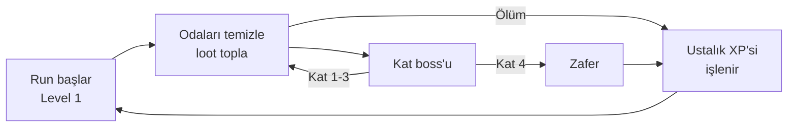

# Zindan Oyunu — Tasarım Dokümanı (GDD)

Sep 23, 2026 · @Mustafa · Son güncelleme: 27 Eyl 2026 (Aşama 10, oyun testi düzeltmeleri v0.10.1 ve v0.10.2)

Bu doküman oyunun tam tasarımı ve yapım planıdır. Tüm sayılar başlangıç değerleridir ve oyun testlerinde ayarlanır.

## Genel Bakış

Tamamen emekle ilerlenen, öl-baştan-başla (roguelike) bir 2D izometrik zindan oyunu. Zindan temizlenir, loot toplanır ve kalıcı silah ustalığı sayesinde her run'da biraz daha güçlü dönülür.

| Konu | Karar |
| --- | --- |
| Motor | Godot 4 |
| Kamera | İzometrik |
| Görsel | Blender'da modellenip 8 yönden render edilen 3D görünümlü sprite'lar, normal map ile dinamik ışık. Görsel yön: karanlık, kanlı, vahşi (Aşama 8) |
| Platform | Windows .exe ve Linux (x86_64; v0.10.3'ten beri) |
| Hedef içerik | \~100 silah, 4 ırk, 55 sıradan düşman, 20 boss, 4 etap |

100 silah ve 55 düşman veri odaklı üretilir: \~12 temel silah tipi ve \~15-18 temel düşman modeli, element, özellik ve varyantlarla çoğaltılır. Yeni içerik eklemek bir tabloya satır eklemek kadar kolay olmalıdır.

## Temel Döngü ve Run Yapısı

Her run level 1'de, yalnızca ırkın başlangıç silahıyla başlar (diğer 3 slot boş). Başlangıç silahı ırk seçim ekranında ırkın kendi ailesindeki 3 tipten biri olarak seçilir, hep Yaygın ve level 1'dir (v0.10.1). Ölünce yalnızca silah tipi ustalığı ve boss ilk kesiş bonusları kalır.


```mermaid
flowchart LR
  A[Run başlar<br/>Level 1] --> B[Odaları temizle<br/>loot topla]
  B --> C[Kat boss'u]
  C -->|Kat 1-3| B
  C -->|Kat 4| D[Zafer]
  B -->|Ölüm| E[Ustalık XP'si<br/>işlenir]
  D --> E
  E --> A
```

| Run sonunda | Ne olur |
| --- | --- |
| Oyuncu leveli (maks 80) | Sıfırlanır |
| Tüm silahlar, tılsımlar, eşyalar | Kaybolur |
| Boss'un run içi ödülü | Kaybolur |
| Silah tipi ustalığı (maks 12) | Kalır |
| Boss ilk kesiş bonusu (+%0,3 hasar) | Kalır |

## Kontroller ve Slotlar

WASD ile yürünür, saldırılar farenin gösterdiği yöne gider. Oyuncunun 4 slotu var ve **envanterin tamamı bu 4 slottur; çanta yoktur**. ~~Slotlar arası değişim ve yerden eşya alma yalnızca oda dışında yapılabilir.~~ **v0.10.1:** envanter savaş sırasında da düzenlenebilir (I ile açılır, oyun durur; bağışık düşmana karşı silah değiştirmek için). Yerden eşya alma yine yalnızca oda dışında (koridorda ya da temizlenmiş odada).

| Tuş | İşlev |
| --- | --- |
| WASD | Yürüme |
| Fare | Nişan (tüm saldırılar fare yönüne) |
| Sol tık | Aktif silahın normal saldırısı |
| Sağ tık | Aktif silahın güçlü saldırısı |
| Q | Birinci ırk yeteneği |
| E | İkinci ırk yeteneği |
| Space | Klasik atılma (tüm ırklarda aynı) |
| Tab | İki aktif silah arasında anında geçiş |
| 1 | İksir |
| F | Etkileşim (loot, kapı, tüccar) |
| I | Envanter: 4 slot (Aşama 5; açıkken oyun durur; v0.10.1'den beri savaşta da düzenlenir) |
| 1 / 2 (ödül ekranında) | Level ya da boss ödülünden birini seçme (Aşama 6; kartlara tıklamak da olur, açıkken oyun durur). v0.10.1: ekran açıldıktan sonra 1,2 sn tıklama ve tuşlar çalışmaz (kartlar soluk/kilitli) |
| O | Ses ayarları: ana ses, müzik, efektler, arayüz, sessiz (Aşama 9; açıkken oyun durur, O ya da Esc kapatır) |
| Esc | Duraklatma menüsü: devam, ses ayarları, ana menüye dön, oyundan çık (Aşama 10; açıkken oyun durur) |
| F5 | Geliştirici (hata ayıklama) menüsü — gizli kısayol (Aşama 10; eskiden M). v0.10.1: kat düğmeleri ve "Bu kata ışınlan" |

| Slot | Ne konur | Etkisi |
| --- | --- | --- |
| Aktif silah 1 | Açık silah | Tam güçle kullanılır |
| Aktif silah 2 | Açık silah | Tam güçle kullanılır, savaşta tuşla geçilir |
| Rezonans | Kilitli ya da açık silah | Kilitliyken normal saldırısının %10'u, açıkken %7'si kadar ek hasar |
| Esnek | Silah (kilitli ya da açık) veya tılsım | Silahsa pasifinin %9'u, tılsımsa tılsımın tam etkisi |

Çanta yoktur: taşınabilen her şey bu 4 slottur. Yeni bir eşya almak için uygun boş slot gerekir; yoksa yerdeki eşya bir slottakiyle değiştirilir ve eskisi geride kalır. Böylece oyuncu istemese de çok eşya bırakmak zorunda kalır (Aşama 5).

## Zindan

Zindan 4 etaptan oluşur ve her etapta daha derine inilir. Harita yapısı (odalar, duvarlar, engeller) her run'da prosedürel olarak yeniden üretilir.

| Etap | Tema | Bulunan silah leveli | Not |
| --- | --- | --- | --- |
| 1 | Damarlı Mağara: bazı bölümlerinde duvarlarda damarlar ve gözler; iskeletler, fareler | 1 |  |
| 2 | Mantar Mağaraları: zehir, böcekler | 10 |  |
| 3 | Kül Dökümhanesi: ateş, taş golemler | 25-40 | Efsanevi silahlar buradan itibaren düşer (sandıklarda v0.10.1'den beri 1-2. katta da düşük şansla) |
| 4 | Boşluk: gölge, hayaletler | 50 |  |

Her etabın 5 boss'luk bir havuzu vardır ve her run'da bu havuzdan rastgele biri çıkar. 20 boss'un hepsini görmek için birçok run gerekir.

## Irklar

4 ırk var: Warrior, Ghost, Archer, Magical. Her ırk her silahı kullanabilir. Kendi silah ailesinde en iyidir, diğer ailelerde küçük bir ayar yer.

| Irk | Silah ailesi | Q | E | Kaynak | Pasif |
| --- | --- | --- | --- | --- | --- |
| Warrior | Kılıç, balta, demir yumruk | Kalkan Hücumu: ileri atılır, yolundaki düşmanlara vurur, iter ve sersemletir (Aşama 6'da Zırh'ın yerine) | Yer sarsıntısı: önündeki alana büyük hasar | Enerji | Yüksek can ve zırh |
| Ghost | Tırpan, hançer, gürz | Faz: maks 1 sn dokunulmaz ve düşmanlara görünmez | Gölge adımı: hedef düşmanın arkasına ışınlanır | Yok (bekleme süresi) | Fiziksele dirençli, ateşe zayıf; özel iyileşme kuralı |
| Archer | Yay, arbalet, mızrak | Geri sıçrama: geriye atılırken önüne 3 ok atar | Ok yağmuru: seçilen alana çoklu ok | Yok (bekleme süresi) | Menzil ve kritik bonusu |
| Magical | Kitap, asa, rün | Uçuş: kısa süre engel ve tuzakların üstünden uçar | Element fırtınası: aktif silahın elementinde alan hasarı | Mana | Element hasarı yüksek, can düşük |

Yakın ırklar (Warrior-Ghost, Archer-Magical) arasında ceza küçük, uzak ırklar arasında büyüktür. Ceza, o ırkın silahla birleşince bozacağı güce göre seçilir: tank ırklar uzak silahta can kaybeder, kırılgan ırklar yakın silahta biraz can kazanıp hasar ya da hız kaybeder.

| Irk ↓ / Silah ailesi → | Warrior | Ghost | Archer | Magical |
| --- | --- | --- | --- | --- |
| Warrior | 0 | −%5 saldırı hızı | −%25 maks can | −%20 maks can, −%10 element |
| Ghost | −%5 saldırı hızı | 0 | −%20 maks can | −%15 maks can, −%10 element |
| Archer | +%10 can, −%15 hasar | +%10 can, −%10 hasar | 0 | −%8 hasar |
| Magical | +%15 can, −%15 saldırı hızı | +%10 can, −%15 saldırı hızı | −%8 hasar | 0 |

Değerler başlangıç noktasıdır, oyun testlerinde ayarlanır. Ustalık ırktan bağımsızdır: Warrior ile yay kullanılırsa Yay ustalığı yine artar.

## Oyuncu Leveli ve Silah Leveli

Oyuncu her run'da level 1'den başlar ve en fazla 80'e çıkar. Silahlar da en fazla 80 level olur ve her 5 levelde istatistikleri +%5 artar.

- **Silah stat artışı:** Her 5 levelde oran yenilenir, üst üste katlanmaz: level 5'te +%5, level 10'da +%10 … level 80'de +%80. Oran her zaman silahın temel değerine uygulanır.
- **Yetişme XP'si:** Oyuncunun levelinin altındaki silah, oyuncunun kazandığı XP'nin 1,5 katını alır (oyuncu 100 XP alırsa silah 150 alır). Oyuncunun levelini yakalayınca normal hıza döner. Bu kural her katta aynıdır.
- **Kilitli silah:** Oyuncunun levelinden yüksek silah, oyuncu o levele gelene kadar kilitli kalır ve aktif slotta kullanılamaz. Rezonans ya da Esnek slota konabilir veya geride bırakılabilir.

**Level hedefi:** 1. kat 1→15 · 2. kat 15→35 · 3. kat 35→55 · 4. kat 55→80. XP eğrisi bu aralıklara göre ayarlanır.

### XP eğrisi

Bir sonraki levele gereken XP = 100 + 20 × mevcut level. Düşman XP'leri, her katın hedef level aralığına tam denk gelecek şekilde ayarlandı: katın tüm düşmanları ve boss'u kesilirse oyuncu katın hedef üst levelinde çıkar.

| Kat | Level aralığı | Gereken toplam XP | Normal düşman | Elit | Boss | Tahmini normal düşman sayısı |
| --- | --- | --- | --- | --- | --- | --- |
| 1 | 1→15 | 3.500 | 40 | 150 | 800 | \~60 |
| 2 | 15→35 | 11.800 | 120 | 500 | 2.400 | \~70 |
| 3 | 35→55 | 19.800 | 180 | 900 | 3.600 | \~80 |
| 4 | 55→80 | 36.000 | 280 | 1.800 | 7.200 | \~90 |

Kat başına 2 elit varsayılmıştır. Odaları atlayan oyuncu hedefin altında kalır; Deneyim kazanımı ödülleri bu açığı kapatır.

## Run İçi Ödüller

Run içinde iki ödül kaynağı var. İkisinde de kendi havuzundan gelen 2 seçenekten biri seçilir ve ödüller run bitince gider.

| Kaynak | Ne zaman | Havuz | Örnek |
| --- | --- | --- | --- |
| Level ödülü | Her 5 levelde (run başına 16 kez) | Küçük stat artışları | +%5 saldırı hızı |
| Boss ödülü | Her boss kesişinde | Büyük stat artışları ve saldırıyı değiştiren özellikler | +%10 saldırı hızı; çift vuruş; saldırıya küçük ek mermi |

### Level ödül havuzu

Küçük ve tekrar seçilebilir stat artışları. Her 5 levelde havuzdan rastgele 2 tanesi sunulur; tavana ulaşan stat artık çıkmaz.

| Ödül | Değer |
| --- | --- |
| Saldırı hızı | +%5 |
| Hasar | +%5 |
| Element hasarı | +%6 |
| Skill hasarı (sağ tık, Q, E) | +%5 |
| Maks can | +%8 |
| Kritik şansı | +%3 |
| Kritik hasarı | +%10 |
| Saldırı menzili | +%4 |
| Hareket hızı | +%4 |
| Bekleme süresi azaltma | +%3 |
| Space bekleme süresi azaltma | +%5 |
| Hasar azaltma | +%3 |
| Can emme | +%1 |
| Deneyim kazanımı | +%8 |
| Altın bulma | +%10 |

### Boss ödül havuzu

İki tür ödül var. Her boss sonrası sunulan 2 seçenekten biri büyük stat artışı, diğeri özel etki olur. Böylece oyuncu her seferinde "güvenli güç mi, build değiştiren etki mi" kararı verir. Özel etkiler bir run'da yalnızca bir kez alınabilir.

| Büyük stat (tekrar seçilebilir) | Değer |
| --- | --- |
| Saldırı hızı | +%10 |
| Hasar | +%12 |
| Element hasarı | +%15 |
| Skill hasarı (sağ tık, Q, E) | +%15 |
| Maks can | +%20 |
| Kritik şansı | +%8 |
| Kritik hasarı | +%25 |
| Saldırı menzili | +%10 |
| Hareket hızı | +%10 |
| Bekleme süresi azaltma | +%8 |
| Hasar azaltma | +%8 |
| Can emme | +%3 |

| Özel etki (run başına bir kez) | Etkisi |
| --- | --- |
| Çift vuruş | Normal saldırı %25 ihtimalle iki kez vurur |
| Ek mermi | Normal saldırı %30 hasarlı küçük bir mermi daha fırlatır (yakın silahta kılıç dalgası) |
| Delici | Mermiler ve dalgalar 1 düşmanı deler |
| Element izi | Space sonrası aktif silahın elementinde yerde iz kalır |
| Kombo ustası | Kombo hasarı +%30 |
| Kritik zinciri | Kritik vuruş %20 ihtimalle sağ tık, Q ve E beklemelerini 1 sn azaltır |
| Rezonans güçlendirme | Rezonans bonusu kilitliyken %15, açıkken %10 olur |
| Hiddet | Öfke tavanı %6'dan %10'a çıkar |
| Cellat | İnfaz eşiği +%2 (boss'larda +%1) |
| Yedek iksir | İksir kapasitesi +1 ve tüm iksirler dolar |
| İkinci şans | Ölünce bir kez %30 canla dirilir |

## Silah Tipi Ustalığı

Ustalık, silahın kendisine değil silah tipine (Kılıç, Yay, Asa…) bağlıdır ve oyunda kalıcı olan tek ilerlemedir. Maks level 12'dir.

| Bonus | Level başına | Level 6 | Level 12 |
| --- | --- | --- | --- |
| Hasar | +%5 | +%30 | +%60 |
| Saldırı hızı | +%3,33 | +%20 | +%40 |
| Saldırı menzili | +%1,67 | +%10 | +%20 |
| Element hasarı | +%2,5 | +%15 | +%30 |

**XP dağılımı:** Run boyunca ustalık XP'si birikir ve run bitince işlenir. XP, verilen toplam hasarın silah tiplerine göre yüzdesiyle bölünür. Örneğin hasarın %70'i kılıçtan, %30'u yaydan geldiyse XP de aynı oranda gider.

**XP eğrisi:** Referans birimi 1 maç = 100 XP, yani 2. katı tamamlayıp ölen bir oyuncunun kazancı.

| Level | Gereken maç | Gereken XP | Toplam maç |
| --- | --- | --- | --- |
| 1 → 2 | 3 | 300 | 3 |
| 2 → 3 | 4 | 400 | 7 |
| 3 → 4 | 6 | 600 | 13 |
| 4 → 5 | 8 | 800 | 21 |
| 5 → 6 | 12 | 1.200 | 33 |
| 6 → 7 | 12 | 1.200 | 45 |
| 7 → 8 | 13 | 1.300 | 58 |
| 8 → 9 | 13 | 1.300 | 71 |
| 9 → 10 | 13 | 1.300 | 84 |
| 10 → 11 | 14 | 1.400 | 98 |
| 11 → 12 | 16 | 1.600 | 114 |

**Derinlik çarpanı:** 1. katta ölüm ×0,1 · 2. katta ölüm ×0,3 · 2. katı bitirme ×1,0 · 3. katta ölüm ×1,5 · 4. katta ölüm ×2,0 · zafer ×3,0.

## Rezonans ve Esnek Slot

Kilitli silahlar çöp değildir: iki özel slot sayesinde kullanılamazken bile güç verirler. Bu, "çok istediğim silahı taşıyıp kilidini açmayı bekleyeyim mi, geride mi bırakayım?" kararını doğurur.

- **Rezonans slotu (1 adet):** Kilitli ya da açık silah konur. Kilidi açılan silah slotta kalabilir, ancak bonus %10'dan %7'ye düşer. Aktif silah her vuruşta, kilitli silahın normal saldırısının %10'u kadar ek hasarı onun elementiyle verir. Örneğin zehirli kılıç ve kilitli yıldırım asasıyla her vuruşta zehir arttı küçük bir yıldırım.
- **Esnek slot (1 adet):** Silah konursa (kilitli ya da açık) pasif özelliğinin %9'u işler. Tılsım konursa tılsımın kendi etkisi tam işler.
- **Bağışıklık geçerlidir:** Rezonans hasarı da bağışıklık kurallarına uyar. Taş düşmana yıldırım rezonansı işlemez (Rezonans bir ek etkidir: v0.10.1 kuralıyla bağışıklıkta 0).
- **İstifleme yok:** Tek Rezonans slotu vardır; ikinci bir kilitli silah ancak Esnek slotta (pasifinin %9'u) taşınabilir, fazlası geride kalır.

### Tılsımlar (ilk sürüm)

| Tılsım | Etkisi |
| --- | --- |
| Kan Taşı | Her öldürme 10 sn boyunca +%2 hasar verir, maks 5 yığın |
| Rüzgâr Tüyü | Space bekleme süresi %30 azalır; atılmadan sonra 2 sn +%15 hareket hızı |
| Element Kalbi | Bir kombo tetiklenince 3 sn boyunca +%20 element hasarı |

## Elementler, Özellikler ve Kombolar

6 element ve 5 özellik vardır. Elementler bağışıklık ve kombo sistemine girer. Özellikler herhangi bir elementle birleşir (örn. "Öfkeli Buz Kılıcı", "İnfazcı Zehir Hançeri"). 12 silah tipi × 6 element × 5 özellik × nadirlik ile 100 silah hedefi rahatça aşılır.

| Element | Tek başına etkisi |
| --- | --- |
| Ateş | Yanma: süreli hasar |
| Su | Islatma: kendi hasarı düşük, kombo hazırlar |
| Yıldırım | Yakındaki düşmana zincirleme sıçrar |
| Zehir | İstiflenen süreli hasar |
| Buz | Yavaşlatma, istiflenince kısa süre dondurur |
| Karanlık | Hedefe arkasından vurulursa +%10 hasar; kısa süreli Gölge işareti bırakır |

| Özellik | Etkisi |
| --- | --- |
| Öfke | Aynı hedefe her vuruşta +%1 hasar, hedef başına ayrı birikir, maks %6 |
| İnfaz | Hedefin canı %7'nin altına düşünce anında öldürür; boss'larda eşik %3 |
| Can Emme | Verilen hasarın %3'ü can olarak döner |
| Sekme | Vuruş %35 ihtimalle yakındaki ikinci düşmana %50 hasarla seker |
| Sersemletme | Vuruş %8 ihtimalle hedefi 0,8 sn sersemletir; boss'larda bunun yerine 1 sn yavaşlatır |

**Kombolar:** Hedefin üzerinde bir element varken ikinci bir elementle vurulursa kombo tetiklenir ve ilk element tüketilir.

| Kombo | Sonuç |
| --- | --- |
| Su + Yıldırım | Elektroşok: tüm ıslak düşmanlara zincirleme hasar |
| Ateş + Buz | Erime: büyük tek seferlik hasar |
| Su + Buz | Donma: hedef 2 sn donar |
| Donmuş + Yıldırım | Kırılma: garantili kritik vuruş |
| Ateş + Zehir | Zehir Patlaması: alan hasarı |
| Ateş + Su | Buhar: hedeflerin isabeti düşer |
| Zehir + Karanlık | Çürüme: iyileşme engellenir, zehir hasarı iki katına çıkar |

Boss'lar dondurulduktan sonra 8 sn donmaya bağışık olur. İki aktif silah arasında geçiş komboların ana aracıdır: Su yayıyla ıslat, Yıldırım asasına geç, Elektroşok patlat.

## Düşmanlar, Boss'lar ve Bağışıklık

55 sıradan düşman \~15-18 temel modelin varyantlarından (taş, zehirli, elit, hayalet sürümü) üretilir. 20 boss, etap başına 5'erli havuzlara bölünür ve her birinin özel bir mekaniği olur.

### İlk düşman listesi

17 temel düşman, 5 rolde: yakın dövüş, uzak, sürü, tank, destek. Her birinin elit sürümü (daha büyük, bir auralı) ve katlar arası element varyantlarıyla 55'e tamamlanır (Aşama 7'de yapıldı: 17 temel + 17 elit + 21 malzeme varyantı; ayrıntılar Uygulamada Verilen Kararlar > Düşmanlar ve boss'lar).

| Kat | Düşman | Rol | Davranış | Bağışık |
| --- | --- | --- | --- | --- |
| 1 | İskelet Savaşçı | Yakın | Oyuncuya yürür, basit kılıç darbesi | — |
| 1 | İskelet Okçu | Uzak | Mesafe korur, tek ok atar | — |
| 1 | Mağara Faresi | Sürü | 5-8'li gruplar, hızlı ve zayıf | — |
| 1 | Göz Yavrusu | Uzak | Duvara yapışık durur, kısa ışın atar | — |
| 1 | Damar Kütlesi | Tank | Yavaş, ölünce etrafına patlar | — |
| 2 | Sporlu Böcek | Sürü | Ölünce zehir bulutu bırakır | Zehir |
| 2 | Mantar Adam | Tank | Yavaş, geniş yumruk | Zehir |
| 2 | Zehir Tükürücü | Uzak | Yerde zehir birikintisi bırakan tükürük | Zehir |
| 2 | Mantar Şifacı | Destek | Yakındaki düşmanları iyileştirir, öncelikli hedef | Zehir |
| 3 | Taş Golemcik | Tank | Zırhlı, yavaş, yere vurur | Yıldırım |
| 3 | Kor Köpeği | Yakın | Sürü halinde hızlı saldırır | Ateş |
| 3 | Cüruf Büyücüsü | Uzak | Ateş topu atar, yere lav bırakır | Ateş |
| 3 | Demir Muhafız | Yakın | Kalkanı önden hasarı engeller; arkadan vurulmalı | Yıldırım |
| 4 | Gölge | Yakın | Kısa süre görünmezleşip arkadan saldırır | Fiziksel |
| 4 | Feryatçı | Uzak | Çığlığı yavaşlatır | Fiziksel |
| 4 | Boşluk Kulu | Tank | Karanlık hasarı, oyuncuyu kendine çeker | Karanlık |
| 4 | Boşluk Çağırıcı | Destek | Sürekli Gölge çağırır, öncelikli hedef | Fiziksel |

**Boss ödülü:**

- Her kesişte boss ödül havuzundan gelen 2 seçenekten biri seçilir (Run İçi Ödüller bölümü)
- Her kesişte 1 silah düşer; nadirliği katın normal düşme oranlarıyla çıkar (garanti yüksek nadirlik yok; ör. 3. katta efsanevi %5). **İstisna (v0.10.1): Kordrak** kesilince %65 ihtimalle 1 Efsanevi YA DA %35 ihtimalle 2 Destansı silah düşer, silah leveli en az 40
- İlk kesişte ayrıca kalıcı +%0,3 hasar (20 boss ile maks +%6)

**Bağışıklık:** Her düşmanın malzemesine göre elementlere karşı Bağışık, Dirençli ya da Zayıf durumu vardır. Bağışık olunan element, o elementle efsunlu silahları ve Rezonans hasarını da kapsar.

**Bağışıklık kuralı (v0.10.1; eskiden bağışık = 0 hasar):** bağışık düşmana **ana silahla yapılan vuruşlar** (sol tık, sağ tık, Q, E ve bunların mermi/alanları) hasarın **%75**'ini verir. **Pasif ve ek etkiler** — element durumu, süreli hasar (yanma, zehir), kombolar, Yıldırım zinciri, özellikler (Öfke, İnfaz, Can Emme, Sekme, Sersemletme; ödüllerden can emme dahil), efsanevi pasifler, Rezonans ve diğer ikincil vuruşlar — bağışıklıkta **0 vurur ve uygulanmaz**. Vuruşta hasar sayısının yanında küçük "BAĞIŞIK" yazısı çıkar (ek etki işlemedi); yalnızca ek etki vurduğunda (0 hasar) eskisi gibi yalnızca "BAĞIŞIK" görünür. Fiziksel bağışıklık da aynı kurala uyar (tek kural).

| Düşman türü | Bağışık | Zayıf |
| --- | --- | --- |
| Taş | Yıldırım | Buz |
| Hayalet | Fiziksel | Ateş |
| Ateş elementali | Ateş | Buz, Su |

~~Yaygın (elementsiz) silahlar hayaletlere %25 hasar verir.~~ v0.10.1'den beri yaygın silahlar da fiziksele bağışık hayaletlere her bağışıklık gibi %75 vurur. Haksız run'ları önlemek için düşmanın üstünde bağışıklık ikonu görünür, oyuncunun her zaman ikinci bir aktif silahı vardır ve envanter savaşta da düzenlenebilir (v0.10.1).

## Boss'lar (İlk Sürüm)

İlk sürümde her katta 1 boss var; kat havuzları sonradan 5'er boss'a tamamlanır. Her boss'un %50 canda başlayan ikinci fazı ve bir elementi ödüllendiren özel bir mekaniği vardır. Saldırıların hepsi yerde kırmızı işaretle önceden gösterilir.

| Kat | Boss | Bağışık | Zayıf |
| --- | --- | --- | --- |
| 1 | Morvath, Ana Göz | — | Yıldırım |
| 2 | Mycela, Spor Kraliçesi | Zehir | Ateş |
| 3 | Kordrak, Erimiş Demirci | Yıldırım | Buz |
| 4 | Nyx'thar, Yankısız | Fiziksel | Ateş |

### 1. Kat — Morvath, Ana Göz

**Görünüş:** Mağara duvarına gömülü, 3-4 oyuncu boyunda ıslak ve etli bir göz kütlesi. Çevresinden zemine ve duvarlara nabzı atan kırmızı-mor damarlar yayılır; duvarlarda 3 küçük göz vardır. Hareket etmez, arena onun etrafındaki yarım daire şeklindeki mağara odasıdır.

| Saldırı | Ne yapar | Nasıl kaçınılır |
| --- | --- | --- |
| Bakış Işını | Arenayı yavaşça tarayan döner ışın | Space ile ışının içinden geçmek ya da kaya sütunların arkasına saklanmak |
| Damar Kırbacı | Zeminde çizgiler halinde damarlar fışkırır | Kırmızı çatlak işaretlerinden çıkmak |
| Göz Yavruları | 4-6 küçük sürünen göz doğurur | Alan hasarıyla temizlemek |

**Özel mekanik — Kapanan Göz Kapağı:** Morvath düzenli olarak göz kapağını kapatır ve hasar almaz. Duvardaki 3 küçük göz kırılınca kapak açılır ve 6 sn boyunca %50 fazla hasar alır. Islak damarlar yıldırımı iletir: yıldırım hasarı duvardaki gözlere de sıçrar.

**2. faz (%50):** Damarlar nabzı hızlanır ve zeminin bazı bölgeleri sürekli hasar verir. Bakış Işını ikiye bölünür ve ters yönlere döner.

### 2. Kat — Mycela, Spor Kraliçesi

**Görünüş:** Mantardan yapılmış, uzun ve ince insansı bir gövde; başında geniş, altı parlayan yeşil-mor bir mantar şapkası. Kolları kök gibi yere uzanır, etrafında sürekli toz halinde sporlar uçuşur. Arena, yer yer büyük mantarların olduğu yuvarlak bir mağara.

| Saldırı | Ne yapar | Nasıl kaçınılır |
| --- | --- | --- |
| Spor Bulutu | Arenada birkaç saniye kalan zehirli bulutlar bırakır | Bulutlardan uzak durmak |
| Kök Patlaması | Oyuncunun altından sırayla kökler fışkırır | Sürekli hareket etmek |
| Spor Oku | Oyuncuya doğru yelpaze şeklinde 5 spor fırlatır | Aralarındaki boşluğa girmek |

**Özel mekanik — İyileştiren Mantarlar:** Mycela arenaya 3 mantar totemi diker; totemler yaşadıkça onu iyileştirir. Totemler öncelikli hedeftir. **v0.10.1:** totemler savaşta **yalnızca bir kez**, Mycela'nın canı **%20**'ye inince dikilir; kırılınca yeniden dikilmez. Ateş, spor bulutlarını yakıp yok eder; üzerinde zehir olan bulut ateşle vurulursa Zehir Patlaması tetiklenir ve boss'a da hasar verir.

**2. faz (%50):** Arena yavaşça sporla dolar; temiz hava alanları küçülür. Mycela köklerini çekip arenada hızla yer değiştirmeye başlar.

### 3. Kat — Kordrak, Erimiş Demirci

**Görünüş:** Kara taştan yontulmuş, iri omuzlu bir golem. Göğsünde turuncu parlayan erimiş bir çekirdek, vücudunda demir zırh plakaları, elinde örs başlı dev bir çekiç. Arena, zemininde lav kanalları olan bir dökümhane salonu.

| Saldırı | Ne yapar | Nasıl kaçınılır |
| --- | --- | --- |
| Örs Darbesi | Çekici yere vurur, genişleyen bir şok halkası yayılır | Space ile halkanın üzerinden atlamak |
| Lav Dolumu | Zemindeki kanalları lavla doldurur | Kanalların dışında durmak |
| Kor Yumruğu | Oyuncuya doğru hızlı bir atılım ve yumruk | Yana kaçmak |

**Özel mekanik — Soğutma:** Zırh plakaları gelen hasarı ~~%70~~ **%50** azaltır (v0.10.1; Kordrak'ın canı da 42.000 → 21.000: buzsuz silahlarla da yenilebilsin). Buz hasarı plakaları soğutur; 5 buz yığınında plakalar kırılır ve zırh 10 sn boyunca kalkar. Ateş + Buz Erime kombosu zırhsız Kordrak'a çok büyük hasar verir. Taş gövdesi nedeniyle yıldırım işlemez.

**2. faz (%50):** Plakalar kalıcı olarak düşer, çekirdek açığa çıkar. Kordrak hızlanır ve her Örs Darbesi'nden sonra etrafa ateş topları saçar.

### 4. Kat — Nyx'thar, Yankısız (final boss'u)

**Görünüş:** Havada süzülen, yırtık bir pelerine benzeyen uzun bir hayalet. Yüzünün yerinde boş bir karanlık ve içinde sönmeyen tek bir soluk ışık; alt kısmı duman gibi dağılır. Arena, uçurumla çevrili, kenarlarında meşale tutacakları olan yürünebilir bir taş platform.

| Saldırı | Ne yapar | Nasıl kaçınılır |
| --- | --- | --- |
| Gölge Kopyaları | 3 kopyaya bölünür; gerçek olanın tek farkı yere gölge düşürmesidir | Gerçek olanı bulmak; sahteye vurmak onu oyuncunun yanına ışınlar |
| Boşluk Yırtığı | Oyuncuyu içine çeken portallar açar | Çekime karşı yürümek ya da Space |
| Çığlık | Etrafındaki alana gecikmeli patlama | İşaret dolmadan alanı terk etmek |

**Özel mekanik — Karanlık Perdesi:** Nyx'thar arenayı karartır; yalnızca yanan meşalelerin çevresi güvenlidir, karanlıkta durmak canı yavaşça eritir. Ateş hasarı sönmüş meşaleleri yeniden yakar. Hayalet olduğu için fiziksele bağışıktır (v0.10.1'den beri yaygın silahlar da bağışıklık kuralıyla %75 vurur; eskiden %25).

**2. faz (%50):** Platformun kenarları uçuruma çöker ve arena küçülür. Gölge Kopyaları 5'e çıkar ve kopyalar da Boşluk Yırtığı açabilir.

## Skill Sistemi

Her silahın iki saldırısı var: sol tık normal saldırı, sağ tık güçlü saldırı. Irkın iki yeteneği Q ve E'de (Irklar bölümü). Space tüm ırklarda aynı klasik atılmadır.

### Silah tipleri

Warrior silahları hızlı ve kısa menzilli, Ghost silahları kısa menzilli ve yüksek hasarlı, Archer silahları uzun menzilli, yavaş-orta hızlı ve biraz düşük hasarlı, Magical silahları orta menzilli ve standart hasarlıdır. Menzil karo cinsindendir; hasar = nadirlik temel hasarı × çarpan.

| Tip | Aile | Saldırı/sn | Menzil | Hasar çarpanı | Güçlü saldırı (sağ tık) |
| --- | --- | --- | --- | --- | --- |
| Kılıç | Warrior | 1,4 | 1,5 | ×1,0 | Dönen kesik: etrafındaki herkese hasar |
| Balta | Warrior | 1,1 | 1,6 | ×1,25 | Balta fırlatma: geri dönen balta |
| Demir yumruk | Warrior | 2,0 | 1,0 | ×0,7 | Seri yumruk: 5 hızlı yumruk, sonuncusu sersemletir |
| Tırpan | Ghost | 0,9 | 2,0 | ×1,5 | Hasat: geniş yay, arkadan vurulanlara +%20 |
| Hançer | Ghost | 1,6 | 1,0 | ×0,9 | Saplama: ileri atılıp hedefin arkasından vurma |
| Gürz | Ghost | 0,7 | 1,4 | ×1,9 | Yere vuruş: alan hasarı ve yavaşlatma |
| Yay | Archer | 0,9 | 9 | ×0,9 | Güçlü atış: basılı tutunca dolan delici ok |
| Arbalet | Archer | 0,6 | 10 | ×1,3 | Saçma: yelpaze şeklinde 5 cıvata |
| Mızrak | Archer | 0,8 | 3,5 | ×1,0 | Fırlatma: uzağa saplınır, tekrar basınca geri döner |
| Kitap | Magical | 1,2 | 5 | ×0,85 | Güdümlü sayfalar: hedef arayan 4 mermi |
| Asa | Magical | 1,0 | 6 | ×1,0 | Element küresi: çarpınca patlayan büyük küre |
| Rün | Magical | 0,8 | 5 | ×1,2 | Rün tuzağı: üzerine basılınca patlayan rün alanı |

### Kaynaklar

| Irk | Kaynak | Nasıl çalışır |
| --- | --- | --- |
| Warrior | Enerji, sabit 100 | Q 40, E 70 enerji harcar. Saniyede 10 dolar, her isabetli vuruşta +2. Sağ tık bekleme süreli (5-7 sn). |
| Magical | Mana: 120 + level × 4 (level 80'de 440) | Sağ tık 45, Q 55, E 75 mana harcar; **normal vuruş (sol tık) mana harcamaz** (v0.10.2; eskiden sol 1, sağ 55, Q 65, E 90). Saniyede maks mananın %3'ü dolar, enerjiden yavaş. Maks levelde arka arkaya karışık 7 skill (yalnızca sağ tıkla 9) atılabilir (eskiden 5-6). |
| Archer | Yok | Sağ tık 6 sn, Q 8 sn, E 18 sn bekleme süresi |
| Ghost | Yok | Sağ tık 5 sn, Q 12 sn, E 10 sn bekleme süresi |

Magical dışındaki bir ırk kitap, asa ya da rün kullanırsa silah mana yerine bekleme süresiyle çalışır; bu süreler normalin 1,5 katıdır.

### Irk başlangıç statları

| Irk | Can (level 1) | Level başına can | Hareket hızı | Zırh |
| --- | --- | --- | --- | --- |
| Warrior | 150 | +6 | 1,0 | %15 |
| Ghost | 100 | +4 | 1,1 | %0 |
| Archer | 90 | +3,5 | 1,05 | %0 |
| Magical | 80 | +3 | 1,0 | %0 |

## Denge: Stat Tavanları

Bir run'da 16 level ödülü, boss ödülleri, silah leveli ve ustalık üst üste biner. Kontrolden çıkmaması için her statta tüm kaynakların toplamı bir tavanla sınırlıdır.

| Stat | Toplam tavan (başlangıç değeri) |
| --- | --- |
| Saldırı hızı | +%150 |
| Saldırı menzili | +%50 |
| Kritik şansı | %60 |
| Hasar azaltma | %75 |
| Bekleme süresi azaltma | %40 |

Hasarın tavanı yoktur, onun yerine düşmanlar ölçeklenir: her katta düşman canı ve hasarı, o katın hedef oyuncu level aralığına göre artar. Tavana ulaşan stat, ödül seçeneklerinde artık çıkmaz. Değerler oyun testlerinde ayarlanır.

## Nadirlik ve Efsanevi Silahlar

4 nadirlik seviyesi var. Nadirlik; temel hasarı, element ve özellik sayısını belirler.

| Nadirlik | Renk | Temel hasar | Element | Özellik | Ekstra |
| --- | --- | --- | --- | --- | --- |
| Yaygın | Gri | 100 | Yok (fiziksel) | Yok |  |
| Ender | Mavi | 125 | 1 | Yok |  |
| Destansı | Mor | 175 | 1 | 1 |  |
| Efsanevi | Turuncu | 260 | 1 | 1 veya 2 | Kendine özel pasif ve skill |

Temel hasar silah tipine göre bir çarpanla ayarlanır: hızlı silahlar (hançer, demir yumruk) daha düşük, yavaş silahlar (balta, gürz) daha yüksek vurur. Böylece saldırı başına değil saniye başına hasar dengelenir.

**Düşme oranları:**

| Kat | Yaygın | Ender | Destansı | Efsanevi |
| --- | --- | --- | --- | --- |
| 1 | %75 | %22 | %3 | %0 |
| 2 | %55 | %33 | %12 | %0 |
| 3 | %35 | %38 | %22 | %5 |
| 4 | %20 | %38 | %32 | %10 |

**Sandık oranları (v0.10.1):** sandıkların kendi tablosu vardır — 2. katta en az Ender (Nadir), 3. katta en az Destansı, 4. katta hep Efsanevi; ilk 2 katta efsanevi şansı düşük. Tüccar ve boss yukarıdaki tabloyu kullanır.

| Kat | Yaygın | Ender | Destansı | Efsanevi |
| --- | --- | --- | --- | --- |
| 1 | %70 | %25 | %4 | %1 |
| 2 | — | %70 | %27 | %3 |
| 3 | — | — | %70 | %30 |
| 4 | — | — | — | %100 |

Gizli oda sandığı bu tablonun üstüne üst nadirlik ×2 uygular (fark alttan düşülür; alt yetmezse Destansı'dan): 1. kat %65 / %25 / %8 / %2, 2. kat — / %40 / %54 / %6, 3. kat — / — / %40 / %60, 4. kat %100 Efsanevi.

**Silah nereden çıkar:** Düşmanlar (normal ve elit) silah düşürmez, yalnızca altın (ve nadiren iksir) düşürür. Kat boss'u kesilince 1 silah düşer ve nadirliği yukarıdaki (normal) tablodan çıkar (boss için garanti yüksek nadirlik yoktur; **istisna Kordrak**, v0.10.1: %65 1 Efsanevi ya da %35 2 Destansı, level en az 40). Silah ayrıca sandıklardan (sandık tablosu), gizli odadan ve tüccardan gelir. Gizli oda üst nadirlik (Destansı, Efsanevi) şanslarını iki katına çıkarır.

Efsanevi pasif örnekleri: her 5. vuruş gökten yıldırım indirir; öldürülen düşman elementinde patlar; bir kombo tetiklenince sağ tık, Q ve E bekleme süreleri sıfırlanır. Her efsanevi silahın adı ve pasifi elle tasarlanır.

## Ekonomi ve Oda Tipleri

Altın yalnızca run içinde harcanır ve ölünce gider. Her kat, savaş odalarının arasına serpiştirilmiş özel odalar içerir.

| Oda | Kat başına | İşlevi |
| --- | --- | --- |
| Savaş | Çoğunluk | Düşman dalgaları, loot ve altın |
| Elit | 1-2 | Güçlü tek düşman, daha çok altın (silah düşürmez) |
| Tüccar | 1 | Silah, tılsım ve iksir satın alma; slottaki eşyaları satma |
| Demirci | 1 | Altınla silah leveli atlatma ya da ek stat yeniden çekme |
| Sandık | 1-2 | Ücretsiz loot, bazen tuzaklı |
| Gizli oda | 0-1 | Duvar kırılarak bulunur, yüksek nadirlik şansı |
| Boss | 1 | Kat sonu; 1 silah düşürür |

Oda değişimi kuralı burada da geçerli: tüccar ve demirci odaları savaş dışı sayılır, slot değişimi yapılabilir.

## Can ve İyileşme

Can kıt bir kaynaktır: temel iyileşme sınırlı iksirler ve boss sonrası tam iyileşmedir.

- **İksir:** Run'a 2 iksirle başlanır, en fazla 3 taşınır. Her biri maks canın %40'ını doldurur. Yenisi tüccardan alınır ya da nadiren düşmandan düşer. Kullanım tuşu: 1.
- **Boss sonrası:** Kat boss'u kesilince can tamamen dolar.
- **Diğer kaynaklar:** Can emme ödülleri ve özellikleri, tılsımlar.
- Temizlenen odalarda otomatik iyileşme yoktur.

**Ghost istisnası (onaylandı):** Ghost iksir kullanamaz ve can emmeyle iyileşmez. Yalnızca iki yolla iyileşir: öldürdüğü her düşman maks canının %4'ünü (elit %10) doldurur, kat boss'u kesilince canı tamamen dolar. Ghost'ta can emme etkileri öldürme başına ek iyileşmeye dönüşür.

## Run Süresi

Tam bir run (4 kat, zafer) hedefi 30-45 dakikadır. Harita boyutu ve düşman sayısı buna göre ayarlanır.

| Kat | Hedef süre | Oda sayısı (boss dahil) |
| --- | --- | --- |
| 1 | 6-8 dk | 8 |
| 2 | 7-10 dk | 9 |
| 3 | 8-12 dk | 10 |
| 4 | 9-15 dk | 11 |

## Menüler ve Oyun Sonu

İlk sürümde yalnızca iki ekran var: Başla tuşu olan ana menü ve ırk seçim ekranı. Ustalık levelleri ve boss ilk kesiş bonusları otomatik kaydedilir. 4. kat boss'u kesilince "Kazandın" ekranı çıkar ve ana menüye dönülür. Ayrıntılı arayüz tasarımı ve hikâye sonraya bırakıldı.

**Yapıldı (Aşama 10):** Oyun ana menüyle açılır: **oyunun adı yazılmaz** (henüz ad yok), arka plan bir videodur (açılışta kanlı giriş bir kez, sonra kansız sakin döngü; müzik videonun sesi); düğmeler videoya gömülü YENİ OYUN, AYARLAR, ÇIKIŞ yazılarıdır (YÜKLE soluk, kayıtlı run yok). Başla → ırk seçimi (4 kart: animasyonlu sprite, statlar, Q/E, pasif, silah ailesi, başlangıç silahının ustalığı; v0.10.1'den beri her kartın altında başlangıç silahını seçen 3 düğme) → zindan. Esc duraklatma menüsünü açar; "Ana menüye dön" run'ı bırakır ve **ölüm sayılır**. Run bitince önce büyük "KAZANDIN" / "ÖLDÜN" başlığı (altından kan damlar), sonra run özeti; oradan yeni run ya da ana menü. Görünüş oyunun karanlık, kanlı tarzındadır (ayrıntılar: Uygulamada Verilen Kararlar > Menüler, denge ve teslim).

## Görsel Stil ve Efektler

Oyun 2D ama 3D gibi görünmeli ve vuruşlar iyi hissettirmelidir.

- **Görsel yön (Aşama 8):** Bu bir şövalye oyunu değil; karanlık, kanlı, vahşi ve kana susamış bir dünya. Soluk ve kirli renkler, kan lekeli giysiler ve silahlar, karanlıkta yanan gözler, karanlık zindan ve meşale ışığı. Her vuruşta kan fışkırır, yere leke düşer; ölen düşman büyük bir fışkırmayla yığılır, yerde kan gölü kalır. Referans: kapüşonlu, gözleri yanan, kanlı kılıçlı iri savaşçı.
- **Sprite üretimi:** Karakter ve düşmanlar Blender'da low-poly modellenir, animasyonlanır ve 8 yönden render alınarak sprite sheet'e dönüştürülür. Aynı render'dan normal map de çıkarılır.
- **Işık:** Meşaleler ve büyüler normal map sayesinde karakterleri dinamik olarak aydınlatır.
- **Shader'lar:** Vuruşta beyaz flaş, eriyerek ölme, outline, sis, su ve lav.
- **Vuruş hissi:** Hitstop (mikro donma), ekran sarsıntısı, uçan hasar sayıları, büyük ve renkli kritik yazısı, silah izi, kıvılcım ve kan partikülleri, savrulan düşmanlar.
- **Loot:** Düşen eşyanın nadirliğine göre ışık sütunu (efsanevi = turuncu).
- **Arayüz:** Godot'nun Control sistemiyle özel tema: envanter ızgarası, sürükle-bırak, stat karşılaştırmalı tooltip, skill çubuğu. Ekranlar kodlamadan önce mockup olarak tasarlanır.
- **Ses:** Ses efektleri kodla sentezlenir. Müzik için basit sentez ya da ücretsiz müzik kütüphaneleri kullanılır. Aşama 9'da efektler de müzik de numpy ile sentezlendi; ses yönü görselle aynıdır: ıslak et ve kemik kırılması, paslı demir, gırtlak gürlemeleri, taş zindan yankısı, uğultulu ve uyumsuz ambiyanslar, savaş davullu boss müzikleri (ayrıntılar: Uygulamada Verilen Kararlar > Ses).

## Açık Kararlar

- [ ] Oyunun adı
- [ ] Kalan 16 boss (kat başına 4)
- [ ] Hikâye ve lore
- [ ] Ayrıntılı arayüz tasarımı
- [x] Envanter: yalnızca 4 slot, çanta yok — Aşama 5
- [x] Silah düşmeleri: düşmanlar yalnızca altın, boss 1 silah (katın normal oranlarıyla) — Aşama 5
- [ ] Efsanevi silah listesi: Aşama 5'te 12 efsanevi önerildi (her tipten bir; ad, element, pasif, sağ tık eki — Uygulamada Verilen Kararlar > Loot ve envanter). Ad ve pasifler değiştirilebilir; liste zamanla genişletilir.
- [x] Ghost iksir kullanamaz (Aşama 3'te onaylandı)
- [x] Magical mana bedelleri düşürüldü: sol tık 1, sağ tık 55, Q 65, E 90 (Aşama 3 testinden sonra); v0.10.2'de yeniden: sol tık 0 (bedava), sağ tık 45, Q 55, E 75
- [x] Kontroller: WASD, fare nişan, sol/sağ tık silah, Q/E ırk, Space atılma
- [x] Kaynaklar: Warrior enerji, Magical mana, Archer ve Ghost bekleme süresi
- [x] Silah ailesi karakterleri (menzil, hız, hasar)
- [x] 3 tılsım, 17 temel düşman, XP eğrisi, 4 boss
- [x] Menüler: Başla ve ırk seçimi; zaferde "Kazandın"
- [x] Level ve boss ödül havuzları (15 + 12 stat, 11 özel etki)
- [x] Nadirlik: Yaygın 100, Ender 125, Destansı 175, Efsanevi 260
- [x] Magical'ın uçuşu, dört ırkın pasifleri
- [x] Silah stat artışı: her 5 levelde oran yenilenir, katlanmaz (maks +%80)
- [x] Oyuncu level hedefi: 1→15, 15→35, 35→55, 55→80
- [x] 3\. kat silah leveli 25-40
- [x] Ustalık XP'si derinlik çarpanları
- [x] Boss ilk kesiş bonusu +%0,3 (20 boss ile maks +%6)
- [x] 12 silah tipi: kılıç, balta, demir yumruk, tırpan, hançer, gürz, yay, arbalet, mızrak, kitap, asa, rün

## Uygulamada Verilen Kararlar

Yapım sırasında dokümanda sayısı ya da ayrıntısı olmayan yerler için verilen kararlar ve oyun testlerinden sonra yapılan değişiklikler. Hepsi `data/` dosyalarında `_default` notuyla işaretlidir ve oyun testlerinde ayarlanabilir. Bu bölüm dokümanın geri kalanıyla aynı ağırlıktadır.

### Oyun testinden sonra yapılan değişiklikler

| Aşama | Değişiklik |
| --- | --- |
| 1 | Vuruş hissi (hitstop, sarsıntı, flaş, savrulma) olduğu gibi onaylandı |
| 2 | Kombolar ve element sistemi olduğu gibi onaylandı |
| 3 | Ghost iksir kullanamaz (açık karar kapandı) |
| 3 | Magical mana bedelleri düşürüldü: sol tık 2 → 1, sağ tık 70 → 55, Q 80 → 65, E 110 → 90 |
| 4 | Zindan üretimi olduğu gibi onaylandı |
| 5 | Envanterin tamamı 4 slot (Aktif 1, Aktif 2, Rezonans, Esnek); çanta yok. Yer yoksa yerdeki eşya bir slottakiyle değiştirilir, eskisi geride kalır — çok eşya bırakmak zorunlu. |
| 5 | Düşmanlar (elit dahil) silah düşürmez, yalnızca altın; boss kesilince 1 silah düşer ve nadirliği katın normal oranlarıyla çıkar ("direkt çok iyi" olmasın; ör. efsanevi %5). "3-4. kat boss'u en az Destansı" ve "elit üst nadirlik ×2" kuralları kaldırıldı. |
| 5 | Loot ve envanter bu iki değişiklikle onaylandı (Aşama 6 başında) |
| 6 | Aşama 5'teki GEÇİCİ "kata inince level katın alt sınırına çıkar" kuralı, gerçek XP gelince kaldırıldı |
| 6 | Warrior'ın Q yeteneği Zırh (oynarken kullanma gereği duyulmadı) kaldırıldı, yerine **Kalkan Hücumu** geldi: ileri 4 karo atılıp yolundaki düşmanlara ×1,5 vurur, iter ve 0,6 sn sersemletir (boss'ta yavaşlatır); 40 enerji |
| 6 | İksir düşme oranı azaltıldı: normal düşman %1,5 → %1, elit %25 → %10 (kat başına ortalama ~1,4 yerine ~0,8 iksir); tüccar aynı |
| 8 | İlk Warrior (çelik zırhlı, mavi tabardlı şövalye) reddedildi: **görsel yön karanlık, kanlı, vahşi** ("laylaylom şövalye değil, kana susamış savaşçı"; referans resimle). Warrior: kapüşonlu, gözleri yanan, kül tenli kaslı savaşçı; kolsuz deri yelek, kanlı yırtık etek, kanlı kılıç. Bu tarz tüm ırklara, düşmanlara, boss'lara ve silahlara uygulandı. |
| 8 | **Demir yumruk her ırkta iki ele giydirilir**; saldırıda sağ ve sol yumruk sırayla vurur (tek elde değil). |
| 8 | **Warrior Kalkan Hücumu:** sol koldaki demir bileklikten kalkan açılır, kalkan önde hücum edilir, yetenek bitince kalkan bilekliğe çekilip kaybolur (sırtta kalkan yok). |
| 8 | **Daha fazla kan:** düşmana (ve oyuncuya) her vuruşta kan fışkırır ve yere leke düşer; ölümde büyük fışkırma ve kan gölü. |
| 8 | Warrior'ın tarzı bu değişikliklerle onaylandı; diğer ırklara ve sanatın geri kalanına geçildi. |
| 8 | Aşama 8 (sanat) oyun testinden sonra olduğu gibi onaylandı ve main'e birleştirildi |
| 9 | Aşama 9 (ses) oyun testinden sonra olduğu gibi onaylandı ve main'e birleştirildi (sentezlenen müzik kabul edildi) |
| 10 | Menü mockup'ı (ana menü, ırk seçimi, duraklatma, Kazandın/özet) ve karanlık-kanlı görsel dil onaylandı; **ana menüde oyunun adı yazmaz** (henüz ad yok) ve **ana menünün arka planı bir videodur** (menü ona göre: düğmeler solda, video tüm ekranı kaplar) |
| 10 | Geçici hata ayıklama menüsü ve test odası kaldırılmadı: **F5 ile açılan gizli geliştirici menüsü** olarak kaldı (M artık bir şey yapmaz) |
| 10 | Duraklatma menüsündeki **"Ana menüye dön" run'ı bırakır ve ölüm sayılır** (ustalık XP'si o kattaki ölüm çarpanıyla işlenir, özet ekranı açılır) |
| 10 | **Menü videosu:** 10 sn'lik videoda kan ~1,4. sn'de başladığı için sürekli döngü sıçrıyordu → videonun tamamı oyun açılışında **bir kez** oynar, sonra çapraz geçişle **kansız ilk 1,3 sn'nin yavaşlatılmış, ileri-geri döngüsüne** geçer; menüye sonraki dönüşlerde yalnızca döngü. **Menü müziği videonun sesi.** |
| 10 | Videoya gömülü **YENİ OYUN / YÜKLE / AYARLAR / ÇIKIŞ** yazıları menü düğmesi oldu (Başla / Ses ayarları / Çık düğmelerinin yerine); **YÜKLE soluk ve tıklanmaz** (kayıtlı run yok) |
| 10 | **Denge sayılarına dokunulmadı** (simülasyon sonuçlarına bakıldı; denge oynanarak ayarlanacak). Bunun yerine **bot hızlandırması:** zindan botunda düşman (boss dahil) 4 hasarlı vuruşta ölür |
| 10 | **Doku sıkıştırması:** renk ve normal sayfaları %85 kayıplı WebP (ışıma katmanları kayıpsız); .exe ~189 → ~153 MB |
| 10 | **Testler her aşamada çalıştırılmıyor** (27 Eyl 2026): `make test`, `make quick`, bot testleri ve `make balance` yerine oyun elle oynanarak test ediliyor, en azından .exe derleniyor |
| 10 (v0.10.1) | **Mycela:** 3 mantar totemi savaşta **yalnızca bir kez**, canı **%20**'ye inince dikilir (eskiden dövüş başında ve kırılınca 30 sn'de bir yeniden) |
| 10 (v0.10.1) | **Kordrak:** can 42.000 → **21.000**, zırh plakalarının hasar azaltması %70 → **%50** (buzsuz da yenilebilsin; buz yine plakaları kırar) |
| 10 (v0.10.1) | **Envanter savaşta da düzenlenir** (I; oyun durur): sürükle-bırak, sağ/çift tık, yere bırakma serbest — bağışık düşmana karşı silah değiştirmek için. Yerden eşya alma yine yalnızca savaş dışında (`economy.slots_in_combat`) |
| 10 (v0.10.1) | **Bağışıklık kuralı:** bağışık düşmana ana silah vuruşu hasarın **%75**'ini verir (eskiden 0); pasif/ek etkiler (element durumu, süreli hasar, kombo, zincir, özellikler, efsanevi pasifler, Rezonans, ödüllerden can emme) **0 vurur ve uygulanmaz**; "BAĞIŞIK" yazısı vuruşta da görünür. Fiziksel bağışıklık da aynı kural: yaygın silah hayaletlere %25 → **%75** (tek kural) |
| 10 (v0.10.1) | **F5 geliştirici menüsü kat ışınlaması düzeltildi:** kat seçimi açılır liste yerine 4 düğme (listeden seçim işlemiyor, hep 1. kat açılıyordu), menü o anki katla açılır; yeni **"Bu kata ışınlan"** level/envanter/ödülleri koruyarak seçilen katın girişine götürür (savaş dışında), "Bu kattan yeni run" run'ı o kattan sıfırlar |
| 10 (v0.10.1) | **Ödül ekranı (level ve boss):** açıldıktan sonra **1,2 sn** tıklama ve 1/2 tuşları çalışmaz; kartlar soluk/kilitli görünür, altındaki kızıl çubuk dolunca seçilir (`rewards.input_delay_sec`) |
| 10 (v0.10.1) | **Kordrak kesim ödülü:** %65 ihtimalle **1 Efsanevi** YA DA %35 ihtimalle **2 Destansı** silah, silah leveli **en az 40** (`loot_tables.boss_drops`; diğer boss'lar eskisi gibi katın normal oranlarıyla 1 silah) |
| 10 (v0.10.1) | **4. kat düşman canı** (floor_scaling) ×8 → **×6** (−%25; hasar ×4 aynı) |
| 10 (v0.10.1) | **Irk seçimi:** her kartın altında ırkın silah ailesindeki **3 silah tipinin düğmesi**; başlangıç silahı bunlardan seçilir (Yaygın, level 1). ↑/↓ (W/S) ile de seçilir; ırk ve silah seçimleri `user://menu.json`'a kaydedilir, oyun yeniden açılınca da hatırlanır |
| 10 | **Aşama 10 v0.10.2 ile onaylandı**, main'e birleştirildi, `v0.1` etiketi. **Dağıtım:** başka cihazda Git'siz oynamak için GitHub sürüm sayfasına `oyun.indir.zip` (README'nin en üstünde "Oyunu indir" bağlantısı) |
| 10 (v0.10.2) | **Rün işareti:** rünün normal vuruşunda (ve rün tuzağında) yere çizilen **altı köşeli yıldız kaldırıldı**; yerine içe dönük dişlerle çevrili, yavaşça dönen bir halka ve ortada dikey göz bebekli, nabız gibi açılıp kapanan bir göz ("yutan göz" mührü) — oyunun karanlık, vahşi tarzına uygun, hiçbir dinî ya da siyasi sembole benzemez |
| 10 (v0.10.3) | **Linux sürümü:** oyun Linux'ta da oynanabilir (x86_64, tek dosya, pck gömülü). Sürüm sayfasına `oyun.indir.linux.tar.gz` (çalıştırma izni korunur); arayüz yazı tipine Linux'taki Palatino benzeri ve serif fontlar eklendi |
| 10 (v0.10.2) | **Magical mana:** normal vuruş (sol tık) **mana harcamaz** (1 → 0; her silahta); skill bedelleri düşürüldü: sağ tık 55 → **45**, Q 65 → **55**, E 90 → **75** (maks levelde arka arkaya karışık 7 skill, eskiden 5-6) |
| 10 (v0.10.1) | **Sandık nadirliği:** sandığın kendi tablosu — 1. kat %70 / %25 / %4 / %1, 2. kat en az Ender (— / %70 / %27 / %3), 3. kat en az Destansı (— / — / %70 / %30), 4. kat **%100 Efsanevi**; gizli oda sandığı üstüne ×2 (`loot_tables.chest_rarity_weights`) |

### Teknik ve his (Aşama 0-1)

- Motor sürümü: Godot 4.7.2 (headless Linux sürümüyle test ve Windows export). Renderer: GL Compatibility. Pencere 1920×1080, açılış penceresi 1600×900, `canvas_items` stretch, `expand` en-boy.
- İzometrik karo 64×32 piksel; 1 karo = karonun zemindeki kenar uzunluğu. Tüm menzil ve hızlar karo cinsindendir.
- Oyuncu: temel hareket hızı 4,5 karo/sn (ırkın hız çarpanıyla çarpılır), gövde yarıçapı 0,3 karo, hasar aldıktan sonra 0,4 sn dokunulmazlık.
- Space atılması: 3 karo, 0,18 sn sürer; 1 sn bekleme, ilk 0,2 sn dokunulmazlık.
- Vuruş hissi: hitstop 60 ms (güçlü vuruş ve kritikte 90 ms), ekran sarsıntısı 5 (güçlü 10, oyuncu hasar alınca 8), sönme hızı 32, beyaz flaş 0,1 sn, geri savrulma 0,7 karo (güçlü 1,3 karo) 0,16 sn'de.
- Oyuncu hasarı da aynı hasar formülünden geçer (ırk direnci ve zırh uygulanır).
- Kat yer renkleri (placeholder) `floors.json` içindedir.

### Savaş çekirdeği (Aşama 2)

- Su'nun kendi hasarı ×0,8. Yıldırım zinciri 3 karo menzil. Buz yığını her buz vuruşunda 3 sn tazelenir.
- Arkadan vuruş: hedefin baktığı yönden 90°'den fazla açıyla gelen vuruş.
- Kombo sayıları: Elektroşok 6 karo içindeki tüm ıslaklara vuruşun %60'ı · Erime vuruşa ek +%200 · Donma 2 sn · Kırılma garantili kritik · Zehir Patlaması 2,5 karo alana %80 · Buhar 2 karo alanda 4 sn %40 ıskalama · Çürüme 6 sn, zehir ×2.
- Zehir + Ateş ve Su + Ateş kombolarında sıra önemli değildir (iki yönde de tetiklenir); diğerlerinde tablodaki sıra geçerlidir.
- Kombo ilk elementi tüketir (Çürüme'de de zehir tüketilir; sonraki zehir iki kat vurur). Bir vuruşta en fazla bir kombo.
- Sekme 3 karo menzil. Sersemletme boss'ta 1 sn %30 yavaşlatır.
- Zincir, sekme ve kombo alan hasarları "ikincil vuruş"tur: element bırakır ama yeni kombo, zincir ya da özellik tetiklemez; kritik ve arkadan vuruş almaz. v0.10.1: ikincil vuruşlar (ve Rezonans, efsanevi pasif patlamaları) bağışık hedefe 0 vurur; ana vuruş %75 (`elements.status_multipliers.immune` / `immune_secondary`; `DamageCalc.Hit.secondary`).
- Fiziksel hasara element hasarı bonusları uygulanmaz.
- Gizli odadaki "üst nadirlik ×2" farkı Yaygın'dan düşülür (Aşama 5'ten beri elit düşmanlar silah düşürmediği için yalnızca gizli oda).
- 1\. kat düşmanlarının prototip statları (Aşama 7'de değişmeden kaldı; zindanda kat ölçeklemesiyle çarpılır — bkz. Düşmanlar ve boss'lar):

| Düşman | Can | Hasar | Zırh | Hız | Saldırı menzili | Hazırlık | Bekleme | Not |
| --- | --- | --- | --- | --- | --- | --- | --- | --- |
| İskelet Savaşçı | 380 | 14 | %0 | 2,2 | 1,1 (90°) | 0,45 sn | 1,3 sn |  |
| İskelet Okçu | 260 | 12 | %0 | 2,0 | 7 | 0,7 sn | 2,0 sn | Ok hızı 9, 5 karo mesafe korur |
| Mağara Faresi | 90 | 6 | %0 | 3,6 | 0,8 (90°) | 0,25 sn | 0,9 sn |  |
| Göz Yavrusu | 200 | 10 | %0 | 0 | 4 | 0,9 sn | 2,4 sn | Işın 0,4 sn, savrulmaz |
| Damar Kütlesi | 900 | 20 | %10 | 1,2 | 1,3 (120°) | 0,8 sn | 2,2 sn | Ölünce 2 karo alana 25 hasar, savrulmaya %70 dirençli |

### Irklar ve silahlar (Aşama 3)

- **Irk pasifleri:** Archer +%10 saldırı menzili ve +%5 kritik şansı; Magical +%15 element hasarı (her silahta geçerli). Warrior ve Ghost'un pasifi başlangıç statları ve dirençleridir.
- **Yetenek hasarı:** Hasar veren Q/E yetenekleri aktif silahın vuruşunun katıdır (skill çarpanı) ve onun elementini taşır; Q/E ile de kombo yapılır.
- **Warrior** Q ~~Zırh: 3 sn, +%20 hasar azaltma ve +%3 hasar~~ → **Kalkan Hücumu** (Aşama 6; oynarken Zırh'ı kullanma gereği duyulmadı): farenin yönünde 0,25 sn'de 4 karo atılır; atılırken dokunulmazdır, düşmanların içinden geçer, duvarda durur, başka saldırı yapılamaz. Yoluna 0,9 karo yaklaşan her düşmana bir kez aktif silahın vuruşunun ×1,5'i (güçlü vuruş: savrulur; elementi, kombosu, özellikleri ve skill hasarı ödülü işler) ve 0,6 sn sersemletme (boss'ta 1 sn %30 yavaşlatma). Bedeli yine 40 enerji. E Yer sarsıntısı: önde 3 karo, 100° yay, aktif silahın ×2,5'i.
- **Warrior enerjisi:** isabet eden her saldırı başına bir kez +2 (vurulan düşman sayısından bağımsız). Sağ tık bekleme süresi 5-7 sn aralığının ortası: 6 sn.
- **Ghost** Q Faz: 1 sn; saldırınca erken biter, faz sırasında düşmanların içinden geçilir. E Gölge adımı: farenin en yakınındaki düşmanın (oyuncuya en fazla 7 karo) 0,9 karo arkasına ışınlanır, 0,25 sn dokunulmazlık; menzilde hedef yoksa yetenek kullanılmaz ve bekleme başlamaz.
- **Ghost iyileşmesi:** Can Emme özellikli silah aktifken öldürme başına ek %3 maks can iyileşmesi.
- **Archer** Q Geri sıçrama: 0,22 sn'de 3 karo geri (dokunulmaz), öne 24°'lik yelpazede 3 ok (her biri ×0,8, 9 karo menzil). E Ok yağmuru: farenin gösterdiği yerde (en fazla 9 karo) 2,2 karo alana 0,35 sn gecikmeyle 0,25 sn arayla 6 dalga ok (her biri ×0,45).
- **Magical** Q Uçuş: 2,5 sn, sütun ve engellerin üstünden geçer (dış duvarlardan geçemez), +%20 hareket hızı; uçuş bir engelin üstünde biterse oyuncu engelden çıkana kadar uçmaya devam eder. E Element fırtınası: farenin gösterdiği yerde (en fazla 6 karo) 2,6 karo alana 0,4 sn arayla 5 vuruş (her biri ×0,7).
- **Magical** her silahta mana harcar (yakın silahta da); v0.10.2'den beri yalnızca sağ tık, Q ve E — normal vuruş (sol tık) her silahta bedavadır. Magical dışı ırk büyü silahında (kitap, asa, rün) sol tık bedavadır, sağ tık = ırkın sağ tık beklemesi × 1,5 (Warrior 9 sn, Ghost 7,5 sn, Archer 9 sn).
- **Irk-silah matrisi** aktif silaha göre işler. Tab ile farklı ailedeki silaha geçince maks can değişir, can oranı korunur. Uçan mermiler atıldıkları silahın statlarını kullanır.
- **İksir** (1 tuşu) Aşama 3'ten itibaren çalışır: run 2 iksirle başlar, maks canın %40'ı; can doluyken içilmez. Tüccar ve iksir düşmesi Aşama 5'te geldi.
- **Çarpışma katmanları:** duvarlar 1, oyuncu 2, düşmanlar 4, sütun ve engeller 8 (Uçuş 8'i yok sayar). Mermiler duvar ve sütunlarda durur.
- **Silah saldırıları** (sol tık ve sağ tık):

| Tip | Sol tık | Sağ tık ayrıntısı |
| --- | --- | --- |
| Kılıç | 110° yay | Dönen kesik: 1,9 karo çevre, ×1,6 |
| Balta | 120° yay | Balta fırlatma: 5 karo gidip döner (hız 11, dönüş ×1,15), gidişte ve dönüşte aynı düşmana birer kez vurur, ×1,4 |
| Demir yumruk | 80° yay | Seri yumruk: 0,09 sn arayla 5 × ×0,55 (1,25 karo, 90°); sonuncusu 0,8 sn sersemletir, boss'ta 1 sn %30 yavaşlatır; seri sürerken yeni saldırı yok |
| Tırpan | 140° yay | Hasat: 2,4 karo, 220° yay, ×1,4, arkadan vurulanlara +%20 |
| Hançer | 70° yay | Saplama: farenin yakınındaki düşmana (4,5 karo) 0,12 sn'de atılıp arkasına geçer ve ×2,2 vurur; hedef yoksa 2,5 karo ileri atılıp keser |
| Gürz | 100° yay | Yere vuruş: 0,8 karo önde 2,2 karo alan, ×1,5, 2 sn %40 yavaşlatma |
| Yay | Ok (hız 18) | Güçlü atış: basılı tutunca 1,2 sn'de ×1'den ×3'e dolar, 11 karo, yoldaki bütün düşmanları deler; bekleme bırakınca başlar |
| Arbalet | Cıvata (hız 22) | Saçma: 40°'lik yelpazede 5 cıvata, her biri ×0,7, 6 karo |
| Mızrak | Dar dürtme (24°) | Fırlatma: 8 karo, deler, menzil sonunda ya da duvarda saplanır; tekrar sağ tık ya da 6 sn sonra geri döner ve dönüşte yeniden vurur; havadayken sol tık çalışmaz; bekleme mızrak dönünce başlar |
| Kitap | Sayfa (hız 13) | Güdümlü sayfalar: 4 mermi, her biri ×0,6, 7 karodaki hedefi arar |
| Asa | Küre (hız 14) | Element küresi: yavaş büyük küre, ilk düşmana ya da duvara çarpınca 2 karo alanda patlar, ×2,0 |
| Rün | Farenin gösterdiği yerde 0,3 sn sonra 1,1 karo patlama (yerdeki işaret v0.10.2'den beri dişli halka + ortada göz; eski altı köşeli yıldız kaldırıldı) | Rün tuzağı: 5 karoya kadar kurulur, 0,5 sn'de hazır olur, 1 karo içine düşman girince 2,2 karo alanda patlar (×2,5), 10 sn sonra söner; aynı anda tek tuzak |

- **Hata ayıklama odası** (Aşama 10'dan beri gizli geliştirici aracı): F5 ile (Aşama 3-9: M) menü açılır; ırk, level, iki silahın tipi/elementi/özelliği ve düşman türü (1. kat dalgaları ya da saldırmayan kuklalar) seçilir. 2-7 / 0 aktif silahın elementini, 8 özelliğini değiştirir; N yeni dalga, R yeniden başlatır. Aşama 4'ten beri oyun zindanla, Aşama 10'dan beri ana menüyle açılır; test odasına F5 menüsündeki "Test odasına git" düğmesiyle geçilir (geri dönüş: "Zindana git"; Esc → duraklatma menüsü → ana menü).

### Zindan (Aşama 4)

Sayıların hepsi `data/dungeon.json` ve `data/floors.json` içindedir.

- **Oda sayısı:** Run Süresi tablosundaki sayı (8 / 9 / 10 / 11, boss dahil) savaş, elit, tüccar, demirci, sandık ve boss odalarının toplamıdır. Düşmansız küçük bir **giriş odası** ve varsa **gizli oda** bu sayıya ektir.
- **Oda tipi sayıları:** Ekonomi ve Oda Tipleri tablosundaki aralıklardan her katta rastgele (elit 1-2, sandık 1-2, gizli 0-1; tüccar, demirci, boss 1). Savaş odası 3'ün altına düşerse önce fazladan sandık, sonra fazladan elit azaltılır.
- **Harita yapısı:** Odalar 28×28 karoluk bir ızgaranın hücrelerine yerleşir, komşu odalar 3 karo genişliğinde koridorla bağlanır. Girişten boss'a giden ana yol oda sayısının %60'ıdır; kalan odalar ana yoldan ya da dallardan çıkan yan dallardır. Boss odası ana yolun sonundadır, tek kapısı vardır ve yan dallar ona bitişik olamaz.
- **Oda tiplerinin yeri:** Tüccar, demirci ve sandık önce çıkmaz odalara konur; elit en az 2 oda derindedir (önce ana yola).
- **Şablonlar (11):** 8 savaş şablonu (Kare salon, Sütunlu salon, L oda, Haç, Yuvarlak mağara, Uzun salon, Çift oda, Halka), 2 küçük oda (tüccar, demirci, sandık, gizli oda), giriş odası ve boss arenası. Elit odası savaş şablonlarının 5'inden seçilir. Her oda 8 yönlü döndürme/aynalamayla ve ±2 karo kaydırılarak yerleşir; kapılar her kenarın ortasındadır.
- **Rastgele engeller:** savaş odasında 2-6, elitte 1-4, sandık odasında 0-2, diğerlerinde yok; %35 ihtimalle 2 karoluk. Kapı yollarına 2 karodan, oda ortasına 2 karodan ve birbirine 2 karodan yakın konmaz; her engelden sonra odanın tüm zemini kapıdan ulaşılabilir olmalıdır, değilse engel geri alınır.
- **Seed:** Her run yeni bir seed alır; her katın haritası `hash(run seed, kat)` ile üretilir, yani aynı seed aynı haritaları verir. Seed ekranın solunda görünür (hata bildiriminde yazılır).
- **Oda akışı:** Oyuncu kapı ağzından 2 karodan fazla içeri girince kapılar demir parmaklıklarla kilitlenir. İlk dalga 0,6 sn sonra, sonrakiler önceki dalga ölünce 1,2 sn arayla gelir. Düşmanlar oyuncudan en az 4 karo uzakta, kapı ağzına ve engellere bitişik olmayan karolarda doğar. Son dalga ölünce kapılar açılır. Düşmansız odalar girildiği anda temizlenmiş sayılır.
- **Dalgalar:** Katın normal düşman sayısı (60 / 70 / 80 / 90) savaş odalarına eşit bölünür; her oda 2-4 dalgaya ayrılır (dalga başına en fazla 8 düşman). Her elit odasında 1 elit vardır; kat başına 2 elitten eksik kalan, rastgele bir savaş odasının son dalgasına eklenir. Mağara Fareleri 3-5'li sürüler halinde gelir.
- ~~**Prototip düşmanlar (Aşama 7'ye kadar):**~~ (Aşama 7'de kaldırıldı; her katın kendi düşmanları gelir.) Tüm katlarda 1. kat modelleri kullanılır: İskelet Savaşçı, Mağara Faresi, Damar Kütlesi. Katı belli etmek için malzeme varyantları karışır: 2. kat Alevli, 3. kat Taş ve Alevli, 4. kat Hayalet. İskelet Okçu ve Göz Yavrusu uzak yapay zekâyla Aşama 7'de gelir. Düşman statları katla ölçeklenmez (Aşama 7).
- ~~**Yer tutucu elit:**~~ (Aşama 7'de gerçek elitler geldi.) İskelet Savaşçı ya da Damar Kütlesi; ×3 can, ×1,5 hasar, ×1,35 boy, altın halka, adı "Elit …".
- ~~**Yer tutucu boss:**~~ (Aşama 7'de gerçek boss'lar geldi.) Katın boss havuzundan seçilen boss'un adını taşıyan dev bir Damar Kütlesi; ×6 can, ×1,6 hasar, ×2,1 boy (çarpışma gövdesi en fazla ×1,5), kırmızı halka ve ekranın üstünde can barı. Gerçek boss'lar Aşama 7'de.
- **Boss sonrası:** Kat boss'u kesilince can tamamen dolar (Ghost dahil), boss odasının ortasında merdiven belirir; F ile bir alt kata inilir. 4. kat boss'u kesilince "KAZANDIN!" yazısı çıkar. Ölünce ya da kazanınca R yeni run başlatır (yeni seed, 1. kat).
- **Gizli oda:** Bir odanın boş ızgara komşusuna konur; aradaki geçit 3 karoluk **çatlak duvarla** kapalıdır (açık renkli, kırık çizgili duvar). Yakın saldırıyla (menzil + 1,2 karo içinde ve duvara dönükken) ya da duvara 1,2 karodan fazla yaklaşan bir mermiyle vurulur; 3 vuruşta kırılır. Gizli oda ve koridoru duvar kırılana kadar çizilmez ve haritada görünmez. İçinde bir sandık vardır.
- **Etkileşim (F):** Sandık, tüccar ve demirci (loot ve arayüzleri Aşama 5'te geldi; bkz. Loot ve envanter); yerdeki silah ve tılsım da F ile alınır. Etkileşim menzili 1,6 karo; yakındaki nesnenin ipucu ekranın ortasında "F: …" olarak görünür.
- **Slot değişimi kuralı:** Kilitli bir odada savaş sürerken `GameState.in_combat` açıktır ve ırk/silah değişikliği yapılamaz; koridorda, temizlenmiş ya da düşmansız odada serbesttir. Tab (iki aktif silah arası) her zaman serbesttir. Aşama 5'teki 4 slotluk envanter bu kuralı kullanır. **v0.10.1:** envanter slotları savaşta da düzenlenir (`GameState.can_change_slots()` / `slots_locked()`, `economy.slots_in_combat`); savaşta kapalı kalanlar: yerden eşya alma ve geliştirici menüsünün "Uygula"sı (ırk/level).
- **Kat paletleri (zemin / duvar / engel):** 1. kat #5a3a44 / #2e1d26 / #7a3448 · 2. kat #3d5a3a / #1f2e22 / #6b4a7a · 3. kat #5a3a24 / #2a2320 / #a0521e · 4. kat #2a2440 / #121020 / #4a3f7a. Gerçek karo setleri Aşama 8'de.
- **Minimap:** Sağ üstte, dünyayla aynı izometrik yönde. Girilen odalar tip rengi ve harfiyle (G giriş, E elit, T tüccar, D demirci, S sandık, B boss, ? gizli oda), girilen odaların komşuları gri "?" olarak görünür; temizlenmemiş düşmanlı odada kırmızı nokta vardır. Gizli oda bulunana kadar görünmez.
- **Duvar arkası siluet:** Karakter (oyuncu ya da düşman) bir duvarın ya da engelin arkasında kalınca yarı saydam silueti duvarın üstünde görünür.
- **Yol bulma:** Düşmanlar ve test botu, arada engel varsa oda içinde engelin etrafından dolaşır (mesafe haritası).
- **Güvenlik ağları:** Kilitli odanın dışına düşen oyuncu (örn. Gölge adımı kapının ötesine ışınlarsa) ve duvarın ötesine itilen düşman odanın içindeki son konumuna geri alınır.
- **Hata ayıklama menüsü (zindanda):** "Uygula" ırk/level/silahları yerinde değiştirir (savaş sırasında kapalı). "Kat" satırı (v0.10.1): 4 kat düğmesi (menü o anki katla açılır) + **"Bu kata ışınlan"** (level, envanter, ödüller, altın korunur; seçilen katın yeni haritasının girişine; savaş dışında) + "Bu kattan yeni run" (eski "Bu kattan yeni harita": run sıfırlanır). "Zindan" satırı: "Test odasına git" ve "Ölümsüz (test)" kutusu (hasar alınmaz; katları hızlı gezmek için). (Eski açılır kat listesinde seçim işlemiyor, hep 1. kat açılıyordu — v0.10.1'de düzeltildi.)
- **Zorluk notu:** Aşama 6'dan beri oyuncu XP ile level atlar; Aşama 7'den beri düşmanlar katla güçlenir (kat ölçeklemesi). Test için menüden level seçilebilir, "+1/+5 level (XP)" kullanılabilir, "Ölümsüz" açılabilir ya da "Boss odasına ışınlan" kullanılabilir.

### Loot ve envanter (Aşama 5)

Sayıların hepsi `data/economy.json`, `data/legendaries.json`, `data/talismans.json` ve `data/loot_tables.json` içindedir.

**Loot üretimi (`LootGenerator`)**

- Silah tipi 12 tipten eşit olasılıkla seçilir (oyuncunun ailesine ağırlık verilmez). Element (Ender ve üstü) 6 elementten eşit olasılıkla; özellikler farklı olmak üzere nadirliğin aralığından (Destansı 1, Efsanevi 1-2).
- Silah leveli katın aralığından eşit olasılıkla: 1. kat 1, 2. kat 10, 3. kat 25-40, 4. kat 50.
- **Karar:** düşmanlar (normal ve elit) silah düşürmez, yalnızca altın ve nadiren iksir düşürür. Kat boss'u kesilince 1 silah düşer; nadirliği katın normal oranlarıyla çıkar (ör. 3. kat: Yaygın %35, Ender %38, Destansı %22, Efsanevi %5). Eski "3-4. kat boss'u en az Destansı" kuralı kaldırıldı. **v0.10.1 istisnası:** Kordrak'ın ödülü `loot_tables.boss_drops`'tan gelir: %65 1 Efsanevi ya da %35 2 Destansı, level katın aralığından ama en az 40 (3. katta = 40) — `LootGenerator.boss_special_weapons`.
- Gizli oda: Destansı ve Efsanevi ×2, fark Yaygın'dan düşülür; **Yaygın yetmezse kalan Ender'den** düşülür. Tüccar ve boss normal tabloyu kullanır. **v0.10.1:** sandık ve gizli oda sandığı kendi tablosunu kullanır (`loot_tables.chest_rarity_weights`; oranlar Nadirlik ve Efsanevi Silahlar bölümünde); `legendary_from_floor` sandıklara uygulanmaz. Gizli oda ×2'si sandık tablosuna uygulanır; alt nadirlik yetmezse kalan fark Destansı'dan düşülür (3. kat gizli sandık: Destansı %40 / Efsanevi %60).
- Efsanevi seçilince 12 efsanevi kayıttan biri eşit olasılıkla gelir (tip ve element kayıttan).
- Aynı seed aynı loot'u verir: kat loot'u `hash(kat seed'i, "loot")`, sandık ve tüccar `hash(kat seed'i, oda, "chest"/"merchant")` ile.

**Düşmeler** (altın miktarları × katın altın çarpanı: 1. kat ×1, 2. kat ×2, 3. kat ×3, 4. kat ×4)

| Kaynak | Altın | Silah | İksir | Diğer |
| --- | --- | --- | --- | --- |
| Normal düşman | 2-5 | — | %1 (Aşama 6'dan önce %1,5) | — |
| Elit | 25-35 | — | %10 (Aşama 6'dan önce %25) | — |
| Boss | 90-110 | 1 (katın normal oranlarıyla; Kordrak: %65 1 Efsanevi / %35 2 Destansı, Lv ≥ 40) | — | — |
| Sandık | 30-50 | 1 (v0.10.1: sandık tablosu) | — | %20 ihtimalle silah yerine sahip olunmayan bir tılsım; %25 tuzaklı |
| Gizli oda sandığı | 60-90 | 1 (sandık tablosu, üst nadirlik ×2) | — | tuzaksız |

- Loot düştüğü yerin çevresine (0,7 karo) yürünebilir bir karoya saçılır. Altın 1,6 karo içine girince kendiliğinden toplanır; iksir üstünden geçince (1 karo, taşıma sınırı dolmadıysa; Ghost almaz). Silah ve tılsım F ile alınır; ad etiketi oyuncuya en yakın eşyada (4 karo içinde) görünür.
- Silah ve tılsım yalnızca savaş dışında alınır (v0.10.1'de de değişmedi) ve uygun ilk boş slota konur: açık silah Aktif 1 → Aktif 2 → Rezonans → Esnek; kilitli silah Rezonans → Esnek; tılsım Esnek. Uygun boş slot yoksa F yerdekiyle **değiştirir** ve eski eşya yere düşer: açık silah kullanılan aktif silahla, kilitli silah Rezonans'takiyle, tılsım Esnek'tekiyle. İpucu bunu önceden söyler ("F: Değiştir — X ↔ Aktif 1: Y (yere düşer)").
- Loot ışık sütunu yüksekliği: Yaygın 46, Ender 80, Destansı 120, Efsanevi 175 piksel (efsanevi nabız gibi atar); tılsım Destansı yüksekliğinde, kendi renginde.
- **Tuzaklı sandık:** açılınca 2 karoluk kırmızı işaret belirir, 1 sn'de dolar ve patlar; içindeki oyuncuya maks canının %20'si (zırhtan önce) hasar.

**Envanter: 4 slot (`Inventory`, `InventoryUI`)**

- **Karar:** envanterin tamamı 4 slottur (Aktif 1, Aktif 2, Rezonans, Esnek); çanta yoktur (`economy.bag_size` = 0). Kod çanta gözlerini hâlâ destekler: `bag_size` > 0 yapılırsa çanta geri gelir.
- Run ırkın kendi ailesinden Yaygın, level 1 bir silahla Aktif 1'de başlar (varsayılan: Warrior kılıç, Ghost hançer, Archer yay, Magical asa; v0.10.1'den beri oyuncu ırk seçim ekranında ailenin 3 tipinden birini seçer — `LootGenerator.start_weapon(ırk, tip)`, `TestRoom.config.start_weapon`); diğer 3 slot boş. Envanter I ile açılır; açıkken oyun durur.
- Kurallar: aktif slotlara yalnızca açık silah; Rezonans'a kilitli ya da açık silah; Esnek'e silah ya da tılsım. En az bir aktif silah kalır. Dolu slota bırakılan eşya yer değiştirir (karşı taraf da kurala uymalı). ~~Savaş sürerken slotlara dokunulamaz~~ v0.10.1'den beri savaşta da slotlar düzenlenir (envanter "SAVAŞ SÜRÜYOR: oyun durdu, slotları düzenleyebilirsin" yazar); savaşta eşya alınamaz.
- Arayüz: sürükle-bırak (slotlar arası taşı / yer değiştir; "Yere bırak" alanı), sağ tık ya da çift tık (aktif slottaki silah Rezonans'la yer değiştirir; Rezonans/Esnek'teki açık silah boş aktif slota, yoksa kullanılan aktif silahla yer değiştirir), sol tık seçer (tüccar ve demirci için).
- Tooltip: ad, nadirlik, tip ve aile, level, kilit, element, özellikler, efsanevi pasif ve sağ tık eki, vuruş hasarı / saldırı/sn / DPS / menzil (oyuncunun ırkı, leveli, run ödülleri, silah tipinin ustalığı ve ilk kesiş bonusuyla — Aşama 6), ırk etkisi, silah tipinin ustalık leveli ve bonusları (Aşama 6), Rezonans'taki ek hasarı, XP; kullanılan aktif silahla kıyas (DPS, vuruş, menzil, maks can farkı yeşil/kırmızı); tüccarda fiyat.
- HUD: altın, iksir (x / 3), silah levelleri, Rezonans ve Esnek slot kutuları.

**Silah leveli ve XP**

- Silah XP eğrisi oyuncununkiyle aynı: sonraki levele 100 + 20 × level.
- XP'yi 4 slottaki açık silahlar alır. Kilitli silah XP almaz, oyuncunun levelini bekler.
- Oyuncunun levelinin altındaki silah 1,5 kat XP alır; yakalayınca normal hıza döner ama oyuncunun levelini geçemez (çubuk dolu bekler, oyuncu level atlayınca gelir).
- Oyuncu XP'si Aşama 6'da geldi: silahlar oyuncunun kazandığı XP'yi (Deneyim kazanımı dahil) aynı anda alır; oyuncu önce level atlar, sonra silahlar yeni levele göre ilerler. Hata ayıklama menüsündeki "Silahlara +1000 XP" yalnızca silahlara verir.
- ~~GEÇİCİ: kata inince oyuncu leveli katın alt sınırına çıkar~~ — **Aşama 6'da kaldırıldı** (`economy.interim_floor_min_level` silindi); level yalnızca XP ile artar. Kilidi açılan silahlar level atlanınca ekranda bildirilir.

**Rezonans ve Esnek slot etkileri (`ItemEffects`)**

- Rezonans ek hasarı her birincil vuruşta (sol tık, sağ tık, Q, E; her hedefe) verilir; ikincil vuruştur: element durumu bırakmaz, kombo/zincir/özellik tetiklemez; kritik yok; bağışıklık geçerli. Hasarı ustalık için Rezonans silahının tipine yazılır.
- Esnek slottaki silahın özellikleri %9 güçle işler: Öfke bonusu ve tavanı, İnfaz eşiği, Can Emme yüzdesi, Sekme ve Sersemletme şansları %9 ile çarpılır (Sekme hasarı ve sersemletme süresi değişmez). Aktif silahta aynı özellik varsa güçler toplanır (1,09). Ghost'ta Esnek'teki Can Emme öldürme başına %3 × 0,09 ek iyileşmeye dönüşür.
- Esnek slottaki efsanevinin pasifi, pasifin `flex_field` sayısı %9 ile çarpılarak işler; sağ tık eki yalnızca aktif silahta.
- Tılsımlar yalnızca Esnek slotta, tam etkiyle. Kan Taşı yığınları tek sayaçla 10 sn'de söner (her öldürme yeniler).

**Efsanevi silahlar (ilk sürüm, 12)** — her birinin elle seçilmiş adı, elementi, pasifi ve sağ tık eki (skill) var; özellik sayısı 1-2 rastgele.

| Silah | Tip | Element | Pasif | Sağ tık eki |
| --- | --- | --- | --- | --- |
| Gökyarığı | Kılıç | Yıldırım | Gökten yıldırım | Element dalgası |
| Kül Yiyen | Balta | Ateş | Ölüm patlaması | Element darbeleri |
| Buzul Yumruğu | Demir yumruk | Buz | Kritik patlaması | Element dalgası |
| Ruh Hasatçısı | Tırpan | Karanlık | Öldürme coşkusu | Element parçaları |
| Engerek Dişi | Hançer | Zehir | Ölüm patlaması | Element parçaları |
| Dalga Kıran | Gürz | Su | Kombo yenilemesi | Element dalgası |
| Fırtına Teli | Yay | Yıldırım | Kritik patlaması | Element darbeleri |
| Kor Tetik | Arbalet | Ateş | Öldürme coşkusu | Element darbeleri |
| Buz Sivrisi | Mızrak | Buz | Gökten element (buz) | Element parçaları |
| Kara Kehanet | Kitap | Karanlık | Kombo yenilemesi | Element parçaları |
| Derinlerin Asası | Asa | Su | Ölüm patlaması | Element darbeleri |
| Veba Mührü | Rün | Zehir | Öldürme coşkusu | Element dalgası |

| Pasif | Etkisi |
| --- | --- |
| Gökten element (`sky_lightning`) | Her 5. saldırıda (aynı saldırının birden çok isabeti bir sayılır) hedefe gökten silahın elementi iner: 1,2 karo alana vuruşun %80'i |
| Ölüm patlaması (`death_burst`) | Öldürülen düşman silahın elementinde patlar: 2 karo alana vuruşun %50'si |
| Kombo yenilemesi (`combo_reset`) | Kombo tetiklenince sağ tık, Q ve E beklemeleri sıfırlanır |
| Öldürme coşkusu (`kill_frenzy`) | Her öldürme 4 sn +%25 saldırı hızı (yenilenir, yığılmaz; saldırı hızı tavanına uyar) |
| Kritik patlaması (`crit_nova`) | Kritik vuruş hedefin etrafında 1,5 karo alana vuruşun %40'ı |

| Sağ tık eki | Etkisi |
| --- | --- |
| Element dalgası (`heavy_nova`) | Sağ tıktan 0,25 sn sonra oyuncunun etrafında 2,5 karo patlama (×0,6) |
| Element darbeleri (`heavy_strikes`) | Farenin gösterdiği yere (en fazla 7 karo) 0,15 sn arayla 3 darbe (1,2 karo, her biri ×0,5) |
| Element parçaları (`heavy_shards`) | Hedef arayan 3 mermi (her biri ×0,4, 7 karodaki hedefi arar) |

- Pasif patlamaları ikincil vuruştur (element bırakır, kritik ve yeni kombo yok); sağ tık ekleri normal vuruştur (kombo yapar).

**Tüccar ve demirci (`Shop`)** — fiyatlar × katın altın çarpanı

- Tüccarın tezgâhı kat başına bir kez üretilir: katın loot tablosundan 3 silah + sahip olunmayan 1 tılsım; iksir sınırsız (taşıma sınırına kadar, Ghost'a satılmaz). Satın alınan eşya uygun boş slota gider (yer yoksa alınamaz; önce bir eşya satılır ya da bırakılır).
- Fiyatlar: silah Yaygın 40, Ender 80, Destansı 160, Efsanevi 400; tılsım 150; iksir 50. Satış alış fiyatının %30'u; slottaki eşya da satılabilir (son aktif silah hariç).
- Demirci: **Level atlat** silahı bir sonraki 5'in katına çıkarır (stat artışı her 5 levelde), en fazla oyuncunun leveline; bedeli kazanılan level × 8. **Elementi yeniden çek** (Ender ve üstü; efsanevide element sabit) 60; **özellikleri yeniden çek** (Destansı ve üstü; aynı sayıda, öncekinden farklı set) 90. Aynı silahta her yeniden çekme sonrakini ×1,5 pahalılaştırır.
- Silah örse sürüklenerek ya da slotta tıklanarak seçilir.

**Hata ayıklama (Aşama 10'dan beri F5'teki gizli geliştirici menüsü)**

- Zindanda "Uygula" yalnızca ırk ve leveli değiştirir (silahlar envanterde kalır). "Loot (test)" satırı: menüdeki iki silahı oyuncunun levelinde boş slotlara ekle, loot yağdır (katın loot'undan 8 silah + altın + iksir + tılsım), +500 altın, slottaki silahlara +1000 XP.
- Geliştirme bayrakları: `--loot-rain`, `--fill-bag` (boş slotları doldurur), `--open-bag` (envanteri açar), `--open-ui=merchant|blacksmith`; `--weapons=` verilirse aktif slotlara o silahlar konur.
- Zindan smoke testinde bot yerdeki eşyaları toplar, yalnızca boş slota sığan eşyaları alır (değiştirmez), tüccarda Rezonans/Esnek'tekini satıp iksir ve bir eşya alır, demircide aktif silahını geliştirir; kat özetinde loot sayıları yazılır.

### İlerleme (Aşama 6)

Sayıların hepsi `data/progression.json` ve `data/rewards.json` içindedir (`_default` notlarıyla). Kod: `scripts/progression/` (Leveling, Mastery, Rewards, RunBonuses), `scripts/ui/reward_ui.gd`, `scripts/ui/run_summary.gd`.

**Oyuncu XP'si ve leveli (`Leveling`, `GameState.add_xp`)**

- Sonraki levele gereken XP = 100 + 20 × mevcut level; maks level 80, orada XP birikmez. Bir anda birden çok level atlanabilir (ör. boss XP'si).
- Düşman XP'si kat ve türe göre (progression.enemy_xp): normal 40 / 120 / 180 / 280, elit 150 / 500 / 900 / 1.800, boss 800 / 2.400 / 3.600 / 7.200. XP yalnızca zindanda, kesilen her düşman için verilir (test odasında XP yok).
- Kabul testi: üretilen haritaların (4 farklı seed) her katındaki tüm normal düşmanlar, 2 elit ve boss kesilirse oyuncu tam olarak 15 / 35 / 55 / 80'de, artan XP'siz çıkar. Harita üreticisi katın normal düşman sayısını (60 / 70 / 80 / 90) ve 2 eliti birebir üretir.
- Deneyim kazanımı ödülü düşman XP'sini çarpar (×(1 + toplam)). Level atlayınca statlar yenilenir (can oranı korunur), Magical'ın maks manası artar, kilidi açılan silahlar bildirilir, ekranda "LEVEL N!" yazar.
- Silahlar oyuncunun aldığı XP'nin aynısını yetişme kuralıyla alır (Loot ve envanter > Silah leveli ve XP).

**Run içi ödüller (`Rewards`, `RewardUI`)**

- Level ödülü her 5 levelde (run başına 16): level havuzundan rastgele 2 farklı stat. Boss ödülü her boss'ta: biri büyük stat havuzundan, diğeri alınmamış bir özel etki; özel etki kalmadıysa iki büyük stat.
- **Zamanlama:** level hemen atlanır ama ödül ekranı savaşı bölmez; kilitli odada savaş bitince (oda temizlenince) açılır, savaş dışındaysa hemen. Birden çok ödül birikirse sırayla gelir (önce level, sonra boss). Ekran açıkken oyun durur; kartlara tıklanır ya da 1 / 2. **v0.10.1:** açıldıktan sonra 1,2 sn (`rewards.input_delay_sec`, gerçek zamanla) tıklama ve tuşlar çalışmaz; kartlar soluk ve kilitli, altlarındaki kızıl çubuk dolunca seçilebilir (yanlışlıkla seçimi önler). Envanter ya da menü açıkken beklenir. HUD'da "Ödül bekliyor" yazar.
- 4. kat boss'u kesilince run zaferle bittiği için boss ödülü sunulmaz (ödüller run sonunda zaten kaybolur); ilk kesiş bonusu yine kaydedilir. Ölünce ya da kazanınca bekleyen ödüller düşer.
- **Havuz filtresi:** tavana ulaşan stat (tüm kaynakların toplamı, aktif silahla: ırk, matris, ödüller, ustalık, efsanevi pasif) havuzdan çıkar; 2'den az uygun ödül kalırsa kalanlar sunulur. İksir kullanamayan ırka (Ghost) "Yedek iksir" sunulmaz.
- Ödüllerin rastgeleliği run seed'inden (aynı seed, aynı seçim sırası aynı seçenekleri verir).
- **Stat ödüllerinin işleyişi:**

| Stat | Nereye eklenir |
| --- | --- |
| Hasar, ilk kesiş bonusu | Hasar formülündeki B (diğer buff'larla toplanır) |
| Skill hasarı | B'ye, yalnızca sağ tık, Q ve E vuruşlarında (onların mermi ve alanları dahil) |
| Element hasarı | E terimindeki element bonusu |
| Kritik şansı / kritik hasarı | Kritik şansına (toplam tavan %60, temel %5 dahil) / K = 1,5 + bonus |
| Saldırı hızı, menzil | Irk-silah matrisi ve ustalıkla toplanır, tavan +%150 / +%50 |
| Maks can | Irk-silah matrisiyle toplanarak can çarpanına |
| Hareket hızı | Irkın hız çarpanına (1 + bonus) |
| Bekleme süresi azaltma | Sağ tık, Q ve E beklemelerini kısaltır (tavan %40) |
| Space bekleme süresi azaltma | Atılma beklemesi; ödüller + Rüzgâr Tüyü toplamı en fazla %50 (**yeni tavan**: GDD'de yoktu, sonsuz atılmayı önlemek için) |
| Hasar azaltma | Irk zırhına eklenir (tavan %75) |
| Can emme | Verilen ana vuruş hasarının yüzdesi kadar iyileşme; Ghost'ta öldürme başına aynı yüzde kadar maks can iyileşmesi |
| Deneyim kazanımı / Altın bulma | Düşman XP'sini / toplanan altını çarpar |

- **Özel etkilerin ayrıntıları:**

| Özel etki | Uygulama |
| --- | --- |
| Çift vuruş | Normal saldırının her isabeti %25 ihtimalle aynı hedefe bir kez daha tam vuruş yapar ("ÇİFT"); ek vuruş tekrar çift vuruş tetiklemez |
| Ek mermi | Her sol tıkta %30 hasarlı ek mermi: yakın silahta (yay vuruşu, dürtme) önde 4 karo giden kılıç dalgası, uzak silahta ve ründe nişan yönünden 8° kaymış küçük mermi (silahın menzili kadar). Normal saldırı sayılır, çift vuruş tetiklemez |
| Delici | Delmeyen her mermiye +1 delme (ok, cıvata, sayfa, küre, kılıç dalgası…); çarpınca patlayan küre, saplanan mızrak ve zaten delenler değişmez |
| Element izi | Atılma bitince yolun başında, ortasında ve sonunda 0,8 karoluk iz; 3 sn boyunca 0,5 sn arayla içindekilere normal vuruşun %15'i (element durumu ve kombo dahil); elementsiz silahta fiziksel |
| Kombo ustası | Kombo hasarına +%30 (HitResolver'ın combo_damage_bonus'u) |
| Kritik zinciri | Her kritik vuruş %20 ihtimalle sağ tık, Q ve E beklemelerini 1 sn azaltır |
| Rezonans güçlendirme | Rezonans oranı kilitliyken %15, açıkken %10 |
| Hiddet | Öfke tavanı %6 → %10 |
| Cellat | İnfaz eşiğine +%2 (boss'ta +%1); yalnızca İnfaz işlerken (aktif silahta ya da Esnek slotta) |
| Yedek iksir | Seçildiği anda iksir kapasitesi +1 ve tüm iksirler dolar |
| İkinci şans | Ölümcül hasarda bir kez %30 canla dirilir, 1,5 sn dokunulmaz |

**Silah tipi ustalığı (`Mastery`, kalıcı)**

- Her silah tipinin ustalığı **level 1'den başlar** (XP tablosu 1 → 2 ile başladığı için) ve bonus = level × level başına bonus olduğundan **level 1 de bonus verir**: +%5 hasar, +%3,33 saldırı hızı, +%1,67 menzil, +%2,5 element (level 6'da 30/20/10/15, level 12'de 60/40/20/30 — GDD tablosu). İstenirse level 1 bonussuz yapılabilir (o zaman level 12 = +%55).
- Hasar bonusu formüldeki U terimidir; saldırı hızı, menzil ve element bonusları statlara eklenir (tavanlara uyar). Bonus, o an kullanılan silahın tipine göredir (mermiler atıldıkları silahın tipiyle).
- **Run sonu:** ustalık XP'si = 100 (referans maç) × derinlik çarpanı; run boyunca verilen hasarın silah tiplerine göre yüzdesiyle bölünür (Rezonans ek hasarı Rezonans silahının tipine, efsanevi patlamalar kendi silahının tipine yazılır). Hiç hasar verilmediyse XP işlenmez. Maks levelde XP birikmez.
- **Derinlik anahtarı:** zafer ×3,0; ölünen kat ×0,1 / ×0,3 / ×1,5 / ×2,0; "2. katı bitirme" ×1,0 = 2. kat boss'u kesilip 3. kata inilmeden ölüm. Hata ayıklama menüsünden yeni harita açmak ya da oyunu kapatmak run'ı işlemez (ustalık yalnızca ölüm ya da zaferde).
- Kabul testi: 12. levele 100 XP'lik 114 referans maçla ulaşılır (ara toplamlar 3, 7, 13, 21, 33, 45, 58, 71, 84, 98, 114 maç).

**Boss ilk kesişi ve kayıt (`SaveManager`)**

- Kat boss'u ilk kez kesilince kalıcı +%0,3 hasar (B terimine; 20 boss ile maks +%6); boss kesildiği anda kaydedilir ("İlk kesiş" notu). Bonus hemen etkiye girer.
- Kayıt `user://save.json` (Windows: `%APPDATA%\Godot\app_userdata\Zindan Oyunu\save.json`): `{"version", "mastery": {tip: {"level", "xp"}}, "boss_first_kills": [...]}`. Önce geçici dosyaya yazılıp yerine taşınır.
- Dayanıklılık: JSON okunamıyor ya da yapı yanlışsa dosya `.bozuk` uzantısıyla yedeklenir ve temiz kayıtla devam edilir; tek tek bozuk girdiler (yanlış tipte ustalık, sayı olmayan level, tekrar eden ya da yazı olmayan boss) atlanır, level 1-12 aralığına sıkıştırılır, negatif XP sıfırlanır.
- Run sonunda kayıt yazıldıktan sonra yeni bir okuyucuyla geri okunup doğrulanır; özet ekranında "İlerleme kaydedildi" (ya da uyarı) yazar.
- Testler (`user://save_unit_tests.json`) ve zindan botu (`user://save_autoplay.json`, her seferinde sıfırdan) oyuncunun kaydına dokunmaz.

**Run sonu özet ekranı (`RunSummary`)**

- Ölünce ya da kazanınca açılır: sonuç, ulaşılan kat, level, süre, öldürme, altın, kazanılan XP, alınan run ödülleri, derinlik çarpanı ve toplam ustalık XP'si, silah tiplerine göre hasar payı / kazanılan XP / level (atlayanlar yeşil) / yeni bonuslar, bu run'daki boss ilk kesişleri. "Yeni run" düğmesi ya da R.

**Arayüz ve hata ayıklama**

- HUD: can ve kaynak barının altında XP barı ("Level N · XP x / y", maks levelde "MAKS"); kat bilgisinin altında alınan ödüller satırı (stat toplamları ve özel etkiler).
- Hata ayıklama menüsünde "İlerleme (test)" satırı: +1 level ve +5 level (gerçek XP ile; ödüller sıraya girer), boss ödülü aç, ustalıkları ve ilk kesişleri sıfırla (kalıcı kaydı siler). Menünün bilgi kutusunda ustalık levelleri ve ilk kesiş sayısı görünür. Menüdeki level seçimi XP'siz doğrudan level verir, ödül vermez.
- Test odası run dışıdır: açılınca run durumu sıfırlanır (ödüller taşınmaz); ustalık kalıcı olduğu için orada da geçerlidir.
- Geliştirme bayrakları: `--grant-levels=N` (run başında N level'lik XP), `--end-run=SN` (SN saniye sonra oyuncu ölür; özet ekranı). Zindan botu level ödülünde ilk seçeneği, boss ödülünde özel etkiyi alır (özel etkiler de smoke testinde denenir).

### Düşmanlar ve boss'lar (Aşama 7)

Sayıların hepsi `data/enemies.json`, `data/bosses.json`, `data/floors.json` (spawn_pool) ve `data/dungeon.json` içindedir (`_default` notlarıyla). Kod: `scripts/enemies/` (Enemy, EnemyHazard, EnemyProjectile), `scripts/bosses/` (Boss, BossArena, BossOverlay, Morvath, Mycela, Kordrak, Nyxthar, NyxCopy). Aşama 1-6'daki `EnemyMelee` sınıfı `Enemy` oldu; yer tutucu elit/boss ve prototip düşman havuzu kaldırıldı.

**55 düşman**

- 17 temel düşman + her birinin **elit sürümü** (17) + **21 malzeme varyantı** = 55. Varyantlar, önceki katların düşmanlarının yeni katın malzemesiyle gelmesidir: 2. kat **Zehirli** (yeni malzeme: zehre bağışık, ateşe zayıf) İskelet Savaşçı, İskelet Okçu, Mağara Faresi, Göz Yavrusu, Damar Kütlesi; 3. kat Taş İskelet Savaşçı, Alevli İskelet Okçu, Taş Mantar Adam, Alevli Sporlu Böcek, Alevli Zehir Tükürücü, Taş Damar Kütlesi; 4. kat Hayalet İskelet Savaşçı, Hayalet İskelet Okçu, Hayalet Mağara Faresi, Hayalet Göz Yavrusu, Hayalet Kor Köpeği, Hayalet Cüruf Büyücüsü, Hayalet Mantar Şifacı, Hayalet Demir Muhafız, Hayalet Damar Kütlesi, Hayalet Taş Golemcik.
- Malzemenin bağışıklıkları düşmanınkine eklenir; bağışık olunan element zayıflık ve direnç listesinden düşer (ör. Alevli Sporlu Böcek ateşe bağışıktır, artık ateşe zayıf değildir).
- **Zayıflıklar** (GDD'nin düşman tablosunda yalnızca bağışıklık vardı): GDD'nin malzeme tablosuyla tutarlı olsun diye eklendi — Taş Golemcik buza zayıf (taş), Kor Köpeği ve Cüruf Büyücüsü buz ve suya zayıf (ateş elementali), Gölge, Feryatçı ve Boşluk Çağırıcı ateşe zayıf (hayalet), mantar düşmanları (Sporlu Böcek, Mantar Adam, Zehir Tükürücü, Mantar Şifacı) ateşe zayıf (Mycela gibi). Boşluk Kulu ve Demir Muhafız'ın zayıflığı yok.

**Yapay zekâ ve saldırılar** — her saldırının hazırlığı boyunca yerde kırmızı işaret dolar; şekli saldırıya göredir (yay, şerit, daire, atılma yolu, koni).

| ai | Davranış |
| --- | --- |
| chase | Oyuncuya yürür (engellerin etrafından dolaşır), menzile girince saldırır |
| kite | Koruduğu mesafenin %75'inden yakınsa geri çekilir; menzil dışında ya da görüş yoksa yaklaşır |
| wall | Duvara yapışık doğar (duvara bitişik, kapı ağzından en az 3 karo uzak karo), yürümez |
| support | Dostlarının yakınında (3,5 karo) kalır, oyuncudan uzak durur; öncelikli hedeftir (başında sarı "!", can barı hep görünür) |
| inert | Hareketsiz, saldırmaz (boss yardımcıları: Duvar Gözü, Mantar Totemi) |

| Düşman | Can | Hasar | Zırh | Hız | Saldırı (hazırlık / bekleme) | Özel |
| --- | --- | --- | --- | --- | --- | --- |
| İskelet Savaşçı | 380 | 14 | %0 | 2,2 | Yay 1,1 karo 90° (0,45 / 1,3 sn) | — |
| İskelet Okçu | 260 | 12 | %0 | 2,0 | Ok 7 karo, hız 9 (0,7 / 2,0 sn) | 5 karo mesafe korur |
| Mağara Faresi | 90 | 6 | %0 | 3,6 | Yay 0,8 karo (0,25 / 0,9 sn) | 3-5'li sürü |
| Göz Yavrusu | 200 | 10 | %0 | 0 | Işın 5 karo, 0,5 genişlik (0,9 / 2,4 sn) | Duvara yapışık; dalgada en fazla 2 |
| Damar Kütlesi | 900 | 20 | %10 | 1,2 | Yay 1,3 karo 120° (0,8 / 2,2 sn) | Ölünce 0,7 sn işaretli 2 karo patlama (hasarının ×1,25'i) |
| Sporlu Böcek | 110 | 7 | %0 | 3,2 | Yay 0,8 karo (0,3 / 1,0 sn) | 3-5'li sürü; ölünce 1,3 karo zehir bulutu (4 sn, 0,5 sn'de bir hasarının ×0,6'sı) |
| Mantar Adam | 1.000 | 22 | %10 | 1,1 | Geniş yumruk 1,6 karo 160° (0,9 / 2,4 sn) | — |
| Zehir Tükürücü | 240 | 10 | %0 | 1,9 | Tükürük 6,5 karo, hız 7 (0,8 / 2,4 sn) | Düştüğü yerde 1 karo zehir birikintisi (4 sn); 4,5 karo mesafe |
| Mantar Şifacı | 300 | 8 | %0 | 2,0 | Spor 6 karo (0,8 / 3,0 sn) | 3 sn'de bir 4,5 karo içindeki yaralı dostları maks canlarının %8'i kadar iyileştirir (Çürüme engeller); dalgada en fazla 1 |
| Taş Golemcik | 1.100 | 24 | %30 | 1,0 | Yere vuruş: etrafında 1,9 karo (1,0 / 2,6 sn) | — |
| Kor Köpeği | 260 | 12 (ateş) | %0 | 3,8 | Atılıp ısırma: 3 karodan başlar, 3,2 karo atılır (0,5 / 2,2 sn) | 2-4'lü sürü |
| Cüruf Büyücüsü | 280 | 15 (ateş) | %0 | 1,9 | Ateş topu 7 karo, hız 8 (0,9 / 2,6 sn) | Düştüğü yerde lav (1 karo, 4 sn); 5 karo mesafe |
| Demir Muhafız | 700 | 18 | %10 | 1,7 | Yay 1,3 karo 100° (0,6 / 1,6 sn) | Önde 120°'lik kalkan; saniyede en fazla 100° döner |
| Gölge | 320 | 16 (karanlık) | %0 | 3,0 | Yay 1,1 karo 100° (0,5 / 1,5 sn) | 6 sn'de bir 1,4 sn görünmez (vurulamaz), sonra oyuncunun 1,2 karo arkasında belirip işaretli saldırır |
| Feryatçı | 300 | 12 (karanlık) | %0 | 2,0 | Çığlık konisi 6 karo 50° (1,0 / 3,0 sn) | Vurursa 2 sn %40 yavaşlatır; 4,5 karo mesafe |
| Boşluk Kulu | 1.200 | 24 (karanlık) | %10 | 1,1 | Yay 1,4 karo 120° (0,85 / 2,3 sn) | 7 sn'de bir çekim: 6 karo mor işaret (0,9 sn), sonra oyuncuyu 2,5 karo kendine çeker (Space'in dokunulmazlığı korur) |
| Boşluk Çağırıcı | 360 | 10 (karanlık) | %0 | 1,9 | Gölge oku 6 karo (0,9 / 3,0 sn) | 7 sn'de bir Gölge çağırır (en fazla 2 canlı, 0,9 sn işaretli); dalgada en fazla 1 |

- Statlar 1. kat ölçeğindedir. Güçlü vuruş sıradan düşmanın hazırlığını böler (boss'unkini bölmez). Donmuş ya da sersem düşman hazırlığı ve atılmayı bırakır.
- **Kat ölçeklemesi** (GDD Denge: "düşman canı ve hasarı katın hedef oyuncu level aralığına göre artar"): can ×1 / ×2,5 / ×5 / ~~×8~~ **×6** (v0.10.1: 4. kat canı −%25), hasar ×1 / ×1,9 / ×2,9 / ×4 (1-4. kat). Oyuncunun kattaki beklenen gücüne göre seçildi (silah leveli, nadirlik, ödüller, can); Aşama 10'da ayarlanır. Boss'lar ölçeklenmez (kendi değerleri vardır); çağırdıkları ölçeklenir.
- **Elit:** ×3 can, ×1,5 hasar, ×1,35 boy, altın halka ve bir **aura** (4,5 karo içindeki düşmanlara ve kendisine; aura renginde halkayla görünür): Hız (%30 hızlı yürüme ve saldırı), Kalkan (%30 az hasar), Yenilenme (saniyede maks canın %1,5'i; Çürüme engeller), Öfke (%30 fazla hasar). Sürü düşmanlarının eliti odada tek başına durabilsin diye daha dayanıklıdır: fare ×9, böcek ×8, köpek ×6 can. Elit odasındaki ve kat başına 2 elitin tamamlanmasında gelen elit, katın temel düşmanlarından (enemy_pool) rastgele seçilir; aurası da rastgeledir.
- **Demir Muhafız'ın kalkanı:** önden (120°) gelen birincil vuruşlar tamamen engellenir ("ENGELLENDİ"; Rezonans ve eşya etkileri de işlemez). Yerden/gökten gelen alanlar (Rün, Ok yağmuru, Element fırtınası), zincir/sekme/kombo gibi ikincil vuruşlar ve süreli hasar kalkandan geçer. Sersem ya da donmuşken kalkan iner.
- **Görünmez Gölge** vurulamaz ve hedef alınamaz; yerde belli belirsiz bir titreşim görünür.
- **Çağrılanlar ve boss yardımcıları** (çağrılan Gölge, Sürünen Göz, Duvar Gözü, Mantar Totemi) XP, altın, iksir ve öldürme iyileşmesi (Ghost) vermez, öldürme sayılmaz; böylece kat XP toplamları (15 / 35 / 55 / 80) değişmez. Çağıranları ölünce dağılırlar. Savaş sırasında gelenler odanın canlılarına eklenir (oda onlar ölmeden açılmaz).
- **Dalgalar:** katın normal düşman sayısı yine birebir üretilir (60 / 70 / 80 / 90); dalga düşmanları katın `spawn_pool`'undan ağırlıklı seçilir (katın temel düşmanları + o katın varyantları). Sürüler grup halinde (fare ve böcek 3-5, köpek 2-4), destek düşmanları dalgada en fazla 1, Göz Yavrusu en fazla 2.
- **Oyuncuya yeni etkiler:** yavaşlatma (hareket hızı; güçlüsü geçerli) ve itme/çekme (yürümeye eklenir, atılırken de işler; karşı yürüyerek ya da Space ile karşı konur). Düşman mermileri duvar ve sütunlarda durur; Ghost'un Faz'ında içinden geçer. Hasar yine oyuncunun zırh ve dirençlerinden geçer; vurulduktan sonraki 0,4 sn dokunulmazlık alan hasarlarına da uygulanır.

**Boss'lar** (bosses.json; değerler son değerdir, kat ölçeklemesinden geçmez)

| Boss | Can | Hasar | Saldırılar arası |
| --- | --- | --- | --- |
| Morvath | 9.000 | 26 | 1,4 sn |
| Mycela | 22.000 | 45 | 1,3 sn |
| Kordrak | ~~42.000~~ **21.000** (plakalıyken ~~%70~~ **%50** az hasar alır; v0.10.1) | 70 | 1,3 sn |
| Nyx'thar | 65.000 (fiziksele bağışık: yaygın silah %75, v0.10.1) | 95 | 1,3 sn |

- Saldırılar rastgele seçilir, art arda aynısı gelmez. Saldırı hasarı = boss hasarı × saldırının çarpanı. Canı %50'ye inince 2. faz başlar ("2. FAZ!"). HUD'daki boss can barında %50 çizgisi, faz ve mekanik ipucu (ör. "Göz kapağı KAPALI — duvardaki 3 gözü kır!") görünür. Gerekirse arenanın zeminine bir katman çizilir (spor sisi, lav kanalları, karanlık, çöken kenarlar).
- Her saldırının uyarısı en az 0,4 sn'dir (`min_warn_sec`; uygulamada en kısası 0,6 sn). Boss ölünce yardımcıları ve yerdeki işaretleri kalkar.
- **Morvath** (duvara gömülü, hareket etmez; arenanın kapının karşısındaki tarafında, merkezden yarıçapın %62'si kadar geride):
  - Bakış Işını: taranacak 150°'lik dilim ve başlangıç çizgisi 1,2 sn işaretlenir; ışın (13 karo, 0,7 genişlik) saniyede 40° döner, değdiği oyuncuya 0,6 sn'de bir ×1 vurur. Sütunların arkası güvenlidir, Space'in dokunulmazlığıyla içinden geçilir.
  - Damar Kırbacı: oyuncuya doğru 44°'lik yelpazede 3 şerit (10 karo, 0,9 genişlik), 0,15 sn arayla, her biri 0,9 sn işaretli (×1,2).
  - Göz Yavruları: 0,8 sn işaretli noktalarda 4-6 Sürünen Göz (en fazla 8 canlı).
  - Kapanan Göz Kapağı: 14 sn açık kalır, sonra kapanır (hasar almaz, "KAPALI") ve duvarda 3 Duvar Gözü belirir (450 can, öncelikli hedef); üçü kırılınca kapak açılır ve 6 sn +%50 hasar alır; 22 sn'de kırılmazsa kapak bonussuz açılır. Morvath'a gelen yıldırım hasarının %50'si duvar gözlerine sıçrar.
  - 2. faz: 4 nabız bölgesi (1,8 karo, 1,5 sn işaretli, 0,5 sn'de bir ×0,45; 12 sn'de bir yer değiştirir); iki ışın ters yönlere ×1,2 hızla döner.
- **Mycela** (arenada oyuncudan en az 4 karo uzakta dolaşır):
  - Spor Bulutu: oyuncunun olduğu yere ve çevresine (4 karo) 3 bulut (1,6 karo, 7 sn, 0,5 sn'de bir ×0,35 zehir), 0,8 sn işaretli.
  - Kök Patlaması: 0,4 sn arayla 4 kez oyuncunun o anki yerine 1 karo, her biri 0,7 sn işaretli (×1,1).
  - Spor Oku: 50°'lik yelpazede 5 spor (hız 8, 11 karo), yolları 0,6 sn çizilir (×0,8).
  - İyileştiren Mantarlar: ~~dövüş başında~~ **v0.10.1: canı %20'ye inince yalnızca bir kez** (`mechanic.plant_at_hp_pct`) 3 Mantar Totemi dikilir (1 sn işaretli, "MANTAR TOTEMLERİ!"; 1.200 can × kat ölçeği, öncelikli hedef; merkezden 5,5 karo). Her totem saniyede boss'un maks canının %0,2'sini iyileştirir; ~~üçü kırılınca 30 sn sonra yeniden dikilir~~ kırılınca yeniden dikilmez. HUD'da önceden "Canı %20'ye inince 3 mantar totemi dikecek" yazar.
  - Ateş bulutu yakar: bir buluta ateş mermisi/alanı ya da menzile uzanan ateşli yakın saldırı değerse bulut Zehir Patlaması'yla yok olur ve 2,5 karo içindeki düşmanlara (Mycela ve totemler dahil) Mycela'nın maks canının %2,5'i kadar hasar verir (oyuncuya dokunmaz).
  - 2. faz: arena sporla dolar — 3 temiz hava alanı kalır (yarıçap 30 sn'de 4 → 2 karo küçülür); 3 sn uyarıdan sonra dışarıdaki oyuncu 0,5 sn'de bir ×0,25 zehir hasarı alır. Mycela 6 sn'de bir 0,7 sn işaretli bir yere ışınlanır.
- **Kordrak** (oyuncuya yavaşça yürür):
  - Örs Darbesi: 1,1 sn işaret — çarpma alanı (1,6 karo, ×1) ve şok halkasının varacağı sınır; halka saniyede 6 karo genişleyerek 9 karoya kadar gider (0,8 kalınlık, ×1,2; Space'le atlanır).
  - Lav Dolumu: arenada hep görünen 4 lav kanalı ("#" şekli, merkezden ±4,5 karo, 1,3 genişlik) 1,6 sn parlar, sonra 6 sn lavla dolar (0,5 sn'de bir ×0,4 ateş).
  - Kor Yumruğu: atılma yolu 0,9 sn işaretlenir; sonra oyuncunun olduğu yere (en fazla 7 karo) saniyede 16 karo atılır, 1,3 karo içindekine ×1,4 ateş.
  - Soğutma: plakalar hasarı ~~%70~~ **%50** azaltır (zırh terimi; v0.10.1). Her buz vuruşu 1 soğuma yığını ekler (5 sn buz gelmezse söner); 5 yığında plakalar 10 sn kırılır. Yıldırıma bağışık (taş gövde).
  - 2. faz: plakalar kalıcı düşer, ×1,4 hızlanır; her Örs Darbesi'nden sonra çevresine 6 ateş topu düşer (2,5-6,5 karo, 1,2 karo, 0,9 sn işaretli, ×0,8).
- **Nyx'thar** (süzülür, sütunların üstünden geçer; fiziksele bağışık):
  - Gölge Kopyaları: 0,7 sn işaretli noktalarda toplam 3 (2. fazda 5) beden belirir; gerçek Nyx'thar bunlardan rastgele birine geçer ve yere koyu gölge düşürür (kopyalar düşürmez). Sahteye vurulursa sahte oyuncunun yanına ışınlanır, 0,6 sn işaretli 140°'lik bir kesik atar (×0,8) ve dağılır. Gerçeğine vurulunca ("BULDUN!") kopyalar dağılır; kopyalar 10 sn sonra da dağılır.
  - Boşluk Yırtığı: 2 (2. fazda 3) portal, 1 sn işaretli, 5 sn açık kalır: 5 karo içindeki oyuncuyu saniyede 2,2 karo içine çeker, merkezi (0,9 karo) 0,5 sn'de bir ×0,4 karanlık hasar verir. 2. fazda kopyaların yerinde de açılır.
  - Çığlık: etrafında 4 karo, 1,5 sn işaretli (×1,5 karanlık).
  - Karanlık Perdesi: arena kararır; 6 meşalenin (kenardan 2 karo içeride) 3,2 karo çevresi güvenlidir; karanlıkta 1 sn'den fazla kalan oyuncu 0,5 sn'de bir ×0,12 karanlık hasar alır. 12 sn'de bir meşale 2 sn kırmızı titreyip söner; en az 2 meşale hep yanar (ateş silahı olmayan oyuncu için adillik). Sönmüş meşaleye ateş mermisi/alanı ya da ateşli yakın saldırı (1,2 karo) değerse yanar.
  - 2. faz: platformun kenarları 2,5 sn kırmızı yanıp söner, sonra çöker: arena yarıçapın %62'sine iner, meşaleler içeri taşınır. Uçuruma basan oyuncu maks canının %10'u kadar hasar alır ve platforma geri konur.

**Test ve hata ayıklama**

- `make bosses` (`--boss-test`): bot her katta doğrudan boss odasının kapısında başlar; oyuncu leveli ve iki aktif silahın (ateş + buz kılıç) nadirliği/leveli, katın boss'una varırken beklenen değerlere ayarlanır (1. kat: level 13, Ender Lv 12 · 2. kat: 33, Destansı Lv 30 · 3. kat: 53, Destansı Lv 45 · 4. kat: 76, Destansı Lv 65). Her boss 240 sn içinde kesilmeli, her saldırısını kullanmalı, 2. faza girmeli ve her uyarı en az 0,4 sn sürmeli; değilse çıkış kodu 9. Aşama 7 sonuçları (ölümsüz bot; bot saldırılardan kaçmaz): Morvath 67 sn, Mycela 170 sn, Kordrak 58 sn, Nyx'thar 143 sn.
- Zindan smoke testinde düşman canı ×0,25 (`--enemy-hp=0.25`): bot, düşman sayısı ×0,2 olduğu için düşük levelde kalır; tam canlı boss'larla kat süresi dolar.
- Hata ayıklama menüsü: zindanda "Boss odasına ışınlan" (savaş dışında; boss odasının kapısının dışına); test odasında "Düşmanlar" listesinden her düşman türü (kendi katının gücüyle, 3'lü; sürüde 5'li) ya da tek eliti ayrı denenebilir. Geliştirme bayrakları: `--boss-rush`, `--boss-test`, `--enemy-hp=X`.
- Botun yeni davranışları (yalnızca testler için): öncelikli hedefe (14 karo içinde) önce saldırır; kalkanlı düşmanın önündeyse yanından dolanır.
- Rastgeleliğe bağlı kalan bir eski test (Kalkan Hücumu'nun ×1,5 hasarı; %5 kritik ihtimali) oyuncunun zar tohumu sabitlenerek düzeltildi.

### Sanat (Aşama 8)

Kod: `tools/blender/` (sprite üretimi), `scripts/core/sprite_body.gd` (8 yönlü sprite gövdesi), `scripts/fx/lighting.gd` (ışık), `scripts/dungeon/iso_tileset.gd` (karolar), `scripts/ui/item_icons.gd` (ikonlar), `assets/shaders/`. Sayılar `data/progression.json > blood`, `data/dungeon.json > lighting`, `data/floors.json > light`, `data/enemies.json > materials` içinde (`_default` notlarıyla). Görsel yön Aşama 8'de belirlendi (Oyun testinden sonra yapılan değişiklikler, Aşama 8).

**Üretim hattı (`make sprites`)**

- Blender 5.2 komut satırından çalışır (`blender -b --factory-startup --python tools/blender/render_sprites.py`); `bpy` ayrıca kurulmaz, Pillow gerekmez (paketleme ve PNG yazımı Blender'ın Python'u ve numpy ile). Bu bilgisayarda: `make sprites BLENDER="/c/Program Files/Blender Foundation/Blender 5.2/blender.exe"` (her şey ~35 dk; `SPRITE_ARGS=--only=warrior,blade,tiles1,icons,props` ile bir kısmı).
- Modeller koddan düşük poligonlu parçalarla kurulur: kutu, silindir, küre, dışbükey kabuk ve (yırtık kumaş için) içbükey levha. Parçalar eklemlere (boş nesneler) bağlıdır; iskelet yok, animasyon eklem açılarıyla (Python'da poz fonksiyonları). Organik parçalar yumuşak, zırh ve taş köşeli gölgelenir.
- Kamera: ortografik, 30° yükseklik (2:1 izometri; zemin ekranda ×0,5, yükseklik ×0,866). 8 yön tek render'da (koleksiyon örnekleri; yön d = cart açısı d × 45°, 0 = doğu, saat yönünde).
- Her kare üç geçiş: albedo (nesne uzayında gürültüyle kirletilmiş renk: deri, pas, kir; kareler arasında kaymaz), kamera uzayı normali, özellik maskesi (ışıma, metal/ıslak kan parlaması, element parıltısı). Gölgeleme numpy'de: yarım-Lambert ışık (sol üst önden) 7 kademeye yuvarlanır (ortam 0,16), speküler parlama (yalnızca metal ve kan), hafif çerçeve ışığı, 2 piksellik koyu dış çizgi. Işıyan parçalar (gözler, lav, kristal, mantar) gölgelenmez ve ayrı bir katmana (`_e.png`) yazılır.
- Çözünürlük: karakter/silah/nesne sayfaları dünya pikselinin 2 katı (oyunda 0,5 ölçekle, doğrusal süzgeçle çizilir), normal haritaları 1× (bellek). Karolar 1×. Modeller ekranda **%15 büyük** çizilir (`MODEL_SCALE` 1,15; çarpışma gövdeleri değişmedi).
- Her animasyon ayrı sayfa (satırlar yön, sütunlar kare); sayfa, animasyonun tüm karelerini kapsayan en küçük kutuya kırpılır. `meta.json`: kare boyu, ayak çapası, fps, döngü, iki elin (her yön ve kare için) ekran konumu, cart açısı, eğimi ve derinliği, karakter boyu ve adım uzunluğu.
- Geliştirme önizlemesi: `build/sprites_preview/<id>.png` (tüm sayfalar) ve `tools/blender/make_preview.py` (8 yönü animasyonlu gösteren tek dosyalık HTML).

**Oyuncu ırkları (4)** — animasyonlar: bekleme 6 kare, yürüme 8 (fps oyuncunun hızına uyar: adım uzunluğu 1,4 × 1,15 karo), saldırı 6 (sağdan sola ağır savuruş), atış/büyü 6 (iki kol öne), sağ yumruk 5 ve sol yumruk 5 (demir yumruk), hasar 4, ölüm 8 (geriye düşüp yatar; 3. kareden sonra silah elden düşer); Warrior'da ayrıca Kalkan Hücumu 6.

| Irk | Görünüş |
| --- | --- |
| Warrior | Kapüşonlu, yüzü gölgede, gözleri turuncu yanan, kül tenli iri savaşçı; çıplak kaslı göğüs, önü açık kolsuz deri yelek, çapraz kılıç kayışı, kanlı yırtık keten etek, zincir zırh, diz boyu çizme ve çelik dizlik; sağda deri, solda demir bileklik |
| Ghost | Uzun ve sıska hayalet-suikastçı: kemik maske, mor yanan gözler, arkaya dökülen siyah saç, yırtık uzun cübbe ve pelerin, kızıl kuşak, göğüste zincir, sargılı soluk kollar, pençe eller, omuzlarda kemik diken |
| Archer | Savaş boyalı, kızıl mohikanlı yırtıcı avcı: kürk omuzluk ve yaka, deri zırh, çapraz kayış, sırtta ok dolu sadak, yeşil yırtık pelerin, kemerde kemik ganimetler, ağzında kanlı bez |
| Magical | Kan büyücüsü: koyu kızıl uzun cübbe ve pelerin, yüksek yaka, boynuzlu kemik taç, soluk ten; yüzde, ellerde ve cübbede eflatun (ırk rengi) yanan rünler, kafatası kemer tokası |

- Irk renkleri kıyafette değil arayüzde kalır (Warrior'ın mavisi gibi).
- **Kalkan Hücumu:** Q'da `rush` animasyonu yeteneğin süresine (+0,15 sn) sığdırılır: sol demir bileklikten çivili demir kalkan açılır (ölçek 0,35 → 1), kalkan öne bakarak hücum, sonra bilekliğe çekilip kaybolur. Kalkan her zaman öne bakar (eklemin dünya yönü ayarlanır).

**Silahlar (12) — ayrı katman**

- Her ırk her silahı taşıyabildiği için silahlar karakterden ayrı sprite'tır: 16 dönüş (22,5°) × 4 eğim (−60°, −20°, 20°, 60°). Oyunda karakterin elindeki konuma, elin o karedeki açısına en yakın hücre çizilir; silahın ortası gövdenin arkasındaysa gövdeden önce çizilir.
- **Demir yumruk iki ele giydirilir**; saldırıda `punch_r` ve `punch_l` sırayla oynar (Seri yumruk da sırayla).
- Element: silahın ağzı/ucu (kılıç ve balta ağzı, tırpan ve mızrak ucu, gürz topuzu, yay kolları, arbalet kolları, kitap sayfaları, asa küresi, rün oyukları, yumruk çivileri) ayrı bir maskeyle element renginde boyanır (%60 örtme). Yaygın (elementsiz) silahta yok.
- Görünüş: koyu çelik, kararmış ahşap, pirinç balçak; kılıç, balta, tırpan, hançer, mızrak ve gürz kanlı.
- Arayüz ikonları aynı modellerden (önden, çapraz) üretilir.

**Düşmanlar (17 + 3 yardımcı) ve boss'lar (4)**

- İskeletler: insansı (iskeletler, mantar düşmanları, golemcik, büyücüler, muhafız, Gölge, Boşluk Kulu/Çağırıcı), sürüngen/böcek (fare, böcek, Kor Köpeği, Sürünen Göz: 4 ya da 6 bacak, baş, çene, kuyruk; çapraz yürüyüş, atılıp ısırma, yan yatarak ölüm), et kütlesi (Göz Yavrusu, Damar Kütlesi, Duvar Gözü, Mantar Totemi, Morvath: nefes alan gövde, sallanan dokunaçlar, yayılarak ölüm). Süzülenler (Feryatçı, Nyx'thar) bacaksız, cübbeleri yere değmez.
- Animasyonlar: bekleme 4, yürüme 6, saldırı ya da atış 5, hasar 3, ölüm 6 kare (boss'larda 6 / 8 / 6 / 3 / 8). Uzak saldıranlar (mermi, ışın, çığlık) atış, diğerleri saldırı animasyonunu oynatır. Hareketsizlerde (duvar gözleri, totem, Morvath) yürüme yok.
- Silahlar modele gömülüdür (iskeletin paslı kılıcı ve kemik yayı, muhafızın kule kalkanı ve gürzü, Kordrak'ın örs çekici…).
- **Malzeme varyantları** sprite'ın rengini parlaklığı koruyarak malzemenin rengine çeker (%55): Taş gri, Alevli turuncu, Zehirli yeşil, Hayalet mavi (+ yarı saydam). **Elitler** ×1,35 × 0,6 oranında büyür (1,21) ve aura renginde, **öncelikli hedefler** sarı dış hatla parlar.
- **Ölüm:** ölüm animasyonu, 0,55 sn sonra 0,7 sn'de kan kırmızısı (kanın rengi) kenarla **eriyerek yok olma** (shader).
- **Boss'lar** gerçek boyutlarında modellenir (sprite büyütülmez): Morvath ~3,5 karo yüksekliğinde duvara gömülü göz kütlesi (kapak kapalıyken `_closed` varyantı: göz etle örtülü); Mycela ~2,4 karo, altı parlayan geniş mantar şapka; Kordrak ~2,4 karo, zırh plakaları (plakalar kırıkken ya da 2. fazda `_p2` varyantı: plakasız, çekirdek açık); Nyx'thar ~2,6 karo, süzülen yırtık pelerin, yüzünde tek ışık. Boss saldırı başlatınca saldırı animasyonunu oynatır. Nyx'thar'ın sahte kopyaları aynı sprite'ı gölgesiz kullanır.

**Kan (`progression.json > blood`)**

- Her vuruşta vuruş yönüne kan fışkırır (12 damla × güç; güçlü/kritik ×1,7, ölüm ×3,2, oyuncuya vurulunca ×0,7; hız 120-360) ve yere 1-3 leke düşer (0,08-0,2 karo). Ölümde ayrıca kan gölü (0,45-0,7 karo).
- Lekeler zeminin hemen üstünde (karakterlerin altında) çizilir, 30 sn kalır, 4 sn'de solar; en fazla 90 leke (eskiler silinir). Kat değişince temizlenir.
- Kanın rengi: kırmızı (#8a0c0c); Hayalet malzemesi koyu mor (#3a2a5c), Zehirli malzemesi yeşil (#4a6a10). Düşman kaydına `blood` alanı eklenerek değiştirilebilir.

**Karolar ve dekor (4 kat)**

- Karo = 64×32 elmas (1×). Zemin 4 varyant (%52 düz taş levha, %26 çatlaklı, %12 kemik/kafatası · mantar · kristal, %10 kan ve kata özgü: damar · lav); duvar 3 varyant (%72 düz tuğla, %20 küçük süs, %8 büyük süs); engel sütunu 2 varyant; demir parmaklıklı kapı; çatlak (gizli oda) duvar. Varyant hücre konumundan (hash) seçilir: aynı harita hep aynı görünür.
- Kata özgü görünüş: 1 Damarlı Mağara — kızıl-mor kaya, duvarlarda damarlar ve gömülü gözler, yerde kemikler; 2 Mantar Mağaraları — yosunlu yeşil taş, parlayan mor mantarlar, iri mantar sütunu; 3 Kül Dökümhanesi — is kara taş, aralarından lav parlar, demir plakalar, korlu mangal; 4 Boşluk — mor-kara taş, parlayan boşluk kristalleri.
- Parlayan parçalar ayrı ışıma katmanıdır (ışıktan etkilenmez, eklenir). Koddan üretilen eski karolar sanat dosyası yoksa kullanılır (aynı atlas koordinatları).
- **Oda nesneleri:** kapalı/açık sandık (demir kuşaklı, kanlı), fenerli kambur tüccar (sarı ışık), örs ve korlu ocakla demirci (turuncu ışık), karanlığa inen taş merdiven (mavi ışık). Yerdeki silah ve tılsım ikonlarıyla görünür.

**Işık (`dungeon.json > lighting`, `floors.json > light`)**

- Katın ortamı karanlıktır (CanvasModulate): 1. kat #7a6a74, 2. kat #687466, 3. kat #7a6a60, 4. kat #5c5674. Karakterler, zemin, duvarlar ve nesneler normal haritalarıyla aydınlanır.
- Oyuncunun çevresinde ışık (8,5 karo, enerji 1,1, #ffe6c8). Odaya bakan duvarlarda 7 duvar hücresinden birine (hash) meşale: 5 karo, enerji 1,15, ±%15 titreme; renk 1-3. kat turuncu tonları, 4. kat mor boşluk ateşi. Büyü mermileri (küre, sayfa, kılıç dalgası) ve düşmanın ateş topu/gölge oku kendi renginde küçük ışık yayar (2,2 karo).
- **Karanlıkta okunurluk:** saldırı uyarıları, tehlike alanları, mermiler, kılıç izi, hasar sayıları, can barları, loot ve ışık sütunları, oda nesnelerinin etiketleri ve arayüz ışıktan etkilenmez (unshaded).

**Shader'lar (`assets/shaders/`)**

- `hit_flash` (karakter): vuruş flaşı, malzeme tonu, eriyerek ölme, dış hat (elit/öncelikli). `lava`: akan, çatlaklarından parlayan lav (ateş birikintileri, Kordrak'ın lav kanalları). `liquid`: dalgalanan parlak birikinti (zehir yeşil, su mavi). `fog`: sürüklenen delikli bulut (Sporlu Böcek ve Mycela'nın spor bulutları, karanlık alanlar). `silhouette`: duvar arkasında kalan karakterin sprite biçimli silüeti. Tehlike alanları uyarı süresince düz işaret, aktifken bu yüzeylerle çizilir.

**Arayüz ikonları**

- 12 silah ve 3 tılsım ikonu (Kan Taşı: demir pençeli kan kırmızısı taş · Rüzgâr Tüyü · Element Kalbi: kehribar kalp kristali) ve dövme demir nadirlik çerçevesi (nadirlik ya da tılsım rengine boyanır). Envanter, tüccar, demirci, HUD silah satırları ve yerdeki eşyalarda kullanılır.

**Hata düzeltmesi:** vuruş flaşı shader'ı dokuyu iki kez çarpıyordu (Godot 4'te `COLOR` zaten doku rengini içerir); düz renkli placeholder'larda görünmüyordu, sprite'ları kararttığı için düzeltildi.

### Ses (Aşama 9)

Kod: `tools/audio/` (sentez: `dsp.py` araçlar, `sfx.py` efekt tarifleri, `music.py` müzik, `sfx_synth.py` giriş), `scripts/autoload/audio.gd` (`Audio` autoload'u), `scripts/ui/audio_settings_ui.gd` (ses ayarları paneli). Tüm ses ayarları ve olay → ses eşlemeleri `data/audio.json` içindedir (`_default` notlarıyla). Ses yönü görsel yönle aynıdır (Aşama 8): karanlık, kanlı, vahşi.

**Üretim hattı (`make sfx`)**

- Blender 5.2'nin kendi Python'u (numpy ve OGG kodlayıcısı `aud` dahil) ile komut satırından çalışır: `make sfx BLENDER="/c/Program Files/Blender Foundation/Blender 5.2/blender.exe"` (hepsi ~15 dk; yalnızca efektler `SFX_ARGS=--sfx` ~30 sn; yalnızca müzik `--music`; bir kısmı `--only=hit_flesh,floor_1`). scipy ve Pillow gerekmez: filtreler numpy FFT'siyle (sabit ve zamanla değişen, Hann pencereli), yankı sentetik taş oda yanıtıyla evrişimle yapılır. MSYS2'nin `python3`'ünde numpy olmadığından Blender'ın Python'u kullanılır; numpy'li başka bir Python'la da efektler üretilebilir (müzik için `aud` gerekir).
- **Efektler:** 137 ses, 264 varyant dosyası: `assets/audio/sfx/<id>_<n>.wav` (44,1 kHz, 16 bit, mono; Godot QOA sıkıştırmasıyla içe aktarır, .exe'ye ~5 MB girer). Her ses kendi tohumuyla (id + varyant) üretilir: aynı komut hep aynı sesi verir. Sesler arası tutarlı gürlük için en gür 100 ms'nin RMS'i sesin hedef düzeyine getirilir (tepe −1 dB; sivri tepeler en fazla +10 dB yumuşak sınırlanır), sondaki sessizlik (−55 dB) kesilir.
- Katmanlar: ıslak et (süzgeci kapanan pütürlü gürültü + aşağı kayan kabarcıklar), kemik çatırtısı (yoğun dürtüler), alçak gövde darbesi (perdesi düşen sinüs), hışırtı (kayan bant), paslı metal ve çan (uyumsuz kısmi sesler, modal sentez), yay kirişi (Karplus-Strong), gırtlak gürlemesi/uluma/çığlık (testere + formant), ateş (çıtırtı + kükreme), şimşek (titrek kare dalga + kıvılcım), taş zindan yankısı.
- **Müzik:** `assets/audio/music/<id>.ogg` (Vorbis 112 kb/sn, stereo, ~0,5 MB). Her parça dikişsiz döngüdür: yankı ve uzayan notalar parçanın başına sarılır, sürekli katmanlar (uğultu, gürültü yatağı) 2 sn'lik eşit güçlü çapraz geçişle döner; içe aktarmada `loop=true`.

| Parça | Süre | İçerik |
| --- | --- | --- |
| 1. kat — Damarlı Mağara | 48 sn | Derin D uğultusu, et içinden gelen nabız (dakikada 50), damlalar, uyumsuz (küçük ikili) yükselen tınılar, uzak inilti, ıslak sesler |
| 2. kat — Mantar Mağaraları | 48 sn | Hastalıklı akortsuz pad (E), kabarcıklar ve damlalar, böcek tıkırtıları, spor pırıltıları, bozuk müzik kutusu motifi |
| 3. kat — Kül Dökümhanesi | 48 sn | Gürleyen ocak, uzakta ritmik örs (dakikada 60), ateş çıtırtısı, C–F# triton uğultusu, buhar, zincir |
| 4. kat — Boşluk | 48 sn | Dipsiz alt ses (B), ağır koro ilerleyişi, ters yükselen çanlar, fısıltılar, seyrek derin çan |
| Morvath | 38,4 sn | 100 bpm, D frig: kalp atışı davulu, bozuk bas riffi, azaltılmış yaylı vuruşlar, inleyen koro |
| Mycela | 36 sn | 6/8 (120 bpm), E armonik minör: yalpalayan arpej, kabile tomları, hışırtılı çıngırak |
| Kordrak | 29,1 sn | 132 bpm endüstriyel C frig: ağır bas davul, 2 ve 4'te örs, bozuk testere bas riffi, alçak vuruşlar |
| Nyx'thar | 38,4 sn | 150 bpm, B minör: hızlı tom yuvarlamaları, koro ilerleyişi, çan arpeji, ters yükselişler |

**Oyunda (`Audio`)**

- **Kanallar:** Master → Music, SFX, UI; Master'ın sonunda tepe sınırlayıcı (−0,5 dB; çok ses üst üste binince bozulmasın). Varsayılan düzeyler: Ana ses %80, Müzik %55, Efektler %85, Arayüz %70.
- **Ses ayarları (O):** her ekranda açılır; 4 kaydırıcı (değişiklik hemen duyulur, efekt/arayüz kaydırıcısı örnek ses çalar) ve "Sessiz" kutusu; açıkken oyun durur, O ya da Esc kapatır (Esc oyundan çıkmaz). Kapatınca `user://settings.json`'a (Windows: `%APPDATA%\Godot\app_userdata\Zindan Oyunu\settings.json`) kaydedilir. Bozuk dosyada varsayılanlar; yanlış tipteki değerler atlanır, aralık dışı değerler 0-1'e sıkıştırılır. Aşama 10: ana menüdeki ve duraklatma menüsündeki "Ses ayarları" da bu paneli açar; panel menülerle aynı temadadır.
- **Konumlu sesler:** dünyadaki sesler 32 oynatıcılık konumlu havuzdan (AudioStreamPlayer2D; dinleyici kamera) çalar: 2.200 ekran pikseline kadar duyulur, doğrusal söner (ekran kenarı ~−5 dB), sağ-sol kaydırma %60. Oyuncunun kendi sesleri, arayüz, kapılar, dalga, boss kükremesi ve müzik vurguları ortadan (12 oynatıcı). Havuz dolarsa en eski ses kesilir.
- **Sınırlar (her ses için, varsayılanlar):** ±%6 rastgele perde, aynı anda en fazla 4 tane, aynı sesin iki çalınması arası en az 0,03 sn, düzey düzeltmesi (dB). Varyantlar art arda aynısı gelmeyecek şekilde seçilir. Oyun durunca (envanter, ödül, menü) dünya sesleri de durur; arayüz sesleri ve müzik sürer.
- **Müzik akışı:** kata girince katın ambiyansı (2,5 sn çapraz geçiş); boss dövüşü başlayınca boss'un kükremesi ve kendi müziği (0,8 sn); boss kesilince 5 sn sonra kat ambiyansına dönülür; run bitince müzik 1,5 sn'de söner ve zafer ya da yenilgi vurgusu çalar (Müzik kanalında). Test odasında müzik yoktur.
- **Olaylar:**

| Olay | Ses |
| --- | --- |
| Sol / sağ tık | Silah tipine göre (`audio.json > weapons`): kılıç/hançer kesik hışırtısı, balta/tırpan/gürz ağır hışırtı, demir yumruk (seri yumrukta her vuruş), mızrak dürtme, yay kirişi, arbalet mekanizması, kitap/asa büyüsü, rün uğultusu; sağ tıkta dönen kesik, fırlatma, saplama, yere vuruş, güçlü atış, saçma, sayfalar, küre, rün tuzağı. Küre patlaması, rün patlaması, ok yağmuru ve element fırtınası vuruşlarının da sesi var |
| Q / E | Her ırk yeteneğinin kendi sesi (Kalkan Hücumu, Yer sarsıntısı, Faz, Gölge adımı, Geri sıçrama, Ok yağmuru, Uçuş, Element fırtınası) |
| Düşmana isabet | Gövdeye göre: et (ıslak darbe), kemik (iskeletler), taş (golemcik, Taş varyantlar, Kordrak), metal (Demir Muhafız), hayalet (Gölge, Feryatçı, Boşluk Çağırıcı, Hayalet varyantlar, Nyx'thar); güçlü vuruşta daha ağır et sesi, kritikte kemik kırılması + çelik parlaması; kalkana engellenince metal çınlaması, bağışıklıkta boğuk ses |
| Element ve kombo | Element bırakan her vuruşa elementin sesi (ateş, su, yıldırım, zehir, buz, karanlık); donma; 7 komboya ayrı ses; İnfaz'da kemik kıran kesik |
| Ölüm | Gövdeye göre (et parçalanması + son hırıltı, kemik yığılması, hayalet uluması, taş yıkılması, metal çöküşü); elitte ek derin gümbürtü; boss'ta uzun ölüm kükremesi |
| Düşman saldırısı | Saldırı tipine göre (yay vuruşu, yere vuruş, ışın, atılıp ısırma, çığlık; mermide ok, tükürük, spor, ateş topu, gölge oku) ve yetenekler (iyileştirme, çağırma, çekim, görünmezlik/belirme); mermi bitince çarpma sesi |
| Tehlikeler | Boss'un ≥ 0,5 sn uyarılı tehlikesinde işaret belirince alçak bir uyarı uğultusu; uyarı bitince etikete (Örs Darbesi, Damar Kırbacı, Kök Patlaması, Çığlık, ateş topları…) ya da biçim ve türe göre (patlama: fiziksel/ateş/zehir/karanlık; alan: lav, gaz, boşluk yırtığı); Damar Kütlesi ve Sporlu Böcek ölüm etkileri |
| Boss mekanikleri | Göz kapağı kapanması/açılması, plakaların kırılması, "BULDUN!", meşalenin yanması; saldırı başlangıçları (Bakış Işını, Spor Oku, Kor Yumruğu, Boşluk Yırtığı); 2. fazda kükreme daha kalın (×0,85 perde) |
| Oyuncu | Atılma, hasar alma, ölüm, iksir içme, Tab silah değiştirme, level atlama, İkinci şans; kaynak/bekleme yetmediğinde ya da işlem yapılamadığında "olmaz" sesi; can %25'in altındayken 0,95 sn'de bir kalp atışı |
| Zindan | Oda kilitlenince demir parmaklık çarpması, dalga başlangıcında savaş davulu ve boru, açılınca gıcırtı, oda temizlenince çan; sandık, tuzak, altın, iksir, eşya alma, nadirliğe göre düşen eşya sesi (efsanevide büyük çan ve koro); çatlak duvar vuruşu ve yıkılması, gizli oda; merdiven; yeni run'da kata iniş gümbürtüsü |
| Arayüz | Tüm düğmelerde tıklama ve üzerine gelme (Audio yeni eklenen her düğmeye bağlanır); envanter açma/kapama, sürükleme/bırakma, satın alma/satma, demircide örs ve yeniden çekme, ödül ekranı açılışı ve seçimi |

- **Veri denetimi:** `DataDB` her eşlemenin var olan bir sese gittiğini, her silah tipi, ırk yeteneği, element, kombo, boss ve kat için ses/müzik tanımlı olduğunu ve düzeylerin 0-1 aralığında olduğunu denetler; eksikse dosyayı ve alanı söyler.

### Menüler, denge ve teslim (Aşama 10)

Kod: `scripts/ui/` (MainMenu, RaceSelect, PauseMenu, RunSummary, UiTheme, BloodDrips), `scenes/main_menu.tscn` (ana sahne), `scenes/race_select.tscn`, `scripts/dungeon/perf_probe.gd`, `tools/dev/balance.py`, `tools/dev/texture_compress.py`, `tools/blender/menu_video.py`, `tools/blender/clean_alpha.py`, `assets/video/` (menu_intro.ogv, menu_loop.ogv), `assets/audio/music/menu.ogg`. Görsel yön yine aynı: karanlık, kanlı, vahşi.

**Akış:** Oyun ana menüyle açılır → Başla → ırk seçimi → zindan (0,8 sn kararmadan açılır) → run sonu ekranı → Yeni run (aynı ırk) ya da Ana menü. Komut satırında oyun bayrağı verilmişse (`--autoplay`, `--seed=…`, `--race=…` gibi test/geliştirme bayrakları) ana menü atlanır ve zindan doğrudan açılır: `make dungeon`, `make bosses` ve denge simülasyonu eskisi gibi çalışır (`--menu` menüde tutar).

**Görünüş (`UiTheme`, `BloodDrips`):** kömür karası zemin, pas-kan kırmızısı çerçeveler, kemik beyazı serif yazı. Yazı tipi sistemin kendi serif fontlarından (`SystemFont`; Windows'ta Palatino Linotype → Book Antiqua → Georgia, Linux'ta v0.10.3'ten beri Palatino benzerleri TeX Gyre Pagella / P052 / URW Palladio L → Liberation / DejaVu Serif): oyuna font dosyası eklenmez, lisans sorunu yoktur; hiçbiri yoksa Godot'nun varsayılan fontu. Düğmenin üzerine gelince (ya da klavye odağında) çerçeve kan kırmızısına döner, solunda kalın kan izi ve kızıl gölge belirir; üzerine gelme ve tıklama sesleri (Aşama 9) çalar, klavyeyle odak değişince de. Büyük başlıkların altından yavaşça kan damlar (`BloodDrips`: damlalar uzar, uçlarındaki damla kopup düşer; oyun dururken de akar). Ses ayarları paneli (O) de aynı temaya geçti.

**Ana menü (`MainMenu`):**
- **Oyunun adı yazılmaz** (henüz ad yok); yalnızca sol altta küçük sürüm yazısı.
- **Arka plan bir video**: 1280×720, 24 fps, 10 sn, sesli; zindan koridoru, ~1,4. sn'den sonra tavandan kan damlar, kamera yavaşça ilerler. Videolar ekranı en-boy oranı korunarak kaplar (taşan kısım kırpılır).
- **Giriş + sakin döngü** (sürekli döngüde kan bir anda kaybolup kamera sıçradığı için): oyun açılışında `menu_intro.ogv` (videonun tamamı) **bir kez** oynar; son 1,4 sn'sinde altta `menu_loop.ogv` başlar ve giriş sönerek kaybolur (kanlı sahne → temiz koridor çapraz geçişi). Döngü videonun **kansız ilk 1,3 sn'sidir** (32 kare): yarı hıza yavaşlatılır (ara kareler komşu karelerin karışımı), ileri + geri dizilir (uç kareler tekrarlanmaz) → 124 kare, 5,2 sn, başı ve sonu aynı kareye bağlı, sıçramasız (`VideoStreamPlayer.loop`). Giriş oyun başına bir kez (`MainMenu.intro_seen`); ırk seçiminden ya da run sonundan menüye dönünce yalnızca döngü.
- **Menü müziği videonun sesidir** (`audio.json > music.tracks.menu` → `menu.ogg`): videodaki ses sessiz bir ambiyans + 3., 6., 8., 9. sn'lerde damla sesleri ve ~-38'den -27 dB'e yükseliyor. 1 sn'lik RMS zarfı yumuşakça dengelenir (üs 0,8; kazanç ×0,5-×4), sonu başına 1,5 sn eşit güçte çapraz geçişle bağlanır (8,5 sn sıçramasız döngü), düzeyi 1. kat ambiyansının RMS'ine eşitlenir (-20,3 dB, tepe -2,8 dB). Videolar sessizdir; müzik ırk seçiminde de kesilmeden sürer, zindana girince kat ambiyansına çapraz geçer.
- `make menu-video VIDEO=… BLENDER=…` (`tools/blender/menu_video.py`, ~1 dk) üç dosyayı da Blender'ın kendi FFmpeg'i ve `aud` modülüyle üretir (ffmpeg kurmak gerekmez; Godot 4 yalnızca Ogg Theora oynatır): Theora ~5 Mb/sn, en fazla 1080p, renkler "Standard" görünüm dönüşümüyle (AgX soldurmasın). Kanın başladığı an `MENU_CALM_END` (varsayılan 1,3 sn). Giriş 4,3 MB, döngü 0,9 MB, müzik 0,12 MB.
- **Düğmeler videonun gömülü yazılarıdır**: videoda solda "YENİ OYUN / YÜKLE / AYARLAR / ÇIKIŞ" yazıları var; `VIDEO_ITEMS` bu yazıların 1280×720'deki yerlerini tutar ve üstlerine görünmez düğmeler konur (videoyla birlikte ölçeklenir). Odaklanan (fare ya da ↑/↓; sarar) yazı kızıl parlar (toplamalı karışımlı ışıma) ve solunda aşağı sızan kan izi belirir; üzerine gelme/tıklama sesleri çalar. YENİ OYUN → ırk seçimi, AYARLAR → ses ayarları paneli, ÇIKIŞ → çık. **YÜKLE soluk** (kenarlara doğru sönen karartma) **ve düğmesi yok**: oyunda kayıtlı run yok. Video modunda soldaki karartma yok, hafif vinyet var.
- Video dosyaları yoksa yedek: koyu zemin, sağ altta yavaşça nabız gibi atan uzak bir kızıllık ve yukarı savrulan korlar; düğmeler solda: **Başla**, **Ses ayarları**, **Çık** (arkalarında soldan karartma ve vinyet). Açılışta 0,9 sn'de kararmadan açılır; Çık 0,4 sn'de kararıp kapatır. Klavye: ↑/↓, Enter; O ses ayarları.

**Irk seçimi (`RaceSelect`):** "Irkını seç" başlığı ve 4 kart (Warrior, Ghost, Archer, Magical). Her kartta ırkın animasyonlu sprite'ı (bekleme animasyonu, elinde başlangıç silahı, izleyiciye dönük, ×3,3 büyük, sol üst önden sıcak meşale ışığı normal haritasıyla aydınlatır, ayağının altında kızıl ışık halkası), ırkın adı ve arayüz rengi çizgisi, can (level başına artış), zırh, hız, kaynak, Q ve E yetenekleri (ad + açıklama), pasif, silah ailesi, başlangıç silahı ve onun kalıcı ustalık leveli. Tıklayınca ya da ←/→, A/D, 1-4 ile seçilir (seçilen kart kan kırmızısı çerçeveli ve parlak, diğerleri soluk; seçilen karakter saldırı animasyonu yapar); çift tık, Enter/Space ya da "Zindana in" run'ı başlatır; Esc/"Geri" ana menüye döner. Seçim `TestRoom.config`'e yazılır ve bir sonraki açılışta aynı ırk seçili gelir.

**Başlangıç silahı seçimi (v0.10.1):** her kartın altında ırkın silah ailesindeki 3 tipin düğmesi (Warrior: Kılıç / Balta / Demir yumruk · Ghost: Tırpan / Hançer / Gürz · Archer: Yay / Arbalet / Mızrak · Magical: Kitap / Asa / Rün); basılı olan, run'ın başlangıç silahıdır (hep Yaygın, level 1; varsayılan `economy.start_weapons`). Başka ırkın silah düğmesine basmak o ırkı da seçer; karttaki karakterin elindeki silah ve "Başlangıç: … · ustalık Lv N" satırı seçime göre değişir. Klavye: ↑/↓ ya da W/S seçili ırkın silahını değiştirir (başlığın altında ipucu satırı). Irk ve ırk başına silah seçimi `user://menu.json`'a kaydedilir (Windows: `%APPDATA%\Godot\app_userdata\Zindan Oyunu\menu.json`): oyun kapatılıp açılınca da hatırlanır; testler ayrı dosya kullanır. Kartlar yeni satıra yer açmak için biraz kısaldı (690 → 650 px).

**Duraklatma menüsü (`PauseMenu`, Esc):** oyun durur, sahne kararır; "Duraklatıldı" başlığı altından kan damlar. Düğmeler: **Devam (Esc)**, **Ses ayarları**, **Ana menüye dön**, **Oyundan çık**. Envanter, ödül ekranı ya da geliştirici menüsü açıkken Esc önce onları kapatır.
- **"Ana menüye dön" run'ı bırakır ve ölüm sayılır**: önce onay sorulur ("Evet, run'ı bırak" / "Vazgeç"; Esc vazgeçer); onaylanınca ustalık XP'si o kattaki ölüm çarpanıyla işlenip kaydedilir, dünya durur ve run sonu ekranı "RUN BIRAKILDI" başlığıyla açılır (altında "N. kat — kat adı · ölüm sayıldı"); oradan ana menü ya da yeni run.
- **"Oyundan çık" da aynı şekilde işler** (tutarlılık için): onaydan sonra run ölüm sayılıp kaydedilir, sonra oyun kapanır. Pencereyi kapatmak (X) ise run'ı işlemez (Aşama 6 kuralı değişmedi).
- Test odasında run olmadığı için ikisi de onaysız, doğrudan ana menüye döner / çıkar.

**Run sonu ekranı (`RunSummary`):** ekran 1 sn'de kararır, 0,25 sn sonra büyük başlık gelir: zaferde altın **KAZANDIN** (altında "<son boss> düştü. Zindan temizlendi."), ölümde kan kırmızısı **ÖLDÜN** ("N. kat — kat adı"), bırakılan run'da **RUN BIRAKILDI**; başlığın altından kan damlar. 1,4 sn sonra (ya da bir tuşa/tıklamaya basınca) Aşama 6'nın özet paneli açılır (kat, level, süre, öldürme, altın, XP, run ödülleri, ustalık payları ve level atlayanlar, ilk kesişler, kayıt durumu) ve iki düğme: **Yeni run (R)** — aynı ırkla, yeni seed — ve **Ana menü (Esc)**. GDD'deki "Kazandın ekranı çıkar ve ana menüye dönülür" böyle karşılandı.

**Geliştirici menüsü:** Aşama 3'ten beri geçici olan hata ayıklama menüsü ve test odası silinmedi; **F5** ile açılan gizli geliştirici menüsü olarak kaldı (M artık bir şey yapmaz; HUD ve ipuçlarında anılmaz). İçeriği aynı (ırk/level/silah, kat, loot, ilerleme, ölümsüz, boss odasına ışınlan, test odası). Test odasında Esc duraklatma menüsünü açar. **v0.10.1:** kat seçimi 4 düğme + "Bu kata ışınlan" (karakter korunur) + "Bu kattan yeni run" (bkz. Zindan > Hata ayıklama menüsü).

**HUD:** sağ üstte yalnızca sürüm (aşama adı kalktı); alt ipucunda "Esc menü", ikinci satırda "Çatlak duvarlara vur: gizli oda!".

**Denge simülasyonu (`make balance`, `tools/dev/balance.py`):** `--balance` botu tam düşman sayısı ve canıyla, ölümsüz olmadan oynar (ölümcül hasarda ölüm sayılır, run sürer), yerdeki işaretlerden ve saldırı hazırlayan düşmandan kaçar, en güçlü iki silahı takar; her kat sonunda `[Denge]` satırı yazar. 4 ırk × seed paralel çalışır, run başına 30 dk sınır; tablo `build/balance/balance.md`. Bir kez çalıştırıldı (4 ırk × 3 seed = 12 run):

| Kat | Hedef süre | Bot süresi (ort., min–maks) | Boss süresi | Hedef level | Level (ort.) | Ölüm/run | Kata ulaşan run |
| --- | --- | --- | --- | --- | --- | --- | --- |
| 1 | 6-8 dk | 9,8 dk (4,7–20,6) | 325 sn | 15 | 15,0 | 6,6 | 12 |
| 2 | 7-10 dk | 25,9 dk (5,4–30*) | 14 sn | 35 | 29,5 | 76 | 12 (2'si geçti) |
| 3 | 8-12 dk | 22,0 dk (14,1–30*) | 136 sn | 55 | 56,5 | 40 | 2 |
| 4 | 9-15 dk | 11,6 dk | 126 sn | 80 | 80,0 | 5 | 1 |

(*) 30 dk sınır. Gözlemler: 1. katın fazlası Morvath'tan (zayıf silahla 5-10 dk); asıl duvar 2. kat (12 run'ın 10'u 30 dk'ya takıldı, level ~30); buz silahı yoksa Kordrak'ın plakaları (%70 hasar azaltma) 3. katta duvar olabiliyor; ganimet şansı süreleri çok değiştiriyor. Bot insandan kötü kaçar ve boss mekaniklerini bilinçli oynamaz. Önerilen ayarlar (Morvath canı 9000 → 6000, 2. kat ölçeği ×2,5/×1,9 → ×2,0/×1,6, plakalar %70 → %50) **uygulanmadı**: denge oynanarak ayarlanacaktı. Oynandıktan sonra (v0.10.1): plakalar %70 → %50 ve Kordrak canı yarıya, Mycela'nın totemleri tek sefer, 4. kat düşman canı ×6 (bkz. aşağıdaki Oyun testi düzeltmeleri).

**Bot hızlandırması:** `Enemy.bot_kill_hits` > 0 ise düşman (boss dahil) oyuncudan o kadar hasarlı vuruş (sıfır hasar ve bağışıklık sayılmaz) alınca hemen ölür. Zindan botunda (`--autoplay`) 4; denge botunda (`--balance`) ve boss testinde (`--boss-test`) 0 (onlar tam savaşı ölçer); `--kill-hits=N` değiştirir. Test odası botu ve matris etkilenmez (kombo denetimleri için). Oyuncunun oyununda her zaman 0.

**Performans (`make perf`, `PerfProbe`):** oyun penceresinde bot 4. katı 90 sn oynar; bu bilgisayarın Intel UHD tümleşik ekran kartında ortalama 59,9 FPS. Yeni dalga doğarken sprite'ların diskten yüklenmesi ~150 ms takılma yapıyordu: katın düşman/boss sprite'ları kata girerken yüklenip kat boyunca tutulur (en düşük saniye 50 → 57 FPS).

**Hata düzeltmeleri:** Mycela'nın totemleri yeniden dikilirken ikinci bir sayaç başlayıp 6 totem olabiliyordu (Mycela hep tam cana dönüyordu); zindan botunun "takıldı" denetimi hedef değişince sıfırlanmıyordu.

**Linux sürümü (v0.10.3, 27 Eyl 2026):** `export_presets.cfg`'ye "Linux" ön ayarı (x86_64, pck gömülü, masaüstü doku biçimi s3tc/bptc; Windows ile aynı içerik filtreleri), `make export-linux` (`build/linux/ZindanOyunu.x86_64`, 117 MB) ve `tools/dev/pack_linux.py`: Windows'ta zip çalıştırma iznini taşımadığı için Linux arşivi tar.gz olarak 755 izniyle yazılır (`ZindanOyunu/ZindanOyunu.x86_64`, ~70 MB). Kodda Windows'a özel tek şey arayüz yazı tipi listesiydi; Linux fontları eklendi (hiçbiri yoksa sistemin `serif` fontu). Kullanıcı verisi Linux'ta `~/.local/share/godot/app_userdata/Zindan Oyunu/`. WSL Ubuntu 24.04'te (WSLg) denendi: arşiv açılınca izin korunuyor, ana menü videosu oynuyor, zindan ve ışıklar doğru çiziliyor (OpenGL 4.5, Mesa llvmpipe); ses WSL'de denenemedi (o Ubuntu'da ses kütüphanesi yok, oyun sessiz sürücüye geçip çalışmaya devam etti). v0.1 sürüm sayfasına `oyun.indir.linux.tar.gz` adıyla, Windows'un `oyun.indir.zip`'inden ayrı dosya olarak eklendi (Windows zip'i de 0.10.3 derlemesiyle değiştirildi).

**Oyun testi düzeltmeleri 2 (v0.10.2, 27 Eyl 2026):** iki değişiklik daha: (1) rünün normal vuruşunda ve rün tuzağında yere çizilen işaret altı köşeli yıldızdı (6 nokta ikişer atlanarak birleşiyordu) — kaldırıldı; `GroundEffect._draw_rune_glyph` artık içe dönük 7 dişli, yavaşça dönen bir halka ve ortada dikey yarık göz bebekli, nabız gibi açılıp kapanan badem biçimli bir göz çizer (zeminde düz çizilip izometrik basılır; element renginde). Rün silahının modelindeki oyuklar (dikey + çapraz çentik) zaten yıldız değildi, değişmedi. (2) Magical'ın normal vuruşu mana harcamaz, skill bedelleri düşürüldü (`races.json > magical.costs`: light 0, heavy 45, q 55, e 75). Testler güncellendi (çalıştırılmadı); .exe derlendi, değişen script'ler derleme için yüklendi (hata yok). Derleme: `ZindanOyunu-Derlemeler\asama-10\ZindanOyunu-v0.10.2\`.

**Oyun testi düzeltmeleri (v0.10.1, 27 Eyl 2026):** oyun baştan sona oynandı (Archer ile 3 run, biri zafer) ve 10 değişiklik yapıldı; hepsi "Oyun testinden sonra yapılan değişiklikler" tablosunda (10 (v0.10.1) satırları) ve ilgili bölümlerde. Kısaca: Mycela totemleri tek sefer (%20 canda) · Kordrak 21.000 can, plaka %50 · envanter savaşta düzenlenir · bağışıklık: ana vuruş %75, ek etkiler 0 · F5 kat ışınlaması düzeltildi · ödül ekranında 1,2 sn giriş kilidi · Kordrak ödülü %65 1 Efsanevi / %35 2 Destansı (Lv ≥ 40) · 4. kat düşman canı ×6 · ırk seçiminde başlangıç silahı seçimi (kalıcı) · sandık nadirlik tablosu (4. kat %100 Efsanevi). Kod: `DamageCalc` (Hit.secondary, immune/immune_secondary), `HitResolver`, `ItemEffects.after_hit`, `Enemy.apply_damage`, `Mycela`, `GameState.can_change_slots/slots_locked`, `InventoryUI`, `DebugMenu`, `DungeonRun.teleport_to_floor`, `RewardUI` (is_locked/unlock), `LootGenerator` (chest_rarity_weights, boss_special_weapons, start_weapon, family_types), `RaceSelect` (weapon_buttons, prefs_path); `DataDB` sandık tablosu ve boss ödüllerini denetler. Testler kodla birlikte güncellendi (bağışıklık, Mycela, Kordrak, envanter, ödül kilidi, sandık/boss ödülü, ırk seçimi) ama **çalıştırılmadı**; yalnızca .exe derlendi ve değişen script'ler derleme için yüklendi (hata yok).

**Boyut:** ışıma katmanlarında (`_e.png`) saydam piksellerin altındaki gereksiz renk verisi temizlendi (`make clean-alpha`; 38,7 → 2,4 MB, görüntü aynı; sprite hattı artık temiz yazar): .exe 220 → ~189 MB. **Doku sıkıştırması**: renk ve normal sayfaları %85 kaliteli kayıplı WebP olarak içe aktarılır, ışıma katmanları kayıpsız (`make textures`, `tools/dev/texture_compress.py`: yalnızca `.import` dosyalarındaki `compress/mode` ve `compress/lossy_quality`; kaynak PNG'ler kayıpsız kalır; `make sprites` sonunda kendisi çalışır). Menü videosu ve müziği ~5,3 MB ekler. **.exe ~153 MB, zip ~80 MB.**

## Uygulama Rehberi

Oyun 11 aşamada (0-10) yapıldı; her aşama oynanabilir ya da test edilebilir bir sonuçla bitti ve oyun testinden sonra bir sonrakine geçildi. Tasarımın kaynağı bu dokümandır; yukarıdaki tablolar oyundaki veri dosyalarının birebir karşılığıdır.

### Proje Durumu ve Çalışma Düzeni

Bu bölüm her aşama sonunda güncellenir. Kısa durum README'nin "Durum" bölümünde, derleme ve araç notları `docs/GELISTIRME.md`'de.

| Aşama | Durum |
| --- | --- |
| 0 — Ortam ve iskelet | ✅ Bitti, main'e birleştirildi |
| 1 — Vuruş hissi prototipi | ✅ Bitti, onaylandı |
| 2 — Savaş çekirdeği | ✅ Bitti, onaylandı (`asama-2` dalı) |
| 3 — Irklar ve silahlar | ✅ Bitti, onaylandı (`asama-3` dalı, sürüm 0.3.1) |
| 4 — Zindan üretimi | ✅ Bitti, onaylandı (`asama-4` dalı, sürüm 0.4.0) |
| 5 — Loot ve envanter | ✅ Bitti, onaylandı (`asama-5` dalı, sürüm 0.5.0) |
| 6 — İlerleme | ✅ Bitti, main'e birleştirildi (`asama-6` dalı, sürüm 0.6.0; Warrior Kalkan Hücumu ve iksir oranı değişiklikleriyle) |
| 7 — Düşmanlar ve boss'lar | ✅ Bitti, onaylandı, main'e birleştirildi (`asama-7` dalı, sürüm 0.7.0) |
| 8 — Sanat | ✅ Bitti, onaylandı, main'e birleştirildi (`asama-8` dalı, sürüm 0.8.0) |
| 9 — Ses | ✅ Bitti, onaylandı, main'e birleştirildi (`asama-9` dalı, sürüm 0.9.0) |
| 10 — Menüler, denge ve teslim | ✅ Bitti, onaylandı, main'e birleştirildi (`asama-10` dalı; Linux sürümü 0.10.3 `linux` dalında yapıldı, main'e birleştirildi ve v0.1 sürüm sayfasına eklendi; 0.10.0 → oyun testi düzeltmeleri 0.10.1 ve 0.10.2). GitHub'da `v0.1` etiketi ve sürüm sayfasında `oyun.indir.zip` |

- **Repo:** https://github.com/MustafaCap/zindan-oyunu (özel). Her aşama kendi dalında (`asama-N`), bitince main'e birleştirilir. `asama-0` … `asama-4` main'e birleştirildi (Pull Request #1-#5); `asama-5` ve `asama-6` Aşama 6 sonunda yerel merge ile main'e birleştirildi. Aşama 7 `main`'den açılan `asama-7` dalında yapıldı (derleme: `ZindanOyunu-Derlemeler\asama-7\`), onaylandı ve main'e birleştirildi. Aşama 8 `main`'den açılan `asama-8` dalında yapıldı (derleme: `ZindanOyunu-Derlemeler\asama-8\`), onaylandı ve main'e birleştirildi. Aşama 9 `main`'den açılan `asama-9` dalında yapıldı (derleme: `ZindanOyunu-Derlemeler\asama-9\`), onaylandı ve main'e birleştirildi. Aşama 10 `main`'den açılan `asama-10` dalında yapıldı (derleme: `ZindanOyunu-Derlemeler\asama-10\`: `ZindanOyunu-v0.10.0` ve oyun testi düzeltmeleriyle `ZindanOyunu-v0.10.1`, `ZindanOyunu-v0.10.2` + zip'leri); 0.10.2 onaylandı (27 Eyl 2026), push edildi ve main'e birleştirildi; `main` üzerinde `v0.1` etiketi ve GitHub sürümü (Release) oluşturuldu.
- **Çalışma düzeni:** geliştirme yerel klonda (`C:\Users\mcap5\Git_Dosyaları\ZindanOyunu-Derlemeler\zindan-oyunu`) yapılır. Her aşama: önceki aşamanın dalından yeni `asama-N` dalı → kod → testler → README Durum + GDD güncellemesi → yerelde commit → oyun testi → onaydan sonra push ve `main`'e birleştirme (`gh` kurulu olmadığından yerel merge: `git switch main`, `git merge --no-ff asama-N`, `git push origin main`).
- **Dağıtım (27 Eyl 2026):** oyun başka cihazlarda Git'siz oynansın diye her sürüm GitHub'ın **Releases** sayfasına **`oyun.indir.zip`** (Windows, içinde yalnızca `ZindanOyunu.exe`) ve v0.10.3'ten beri **`oyun.indir.linux.tar.gz`** (Linux) adıyla eklenir. README'nin en üstündeki "Oyunu indir" bağlantısı (`releases/latest/download/oyun.indir.zip`) hep son sürümü indirir; repo özel olduğu için diğer cihazda GitHub'a giriş gerekir. .exe (153 MB) GitHub'ın 100 MB dosya sınırı yüzünden repoya konmaz; sürüm dosyası repoyu büyütmez. İlk sürüm: `v0.1` (oyun sürümü 0.10.2). Sürüm GitHub'ın web arayüzünden oluşturulur, zip sürükle-bırakla eklenir.
- **Windows'ta araçlar:** Godot 4.7.2 (Windows sürümü) ve aynı sürümün export şablonları kurulu olmalıdır. **Geliştirme bilgisayarında (Aşama 6'da kuruldu):** Godot `C:\Users\mcap5\Godot\Godot_v4.7.2-stable_win64.exe` (komut satırı için `..._win64_console.exe`; PATH'te değil, `make test GODOT=/c/Users/mcap5/Godot/Godot_v4.7.2-stable_win64_console.exe`), export şablonları `%APPDATA%\Godot\export_templates\4.7.2.stable\`, `make` MSYS2'den (`C:\msys64\ucrt64\bin\make`), Python `C:\msys64\ucrt64\bin\python3`. `zip` yok: `make export-windows` bu durumda PowerShell `Compress-Archive` kullanır. `make` yoksa Makefile'daki komutlar doğrudan çalıştırılır (ör. `godot --headless --path . -s tests/run_tests.gd`). `.exe`, `godot --headless --path . --export-release "Windows Desktop" build/windows/ZindanOyunu.exe` ile üretilir; Windows'ta doğrudan çalıştırıldığı için parçalamaya gerek yoktur.
- **Test:** `make test` beş adımı çalıştırır: birim testleri (220 test; Aşama 9: her sesin dosyaları, müziklerin döngüsü, koddaki her ses çağrısının var olan bir sese gitmesi, silah/yetenek/element/kombo sesleri, bozuk ses eşlemesinde açık hata, kanallar ve sınırlayıcı, çalma sınırları ve havuz, gövdeye göre vuruş sesleri, tehlike sesleri, olay sesleri, müzik akışı, ayar kaydı ve onarımı, ayar paneli; Aşama 7: 55 düşman, kat ölçeklemesi, elit/aura, varyantlar, dalgalar, tehlike şekilleri ve uyarı, kalkan, çağrılanların ödülsüzlüğü, 4 boss'un mekanikleri; loot oranları 10.000 düşüşlük simülasyonla; Aşama 6: kat XP toplamları hedef levellere birebir, ustalık 114 maç, ödüller, tavanlar, 11 özel etki, kayıt dayanıklılığı), test odası smoke testi (`make smoke`), 48 ırk × silah kombinasyonu (`make matrix`) ve zindan smoke testi (`make dungeon`: sabit seed'le ölümsüz bot 4 katın her odasına girer, gizli duvarı kırar, loot toplar, tüccar ve demirciyi kullanır, level ve boss ödüllerini seçer, boss'ları keser, merdivenle iner; zaferde ustalık kaydedilip geri okunur, yazılamazsa çıkış kodu 8; Aşama 7'den beri düşman canı ×0,25) ve boss testi (`make bosses`: 4 boss katın beklenen gücüyle 240 sn içinde kesilir, her saldırı kullanılır, 2. faz görülür, her uyarı ≥ 0,4 sn; sorun varsa çıkış kodu 9).
- **Test (27 Eyl 2026'dan beri):** testler (`make test`, `make quick`, bot testleri ve `make balance`) her aşamada çalıştırılmıyor; oyun elle oynanarak test ediliyor (bot testleri çok uzun sürüyordu), en azından .exe derleniyor. Testler kodla birlikte güncel tutuluyor. (Önceden: geliştirirken `make quick`, aşama sonunda bir kez `make test`.)
- **Boyut:** Aşama 8'de sprite'lar (~110 MB PNG) nedeniyle .exe ~210 MB, zip ~138 MB; Aşama 9'daki sesler depoda ~26 MB (WAV + OGG), .exe'ye ~9 MB ekler (efektler QOA sıkıştırmalı). **Aşama 10:** ışıma katmanları temizlendi (220 → ~189 MB) ve renk/normal sayfaları %85 kayıplı WebP (kaynak PNG'ler depoda kayıpsız); menü videosu + müziği ~5,3 MB. **.exe ~153 MB, zip ~80 MB.** Linux (v0.10.3): tek dosya ~117 MB, tar.gz ~70 MB.
- **Bilinen:** `bpy` ayrıca kurulmadı: sprite'lar Blender 5.2'nin kendisiyle komut satırından üretilir (`C:\Program Files\Blender Foundation\Blender 5.2\blender.exe`; `make sprites BLENDER=...`, ~35 dk). Sesler de Blender'ın Python'uyla (`make sfx BLENDER=...`, ~15 dk). .exe imzasız olduğu için SmartScreen uyarısında "Ek bilgi → Yine de çalıştır". Başsız (headless) testlerin sonunda "resources still in use at exit" uyarısı çıkabilir: kapanışta hâlâ çalan seslerdendir, zararsızdır.

### Teknik Altyapı

| Araç | Kullanım | Nereden |
| --- | --- | --- |
| Godot 4 (kullanılan: 4.7.2) | Motor; Linux headless sürümü testler ve export için | GitHub releases (godotengine/godot) |
| Godot export şablonları | Linux'tan Windows .exe derlemek | Aynı sürümün GitHub release'i |
| GDScript | Tüm oyun kodu | — |
| Blender (kullanılan: 5.2, Python `bpy` içinde) | Low-poly modeller, 8 yönlü sprite render'ı, normal map, karolar, ikonlar (komut satırından: `blender -b --python`) | blender.org (`pip install bpy` gerekmez) |
| Python + numpy (Blender'ın Python'u) | Sprite sheet paketleme, ses efekti ve müzik sentezi (Aşama 9: müzik OGG'si Blender'ın `aud` modülüyle yazılır; Pillow ve scipy gerekmedi) | Blender ile gelir |
| GitHub | Kod deposu ve sürümler (Releases) | github.com/MustafaCap/zindan-oyunu |

**Repo adı:** `zindan-oyunu` (oyunun adı belirlenince değiştirilir).

```
zindan-oyunu/
  project.godot
  export_presets.cfg      # Windows Desktop ön ayarı
  Makefile
  README.md               # nasıl derlenir, nasıl oynanır
  docs/GDD.md             # bu doküman
  docs/GELISTIRME.md      # geliştirme notları: araçlar, derleme, git ve sürüm
  data/                   # tüm denge sayıları (JSON)
  scenes/                 # main_menu, race_select, game, player, enemies, bosses, rooms, ui
  scripts/
    autoload/             # Events, DataDB, GameState, SaveManager, Audio (Aşama 9)
    combat/               # DamageCalc, StatusEffects, Combos
    player/
    enemies/              # Enemy (17 düşman, elit, aura), EnemyHazard (işaretli yer tehlikeleri), EnemyProjectile
    bosses/               # Boss, BossArena, BossOverlay, Morvath, Mycela, Kordrak, Nyxthar, NyxCopy
    dungeon/              # DungeonRun (oyun sahnesi), DungeonGenerator, DungeonLayout, RoomController, DungeonNav, RoomProp, DungeonAutopilot (bot),
                          # PerfProbe (Aşama 10: FPS ölçümü), test odası
    loot/                 # Weapon, Talisman, LootGenerator, Inventory, Shop, ItemEffects, WeaponInfo, LootDrop, ChestTrap
    ui/                   # Hud, Minimap, DebugMenu, InventoryUI, ItemSlot, ElementIcons, ItemIcons, RewardUI, RunSummary, AudioSettingsUI (Aşama 9),
                          # MainMenu, RaceSelect, PauseMenu, UiTheme, BloodDrips (Aşama 10)
    progression/          # Leveling (oyuncu XP'si), Mastery (ustalık), Rewards (ödül havuzları), RunBonuses (stat toplamı)
    core/                 # Iso, Shapes, PlaceholderBody, SpriteBody (Aşama 8: 8 yönlü sprite gövdesi), XRayMarker
    fx/                   # Juice (vuruş hissi, kan), SlashFx, Lighting (Aşama 8: ortam, oyuncu ışığı, meşaleler)
  assets/
    sprites/              # characters/<id>/ (4 ırk, 20 düşman, 4 boss), weapons/, tiles/, props/, icons/ (Aşama 8)
    shaders/              # hit_flash (karakter), lava, liquid, fog, silhouette, noise.gdshaderinc
    audio/sfx, audio/music  # Aşama 9: 264 efekt (<id>_<n>.wav) ve 8 müzik (<id>.ogg), make sfx üretir; menu.ogg (Aşama 10: menü videosunun sesi)
    video/                # Aşama 10: menu_intro.ogv (kanlı giriş, bir kez), menu_loop.ogv (sakin döngü); make menu-video üretir
    fonts
  tools/
    blender/              # render_sprites.py (giriş), sprite_lib.py, humanoid.py, characters.py, enemies.py,
                          # weapons.py, tiles.py, props.py, icons.py, make_preview.py (HTML önizleme),
                          # menu_video.py (Aşama 10: menü videosu → Theora + müzik), clean_alpha.py (ışıma katmanı temizliği)
    audio/                # Aşama 9: sfx_synth.py (giriş), dsp.py (sentez araçları), sfx.py (137 efekt tarifi), music.py (8 parça)
    dev/print_dungeon.gd  # bir katın haritasını ASCII olarak basar (geliştirme aracı)
    dev/balance.py        # Aşama 10: denge simülasyonu (paralel bot run'ları → build/balance/balance.md)
    dev/texture_compress.py # Aşama 10: sprite içe aktarma sıkıştırması (renk/normal %85 WebP, ışıma kayıpsız)
  tests/                  # headless birim testleri
  build/                  # export çıktıları (git'e girmez)
```

| Make hedefi | Ne yapar |
| --- | --- |
| `make test` | Birim testleri + test odası smoke + ırk×silah matrisi + zindan smoke testi + boss testi |
| `make dungeon` | Zindan smoke testi: bot 4 katı baştan sona yürür, loot toplar, tüccar/demirci kullanır (Aşama 4-5 kabulü) |
| `make bosses` | Boss testi: bot her katın boss'unu katın beklenen gücüyle keser; saldırılar, 2. faz ve uyarı süreleri denetlenir (Aşama 7 kabulü) |
| `make sprites` | Blender'la (komut satırından) tüm sprite, normal map, karo, nesne ve ikonları yeniden üretir (`BLENDER=...`, `SPRITE_ARGS=--only=...`; hepsi ~35 dk) |
| `make sfx` | Blender'ın Python'uyla ses efektlerini (`assets/audio/sfx`, WAV) ve müziği (`assets/audio/music`, OGG) sentezler (`BLENDER=...`, `SFX_ARGS=--sfx` / `--music` / `--only=...`; hepsi ~15 dk) |
| `make balance` | Aşama 10 denge simülasyonu: `--balance` botu 4 ırk × seed paralel oynar, kat süresi / level / ölüm tablosu (`build/balance/balance.md`; ~15-25 dk, yalnızca denge ayarlanırken) |
| `make perf` | Aşama 10: oyun penceresinde bot 4. katı 90 sn oynar, saniyelik FPS ve özet (`--perf=SN`) |
| `make menu-video` | Aşama 10: ana menü videosu → `menu_intro.ogv` + `menu_loop.ogv` + `music/menu.ogg` (`VIDEO=...`, `BLENDER=...`, `MENU_CALM_END=1.3`; ~1 dk) |
| `make textures` | Aşama 10: sprite sıkıştırma ayarı — renk/normal sayfaları %85 kayıplı WebP, ışıma (`_e`) kayıpsız; `make sprites` sonunda kendisi çalışır |
| `make clean-alpha` | Aşama 10: sprite ışıma katmanlarında saydam piksellerin rengini sıfırlar (`BLENDER=...`; dosya küçülür, görüntü aynı) |
| `make export-windows` | `build/windows/` içine .exe üretir ve zip'ler |
| `make all` | Hepsini sırayla çalıştırır |

### Mimari ve Veri

Oyun veri odaklıdır: denge sayılarının hiçbiri koda yazılmaz, hepsi `data/` altındaki JSON dosyalarından okunur. Yeni silah ya da düşman eklemek bir JSON kaydı eklemektir.

| Dosya | İçerik | GDD kaynağı |
| --- | --- | --- |
| `races.json` | Can, hız, zırh, kaynak, Q/E, pasif; `sprite` (Aşama 8: sprite klasörü) | Irklar, Skill Sistemi |
| `race_weapon_matrix.json` | Irk-silah ailesi ceza ve bonusları | Irklar |
| `weapon_types.json` | 12 tip: aile, hız, menzil, çarpan, sağ tık | Skill Sistemi |
| `rarities.json` | Temel hasar, element/özellik sayısı | Nadirlik |
| `loot_tables.json` | Kat bazında nadirlik oranları ve silah levelleri | Nadirlik, Zindan |
| `elements.json` | 6 element, durum etkileri, 7 kombo | Elementler |
| `traits.json` | 5 özellik | Elementler |
| `legendaries.json` | 12 efsanevi silah; pasif ve sağ tık eki şablonları | Nadirlik |
| `talismans.json` | 3 tılsım (etki sayıları, renk) | Rezonans ve Esnek Slot |
| `enemies.json` | 17 düşman (rol, yapay zekâ, statlar, saldırı, yetenek, ölüm etkisi), malzemeler (Taş, Hayalet, Alevli, Zehirli; Aşama 8: kan rengi `blood`), 21 varyant, kat ölçeklemesi, elit ve 4 aura, boss yardımcıları | Düşmanlar, Uygulamada Verilen Kararlar |
| `bosses.json` | 4 boss: can, hasar, saldırı sayıları ve uyarı süreleri, mekanikler, 2. fazlar; boss testi ayarları | Boss'lar, Uygulamada Verilen Kararlar |
| `rewards.json` | Level ve boss ödül havuzları, özel etkilerin sayıları, ödül zamanlaması | Run İçi Ödüller, Uygulamada Verilen Kararlar |
| `progression.json` | XP eğrisi, düşman XP'leri, ustalık eğrisi ve başlangıç leveli, derinlik çarpanları, stat tavanları (Space tavanı dahil); vuruş hissi; kan (Aşama 8: damla, leke, kan gölü, eriyerek ölme) | Level, Ustalık, Denge, Görsel Stil |
| `floors.json` | 4 kat: tema, oda sayıları, düşman havuzu (enemy_pool: elitler), dalga havuzu (spawn_pool: düşman ve varyant ağırlıkları), placeholder renk paleti, ışık (Aşama 8: ortam ve meşale rengi); oda tipleri | Zindan, Run Süresi, Ekonomi |
| `economy.json` | Çanta boyu (0: yalnızca 4 slot), başlangıç silahları, altın ve düşme oranları, toplama, sandık tuzağı, tüccar fiyatları, demirci, silah XP'si (geçici kat level kuralı Aşama 6'da silindi) | Ekonomi, Uygulamada Verilen Kararlar |
| `audio.json` | Aşama 9: kanal düzeyleri, konumlu ses ve havuz, 137 sesin varyant sayısı ve ayarları (düzey, perde, aynı anda, aralık, kanal, konumlu), olay → ses eşlemeleri (silahlar, yetenekler, elementler, kombolar, gövdeye göre vuruş/ölüm, düşman saldırıları, mermiler, tehlikeler, boss'lar), müzik parçaları ve akışı, düşük can kalp atışı | Görsel Stil (Ses), Uygulamada Verilen Kararlar |
| `dungeon.json` | Harita üretimi: ızgara, koridor, oda şablonları, engeller, dalgalar, duvara gömülü boss yerleşimi, gizli duvar (prototip düşmanlar ve yer tutucu elit/boss Aşama 7'de kaldırıldı); ışık (Aşama 8: oyuncu ışığı, meşale sıklığı/ışığı, mermi ışığı) | Zindan, Uygulamada Verilen Kararlar |

**Autoload'lar:** `Audio` (Aşama 9: ses kanalları, efektler, müzik, ses ayarları; `user://settings.json`), `Events` (sinyal merkezi), `DataDB` (JSON'ları yükler ve doğrular; ödül havuzundaki statları ve özel etkileri de denetler), `GameState` (aktif run: level ve XP — `add_xp` —, envanter — `Inventory`: 4 slot, altın, iksir —, ödül buff'ları ve özel etkiler, bekleyen ödül ekranları, kesilen boss'lar, silah tipine göre hasar, kat, seed, savaşta mı), `SaveManager` (kalıcı veri: ustalıklar, boss ilk kesişleri; `user://save.json`; bozuk kayda dayanıklı).

**Hasar formülü:** Tüm hasar tek bir `DamageCalc` fonksiyonundan geçer ve birim testleriyle korunur.

```latex
\text{Hasar} = T \times \text{Ç} \times (1+L) \times (1+U) \times (1+B) \times E \times K \times A \times (1-Z)
```

| Terim | Anlam |
| --- | --- |
| T | Nadirlik temel hasarı (100 / 125 / 175 / 260) |
| Ç | Silah tipi hasar çarpanı |
| L | Silah level oranı (her 5 levelde yenilenir: 0,05 … 0,80) |
| U | Ustalık hasar bonusu (level × 0,05; ustalık level 1'den başlar, yani en az 0,05) |
| B | Toplam hasar buff'ları, kendi aralarında toplanarak: level ve boss ödülleri (skill hasarı yalnızca sağ tık/Q/E'de), ilk kesiş bonusu, Öfke, ırk-silah cezası, Kan Taşı |
| E | Element çarpanı = durum çarpanı × (1 + element hasarı bonusları) |
| K | Kritikse 1,5 + kritik hasarı bonusları, değilse 1 |
| A | Karanlık silahla arkadan vuruşta 1,1, diğer durumlarda 1 |
| Z | Hedefin zırhı / hasar azaltması (tavan %75) |

**Dokümanda söylenmeyen ayrıntılar için varsayılanlar:**

- Elementli bir silahın tüm hasarı o elementtir; yaygın silahlar fizikseldir.
- Durum çarpanı: bağışık 0 (yaygın silah hayalete 0,25), dirençli 0,5, normal 1, zayıf 1,5.
- Temel kritik şansı %5.
- Yanma: 3 sn, saniyede vuruş hasarının %20'si. Zehir: yığın başına 4 sn, saniyede %8, maks 5 yığın. Islak ve Gölge işareti: 4 sn. Buz: yığın başına %10 yavaşlatma, 5 yığında 1,5 sn donma. Yıldırım: 2 hedefe %50 hasarla sıçrar.
- Rezonans hasarı = kilitli silahın T × Ç × (1+L) değerinin %10'u (açıksa %7'si), onun elementiyle; oyuncunun buff'larından etkilenmez.
- Esnek slottaki silah: özelliklerinin ve efsanevi pasifinin sayısal değerleri %9 ile işler.
- Space atılması: 1 sn bekleme, ilk 0,2 sn dokunulmazlık.
- Saldırı hızı = tipin saldırı/sn değeri × (1 + hız bonusları), tavanlara uyar.

### Yapım Aşamaları 0-5

#### Aşama 0 — Ortam ve iskelet

1. Godot 4'ün Linux headless sürümünü ve aynı sürümün export şablonlarını GitHub'dan indir; `godot --version` ile doğrula.
2. `pip install bpy numpy pillow --break-system-packages`. `bpy` kurulamazsa not al; Aşama 8'e kadar gerekmiyor.
3. Repo iskeletini kur. `project.godot`: 1920×1080 pencere, canvas\_items stretch, Y-sort. Input map: WASD, sol/sağ tık, Q, E, Space, Tab, 1, F.
4. Autoload iskeletleri ve `data/` JSON dosyalarını oluştur; `DataDB` eksik ya da hatalı alanda açık bir hata versin.
5. Headless test çalıştırıcısını (`tests/run_tests.gd`) ve Makefile'ı yaz.
6. Windows Desktop export ön ayarını kur; `make export-windows` ile .exe üret ve zip'le.
7. GitHub reposunu aç, README yaz, push et.

**Kabul:** `make test` geçer; boş pencere açan .exe Windows'ta çalışır.

#### Aşama 1 — Vuruş hissi prototipi

1. İzometrik TileMap ile tek oda (renkli placeholder karolar), çarpışmalı duvarlar ve sütunlar.
2. Oyuncu: WASD ile 8 yön, fareye bakma, Space atılması.
3. Kılıç: sol tık yay şeklinde vuruş, sağ tık Dönen kesik.
4. İskelet Savaşçı: takip ve saldırı yapay zekâsı, can barı.
5. Vuruş hissi: 60 ms hitstop, ekran sarsıntısı, beyaz flaş shader'ı, uçan hasar sayıları, kıvılcım partikülü, geri savrulma.
6. Can, ölüm ve yeniden başlama.

**Kabul:** .exe'de oda temizlenince vuruşlar iyi hissettirir; hissettirmiyorsa bu aşamada ayar yapılır.

#### Aşama 2 — Savaş çekirdeği

1. `DataDB`'yi elements, traits, weapon\_types, rarities ve 1. kat enemies ile doldur.
2. `DamageCalc`: hasar formülü ve her terim için birim testi (bağışık = 0, yaygın silah hayalete %25, kritik, arkadan vuruş, zırh tavanı).
3. `StatusEffects` ile 6 element durumu; `Combos` ile 7 kombo (ilk element tüketilir, boss donmadan sonra 8 sn bağışık).
4. 5 özellik: Öfke, İnfaz (boss'ta %3), Can Emme, Sekme, Sersemletme.
5. Düşmanın üstünde bağışıklık ikonu.

**Kabul:** Tüm testler geçer; test odasında kombolar görsel olarak tetiklenir.

#### Aşama 3 — Irklar ve silahlar

1. 4 ırk: statlar, Q/E yetenekleri, kaynaklar (enerji, mana, bekleme süresi), Ghost'un iyileşme kuralı.
2. 12 silah tipinin normal ve sağ tık saldırıları (placeholder görsellerle).
3. İki aktif slot ve Tab; ırk-silah matrisi; Magical dışındaki ırkta büyü silahı beklemesi ×1,5.
4. Geçici hata ayıklama menüsü: ırk, silah ve element seçip deneme.

**Kabul:** Her ırk × silah tipi kombinasyonu hata ayıklama odasında denenebilir.

#### Aşama 4 — Zindan üretimi

1. `DungeonGenerator`: kat başına oda grafiği (oda sayıları Run Süresi tablosundan), başlangıçtan boss'a; elit, tüccar, demirci, sandık ve gizli odaların yerleşimi.
2. 6-8 elle çizilmiş oda şablonu ve rastgele engel yerleşimi; her run yeni seed.
3. Oda akışı: girince kapılar kilitlenir, düşman dalgaları gelir, temizlenince açılır. Savaş dışında slot değişimi serbest.
4. 4 katın placeholder renk paletleri ve katlar arası geçiş.
5. Testler: aynı seed aynı haritayı üretir, her odaya ulaşılabilir.

**Kabul:** 4 kat baştan sona yürünebilir.

#### Aşama 5 — Loot ve envanter

1. `LootGenerator`: kat nadirlik tablosu, tip, element, özellik, kat silah leveli aralığı, efsanevi 3. kattan itibaren.
2. Silah leveli, yetişme XP'si ve kilitli silahlar.
3. 4 slot (2 aktif, Rezonans, Esnek; çanta yok — Aşama 5); sürükle-bırak arayüz; stat karşılaştırmalı tooltip.
4. Altın, tüccar (al-sat, iksir), demirci (level atlatma, stat yeniden çekme), iksir sistemi.
5. Nadirliğe göre loot ışık sütunları.

**Kabul:** 10.000 düşüşlük simülasyon testinde oranlar tabloya ±%1 uyar; envanter oynanabilir.

### Yapım Aşamaları 6-10

#### Aşama 6 — İlerleme

1. Oyuncu XP ve leveli (XP eğrisi formülü), düşman XP'leri.
2. Her 5 levelde level havuzundan 2 seçenekli ödül ekranı; tavana ulaşan stat havuzdan çıkar.
3. Boss ödülü: 1 büyük stat + 1 özel etki seçeneği.
4. Ustalık: hasar payına göre XP, derinlik çarpanı, 12 levellik eğri ve bonuslar; run sonu özet ekranı.
5. `SaveManager`: ustalıklar ve boss ilk kesişleri; bozuk kayıt dosyasına dayanıklı.
6. Stat tavanları.

**Kabul:** Testlerde kat XP toplamları hedef levellere birebir uyar ve ustalık eğrisi 114 referans maç tutar. Run sonunda ustalık kaydedilir, oyun yeniden açılınca korunur.

#### Aşama 7 — Düşmanlar ve boss'lar

1. 17 düşman, rolüne göre durum makinesi yapay zekâsı ve elit sürümleri.
2. 4 boss: saldırılar, yerde kırmızı uyarı işaretleri, özel mekanikler, 2. fazlar, boss can barı.
3. Kat bazında düşman güç ölçeklemesi.

**Kabul:** Her boss yenilebilir ve tüm saldırıları önceden işaretlidir.

#### Aşama 8 — Sanat

1. `tools/blender/render_sprites.py`: karakterleri koddan low-poly modelle; bekleme, yürüme, saldırı, hasar alma ve ölüm animasyonları.
2. Ortografik izometrik kamera, 8 yön, toon benzeri gölgeleme; renk ve normal geçişleri ayrı render.
3. Pillow ile sprite sheet paketleme; Godot'da normal map'li CanvasTexture ve meşaleler için PointLight2D.
4. 4 katın karo setleri ve dekorları: damar ve gözler, mantarlar, lav kanalları, boşluk platformları.
5. Shader'lar: flaş, eriyerek ölme, outline, sis, lav ve su.
6. Silah ve tılsım ikonları, nadirlik renk çerçeveleri.

Önce tek bir ırkın karakteri yapılır; tarz oturunca diğerlerine geçilir.

**Yapıldı (Aşama 8):** Warrior'ın ilk hali reddedildi, karanlık-kanlı tarzla yeniden yapılıp onaylandı; ardından 4 ırk, 12 silah, 20 düşman, 4 boss, 4 katın karoları, oda nesneleri, ışık, kan, shader'lar ve ikonlar (ayrıntılar: Uygulamada Verilen Kararlar > Sanat).

**Kabul:** Görsel tarz oturur ve tüm placeholder'lar değişir.

#### Aşama 9 — Ses

1. `tools/audio/sfx_synth.py`: vuruş, kritik, atılma, element başına sesler, kombo, nadirliğe göre loot, level atlama ve arayüz sesleri.
2. Müzik: kat başına ambient döngü ve boss müziği. Sentez yeterli olmazsa ücretsiz lisanslı müzik kullanılır.
3. Ses kanalları ve ses seviyesi ayarları.

**Yapıldı (Aşama 9):** 137 sentez efekt (264 varyant), 4 kat ambiyansı ve 4 boss müziği (sentez, dikişsiz döngü), `Audio` autoload'u (kanallar, konumlu ses havuzu, müzik geçişleri), O tuşuyla ses ayarları paneli ve kalıcı ayarlar (ayrıntılar: Uygulamada Verilen Kararlar > Ses).

**Kabul:** Oyun testinde onay.

#### Aşama 10 — Menüler, denge ve teslim

1. Ana menü, ırk seçimi, duraklatma menüsü, "Kazandın" ve run özeti ekranları.
2. Denge: otomatik simülasyonla kat başına ortalama süre ve level; ardından oyun testleri.
3. 60 FPS hedefiyle performans ve hata düzeltmeleri.
4. Final .exe, README ve GitHub'da `v0.1` sürüm etiketi.

**Kabul:** Oyun baştan sona oynanır.

### Çalışma Kuralları ve Teslim

- **Tek kaynak bu doküman.** Bir tasarım kararı değişince değişiklik hem `data/` dosyalarına hem `docs/GDD.md`'ye işlenir.
- **Her aşama sonunda:** `make export-windows` → oyun testi (27 Eyl 2026'dan beri testler her aşamada çalıştırılmıyor) → onaydan sonra GitHub'a push ve `main`'e birleştirme.
- **Test Windows'ta oynanarak yapılır.** Hata raporu için log dosyası `%APPDATA%\Godot\app_userdata\<proje adı>\logs` altındadır.
- **Önce placeholder, sonra sanat.** Oynanış Aşama 7'ye kadar renkli şekillerle yapılır; sanat Aşama 8'de gelir.
- **Kod:** GDScript'te statik tipler, her script'in başında kısa bir açıklama, koda gömülü denge sayısı yok.
- **Git:** Her aşama kendi branch'inde (`asama-0`, `asama-1` …), bitince `main`'e merge edilir; commit mesajları Türkçe ve anlamlıdır.
- **Durum:** README'nin "Durum" bölümü her aşama sonunda güncellenir (bitmiş aşamalar, kalınan adım, bilinen hatalar).
- **Açık kararlar** (oyunun adı, kalan 16 boss, hikâye, ayrıntılı arayüz) oyunun yapımını engellemez; ilgili aşamaya gelindiğinde karar verilir.
